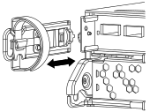

= Remove the controller module, replace the boot media and transfer the boot image to the boot media - AFF A200
:icons: font
:imagesdir: ../media/

To replace the boot media, you must remove the impaired controller module, install the replacement boot media, and transfer the boot image to a USB flash drive.

== Step 1: Remove the controller
:icons: font
:imagesdir: ../media/

[.lead]
To access components inside the controller, you must first remove the controller module from the system and then remove the cover on the controller module.

.Steps
. If you are not already grounded, properly ground yourself.
. Loosen the hook and loop strap binding the cables to the cable management device, and then unplug the system cables and SFPs (if needed) from the controller module, keeping track of where the cables were connected.
+
Leave the cables in the cable management device so that when you reinstall the cable management device, the cables are organized.

. Remove and set aside the cable management devices from the left and right sides of the controller module.
+

. Squeeze the latch on the cam handle until it releases, open the cam handle fully to release the controller module from the midplane, and then, using two hands, pull the controller module out of the chassis.
+
image::../media/drw_2240_x_opening_cam_latch.svg[]

. Turn the controller module over and place it on a flat, stable surface.
. Open the cover by sliding in the blue tabs to release the cover, and then swing the cover up and open.
+
image::../media/drw_2600_opening_pcm_cover.svg[]

== Step 2: Replace the boot media
:icons: font
:imagesdir: ../media/

[.lead]
You must locate the boot media in the controller and follow the directions to replace it.

.Steps
. If you are not already grounded, properly ground yourself.
. Locate the boot media using the following illustration or the FRU map on the controller module:
+
image::../media/drw_2600_boot_media_move_aminated_gif.svg[]

. Press the blue button on the boot media housing to release the boot media from its housing, and then gently pull it straight out of the boot media socket.
+
NOTE: Do not twist or pull the boot media straight up, because this could damage the socket or the boot media.

. Align the edges of the replacement boot media with the boot media socket, and then gently push it into the socket.
. Check the boot media to make sure that it is seated squarely and completely in the socket.
+
If necessary, remove the boot media and reseat it into the socket.

. Push the boot media down to engage the locking button on the boot media housing.
. Close the controller module cover.

== Step 3: Transfer the boot image to the boot media
:icons: font
:imagesdir: ../media/

[.lead]
You can install the system image to the replacement boot media using a USB flash drive with the image installed on it. However, you must restore the var file system during this procedure.

.What you'll need
* You must have a USB flash drive, formatted to FAT32, with at least 4GB capacity.
* A copy of the same image version of ONTAP as what the impaired controller was running. You can download the appropriate image from the Downloads section on the NetApp Support Site
 ** If NVE is enabled, download the image with NetApp Volume Encryption, as indicated in the download button.
 ** If NVE is not enabled, download the image without NetApp Volume Encryption, as indicated in the download button.
* If your system is an HA pair, you must have a network connection.
* If your system is a stand-alone system you do not need a network connection, but you must perform an additional reboot when restoring the var file system.

.Steps
. Align the end of the controller module with the opening in the chassis, and then gently push the controller module halfway into the system.
. Reinstall the cable management device and recable the system, as needed.
+
When recabling, remember to reinstall the media converters (SFPs) if they were removed.

. Insert the USB flash drive into the USB slot on the controller module.
+
Make sure that you install the USB flash drive in the slot labeled for USB devices, and not in the USB console port.

. Push the controller module all the way into the system, making sure that the cam handle clears the USB flash drive, firmly push the cam handle to finish seating the controller module, push the cam handle to the closed position, and then tighten the thumbscrew.
+
The node begins to boot as soon as it is completely installed into the chassis.

. Interrupt the boot process to stop at the LOADER prompt by pressing Ctrl-C when you see Starting AUTOBOOT press Ctrl-C to abort....
+
If you miss this message, press Ctrl-C, select the option to boot to Maintenance mode, and then halt the node to boot to LOADER.

. For systems with one controller in the chassis, reconnect the power and turn on the power supplies.
+
The system begins to boot and stops at the LOADER prompt.

. Although the environment variables and bootargs are retained, you should check that all required boot environment variables and bootargs are properly set for your system type and configuration using the `printenv bootarg name` command and correct any errors using the `setenv variable-name _value_` command.
 .. Check the boot environment variables:
  *** `bootarg.init.boot_clustered`
  *** `partner-sysid`
  *** `bootarg.init.flash_optimized` for AFF C190/AFF A220 (All Flash FAS)
  *** `bootarg.init.san_optimized` for AFF A220 and All SAN Array
  *** `bootarg.init.switchless_cluster.enable`
 .. If External Key Manager is enabled, check the bootarg values, listed in the `kenv` ASUP output:
  *** `bootarg.storageencryption.support _value_`
  *** `bootarg.keymanager.support _value_`
  *** `kmip.init.interface _value_`
  *** `kmip.init.ipaddr _value_`
  *** `kmip.init.netmask _value_`
  *** `kmip.init.gateway _value_`
 .. If Onboard Key Manager is enabled, check the bootarg values, listed in the `kenv` ASUP output:
  *** `bootarg.storageencryption.support _value_`
  *** `bootarg.keymanager.support _value_`
  *** `bootarg.onboard_keymanager _value_`
 .. Save the environment variables you changed with the `savenv` command
 .. Confirm your changes using the `printenv variable-name` command.
. Set your network connection type at the LOADER prompt:
 ** If you are configuring DHCP: `ifconfig e0a -auto`
+
NOTE: The target port you configure is the target port you use to communicate with the impaired node from the healthy node during var file system restore with a network connection. You can also use the e0M port in this command.

 ** If you are configuring manual connections: `ifconfig e0a -addr=filer_addr -mask=netmask -gw=gateway-dns=dns_addr-domain=dns_domain`
  *** `filer_addr` is the IP address of the storage system.
  *** `netmask` is the network mask of the management network that is connected to the HA partner.
  *** `gateway` is the gateway for the network.
  *** `dns_addr` is the IP address of a name server on your network.
  *** `dns_domain` is the Domain Name System (DNS) domain name.
+
If you use this optional parameter, you do not need a fully qualified domain name in the netboot server URL. You need only the server's host name.

+
NOTE: Other parameters might be necessary for your interface. You can enter help ifconfig at the firmware prompt for details.
