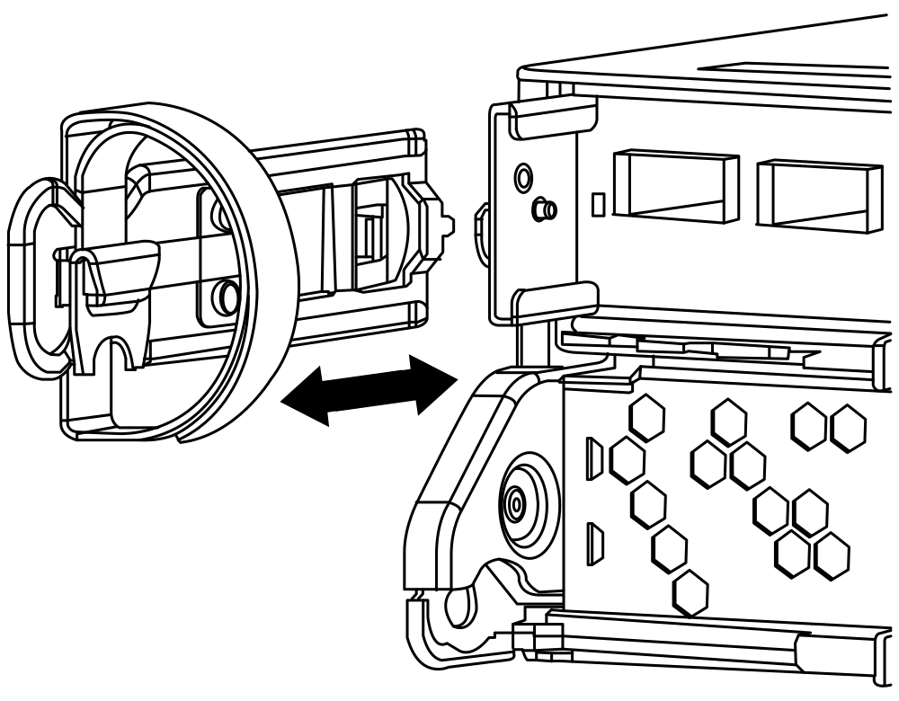

= Return the failed part to NetApp - AFF A200
:icons: font
:imagesdir: ../media/

Remove and set aside the cable management devices from the left and right sides of the controller module.

== drw-25xx_cable_management_arm_COLE.svg (commented out after build failure)

// 

== TEST ICON CAPTURE

image:../media/legend_icon_01.png[]

== PNG
image::../media/drw_25xx_cable_management_arm.png[]

== GIF
image::../media/drw_25xx_cable_management_arm.gif[]

== SVG
image::../media/drw_25xx_cable_management_arm.svg[]

Squeeze the latch on the cam handle until it releases, open the cam handle fully to release the controller module from the midplane, and then, using two hands, pull the controller module out of the chassis.

== PNG
image::../media/drw_2240_x_opening_cam_latch.png[]

== GIF
image::../media/drw_2240_x_opening_cam_latch.gif[]

== SVG
image::../media/drw_2240_x_opening_cam_latch.svg[]

Turn the controller module over and place it on a flat, stable surface.
Open the cover by sliding in the blue tabs to release the cover, and then swing the cover up and open.

== PNG
image::../media/drw_2600_opening_pcm_cover.png[]

== GIF
image::../media/drw_2600_opening_pcm_cover.gif[]

== SVG
image::../media/drw_2600_opening_pcm_cover.svg[]

== legend_icon gif

|===
a|
image:../media/legend_icon_01.gif[]
a|
Lever
a|
image:../media/legend_icon_02.gif[]
a|
Latching mechanism
|===

= legend_icon svg

|===
a|
image:../media/legend_icon_01.svg[]
a|
Lever
a|
image:../media/legend_icon_02.svg[]
a|
Latching mechanism
|===

= legend_icon png (note)

|===
a|
image:../media/legend_icon_01.png[]
a|
Lever
a|
image:../media/legend_icon_02.png[]
a|
Latching mechanism
|===
