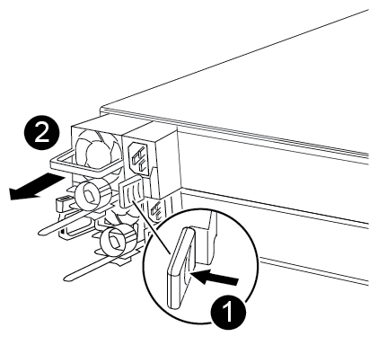
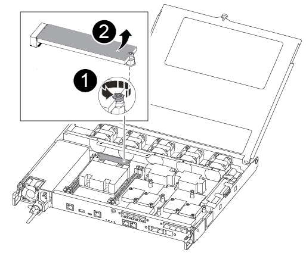

= Replace the controller module hardware - AFF A250
:icons: font
:imagesdir: ../media/

[.lead]
To replace the controller module hardware, you must remove the impaired controller, move FRU components to the replacement controller module, install the replacement controller module in the chassis, and then boot the system to Maintenance mode.

== Step 1: Remove the controller module

[.lead]
You must remove the controller module from the chassis when you replace a component inside the controller module.

Make sure that you label the cables so that you know where they came from.

Use the following video or the tabulated steps to replace a controller module:

video::ab0ebe6b-e891-489c-aab4-ac5b015c8f01[panopto, title="Animation - Replace a controller module"]

. If you are not already grounded, properly ground yourself.
. Unplug the controller module power supplies from the source.
. Release the power cable retainers, and then unplug the cables from the power supplies.
. Insert your forefinger into the latching mechanism on either side of the controller module, press the lever with your thumb, and gently pull the controller a few inches out of the chassis.
+
NOTE: If you have difficulty removing the controller module, place your index fingers through the finger holes from the inside (by crossing your arms).
+
image::../media/drw_a250_pcm_remove_install.png[]
+
[cols="1,3"]
|===
a|
image:../media/legend_icon_01.png[]|
Lever
a|
image:../media/legend_icon_02.png[]
a|
Latching mechanism
|===

. Using both hands, grasp the controller module sides and gently pull it out of the chassis and set it on a flat, stable surface.
. Turn the thumbscrew on the front of the controller module anti-clockwise and open the controller module cover.
+
image::../media/drw_a250_open_controller_module_cover.png[]
+
[cols="1,3"]
|===
a|
image:../media/legend_icon_01.png[]|
Thumbscrew
a|
image:../media/legend_icon_02.png[]
a|
Controller module cover.
|===

. Lift out the air duct cover.
+
image::../media/drw_a250_remove_airduct_cover.png[]

== Step 2: Move the power supply

[.lead]
You must move the power supply from the impaired controller module to the replacement controller module when you replace a controller module.

. Disconnect the power supply.
. Open the power cable retainer, and then unplug the power cable from the power supply.
. Unplug the power cable from the power source.
. Rotate the cam handle such that it can be used to pull power supply out of the controller module while pressing the locking tab.
+
CAUTION: Do not use excessive force when sliding the controller module into the chassis to avoid damaging the connectors.
+

The power supply is short. Always use two hands to support it when removing it from the controller module so that it does not suddenly swing free from the controller module and injure you.
+

+
[cols="1,3"]
|===
a|
image:../media/legend_icon_01.png[]|
Blue power supply locking tab
a|
image:../media/legend_icon_02.png[]
a|
Power supply
|===

. Move the power supply to the new controller module, and then install it.
. Using both hands, support and align the edges of the power supply with the opening in the controller module, and then gently push the power supply into the controller module until the locking tab clicks into place.
+
The power supplies will only properly engage with the internal connector and lock in place one way.
+
CAUTION: To avoid damaging the internal connector, do not use excessive force when sliding the power supply into the system.

== Step 3: Move the fans

[.lead]
You must move the fans from the impaired controller module to the replacement module when replacing a failed controller module.

. Remove the fan module by pinching the side of the fan module, and then lifting the fan module straight out of the controller module.
+
image::../media/drw_a250_replace_fan.png[]
+
[cols="1,3"]
|===
a|
image:../media/legend_icon_01.png[]|
Fan module
|===

. Move the fan module to the replacement controller module, and align the edges of the fan module with the opening in the controller module, and then slide the fan module in.
. Repeat these steps for the remaining fan modules.

== Step 4: Move the boot media

[.lead]
There is one boot media device in the AFF A250 under the air duct in the controller module. You must move it from the impaired controller module to the replacement controller module.

You need a #1 magnetic Phillips head screwdriver to remove the screw that holds the boot media in place. Due to the space constraints within the controller module, you should also have a magnet to transfer the screw on to so that you do not lose it.

. Locate and move the boot media from the impaired controller module to the replacement controller module.
+

+
[cols="1,3"]
|===
a|
image:../media/legend_icon_01.png[]|
Remove the screw securing the boot media to the motherboard in the impaired controller module.
a|
image:../media/legend_icon_02.png[]
a|
Lift the boot media out of the impaired controller module.
|===

 .. Using the #1 magnetic screwdriver, remove the screw from the boot media, and set it aside safely on the magnet.
 .. Gently lift the boot media directly out of the socket and align it into place in the replacement controller module.
 .. Using the #1 magnetic screwdriver, insert and tighten the screw on the boot media.
+
NOTE: Do not apply force when tightening the screw on the boot media; you might crack it.

== Step 5: Move the DIMMs

[.lead]
To move the DIMMs, locate and move them from the impaired controller into the replacement controller and follow the specific sequence of steps.

image::../media/drw_a250_dimm_replace.png[]

NOTE: Install each DIMM into the same slot it occupied in the impaired controller module.

. Slowly push apart the DIMM ejector tabs on either side of the DIMM, and slide the DIMM out of the slot.
+
NOTE: Hold the DIMM by the edges to avoid pressure on the components on the DIMM circuit board.

. Locate the corresponding DIMM slot on the replacement controller module.
. Make sure that the DIMM ejector tabs on the DIMM socket are in the open position, and then insert the DIMM squarely into the socket.
+
The DIMMs fit tightly in the socket. If not, reinsert the DIMM to realign it with the socket.

. Visually inspect the DIMM to verify that it is evenly aligned and fully inserted into the socket.
. Repeat these steps for the remaining DIMM.

== Step 6: Move a mezzanine card

[.lead]
To move a mezzanine card, you must remove the cabling and any QSFPs and SFPs from the ports, move the mezzanine card to the replacement controller, reinstall any QSFPs and SFPs onto the ports, and cable the ports.

. Locate and move the mezzanine cards from your impaired controller module.
+
image::../media/drw_a250_replace_mezz_card.png[]
+
[cols="1,3"]
|===
a|
image:../media/legend_icon_01.png[]|
Remove screws on the face of the controller module.
a|
image:../media/legend_icon_02.png[]
a|
Loosen the screw in the controller module.
a|
image:../media/legend_icon_03.png[]
a|
Move the mezzanine card.
|===

. Unplug any cabling associated with the mezzanine card.
+
Make sure that you label the cables so that you know where they came from.

 .. Remove any SFP or QSFP modules that might be in the mezzanine card and set it aside.
 .. Using the #1 magnetic screwdriver, remove the screws from the face of the impaired controller module and from the mezzanine card, and set them aside safely on the magnet.
 .. Gently lift the mezzanine card out of the socket and move it to the same position in the replacement controller.
 .. Gently align the mezzanine card into place in the replacement controller.
 .. Using the #1 magnetic screwdriver, insert and tighten the screws on the face of the replacement controller module and on the mezzanine card.
+
NOTE: Do not apply force when tightening the screw on the mezzanine card; you might crack it.

. Repeat these steps if there is another mezzanine card in the impaired controller module.
. Insert the SFP or QSFP modules that were removed onto the mezzanine card.

== Step 7: Move the NV battery

[.lead]
When replacing the controller module, you must move the NV battery from the impaired controller module to the replacement controller module.

. Locate and move the NVMEM battery from your impaired controller module to the replacement controller module.
+
image::../media/drw_a250_replace_nvmem_batt.png[]
+
[cols="1,3"]
|===
a|
image:../media/legend_icon_01.png[]|
Squeeze the clip on the face of the battery plug.
a|
image:../media/legend_icon_02.png[]
a|
Unplug the battery cable from the socket.
a|
image:../media/legend_icon_03.png[]
a|
Grasp the battery and press the blue locking tab marked PUSH.
a|
image:../media/legend_icon_04.png[]
a|
Lift the battery out of the holder and controller module.
|===

. Locate the battery plug and squeeze the clip on the face of the battery plug to release the plug from the socket.
. Grasp the battery and press the blue locking tab marked PUSH, and then lift the battery out of the holder and controller module.
. Locate the corresponding NV battery holder on the replacement controller module and align the NV battery to the battery holder.
. Insert the NV battery plug into the socket.
. Slide the battery pack down along the sheet metal side wall until the support tabs on the side wall hook into the slots on the battery pack, and the battery pack latch engages and clicks into the opening on the side wall.
. Press firmly down on the battery pack to make sure that it is locked into place.

== Step 8: Install the controller module

[.lead]
After all of the components have been moved from the impaired controller module to the replacement controller module, you must install the replacement controller module into the chassis, and then boot it to Maintenance mode.

You can use the following illustrations or the written steps to install the replacement controller module in the chassis.

. If you have not already done so, install the air duct.
+
image::../media/drw_a250_install_airduct_cover.png[]

. Close the controller module cover and tighten the thumbscrew.
+
image::../media/drw_a250_close_controller_module_cover.png[]
+
[cols="1,3"]
|===
a|
image:../media/legend_icon_01.png[]
|Controller module cover
a|
image:../media/legend_icon_02.png[]
a|
Thumbscrew
|===

. Align the end of the controller module with the opening in the chassis, and then gently push the controller module halfway into the system.
+
NOTE: Do not completely insert the controller module in the chassis until instructed to do so.

. Cable the management and console ports only, so that you can access the system to perform the tasks in the following sections.
+
NOTE: You will connect the rest of the cables to the controller module later in this procedure.

. Insert the controller module into the chassis:
. Ensure the latching mechanism arms are locked in the fully extended position.
. Using both hands, align and gently slide the controller module into the latching mechanism arms until it stops.
. Place your index fingers through the finger holes from the inside of the latching mechanism.
. Press your thumbs down on the orange tabs on top of the latching mechanism and gently push the controller module over the stop.
. Release your thumbs from the top of the latching mechanisms and continue pushing until the latching mechanisms snap into place.
+
The controller module begins to boot as soon as it is fully seated in the chassis. Be prepared to interrupt the boot process.

+
The controller module should be fully inserted and flush with the edges of the chassis.
