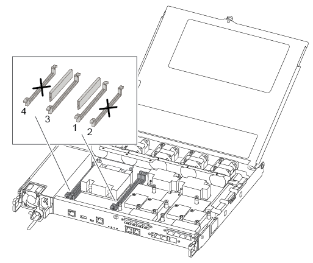
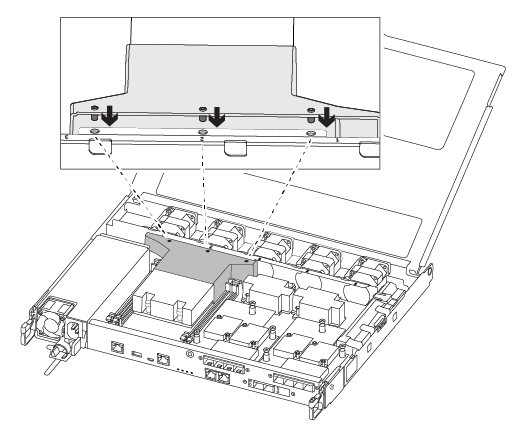

= Replace a DIMM - AFF A250
:icons: font
:imagesdir: ../media/

[.lead]
You must replace a DIMM in the controller module when your system registers an increasing number of correctable error correction codes (ECC); failure to do so causes a system panic.

.About this task
All other components in the system must be functioning properly; if not, you must contact technical support.

You must replace the failed component with a replacement FRU component you received from your provider.

== Step 1: Shut down the impaired controller

include::../_include/shutdown_most_frus.adoc[]

== Step 2: Remove the controller module

You must remove the controller module from the chassis when you replace a component inside the controller module.

Make sure that you label the cables so that you know where they came from.

. If you are not already grounded, properly ground yourself.
. Unplug the controller module power supplies from the source.
. Release the power cable retainers, and then unplug the cables from the power supplies.
. Insert your forefinger into the latching mechanism on either side of the controller module, press the lever with your thumb, and gently pull the controller a few inches out of the chassis.
+
NOTE: If you have difficulty removing the controller module, place your index fingers through the finger holes from the inside (by crossing your arms).
+
image::../media/drw_a250_pcm_remove_install.png[]
+
[cols="1,3"]
|===
a|
image:../media/legend_icon_01.png[]|
Lever
a|
image:../media/legend_icon_02.png[]
a|
Latching mechanism
|===

. Using both hands, grasp the controller module sides and gently pull it out of the chassis and set it on a flat, stable surface.
. Turn the thumbscrew on the front of the controller module anti-clockwise and open the controller module cover.
+
image::../media/drw_a250_open_controller_module_cover.png[]
+
[cols="1,3"]
|===
a|
image:../media/legend_icon_01.png[]|
Thumbscrew
a|
image:../media/legend_icon_02.png[]
a|
Controller module cover.
|===

. Lift out the air duct cover.
+
image::../media/drw_a250_remove_airduct_cover.png[]

== Step 3: Replace a DIMM

To replace a DIMM, you must locate it in the controller module using the DIMM map label on top of the air duct and then replace it following the specific sequence of steps.

Use the following video or the tabulated steps to replace a DIMM:

video::fa6b8107-86fb-4332-aa57-ac5b01605e52[panopto, title="Animation - Replace a DIMM"]

. Replace the impaired DIMM on your controller module.
+
The DIMMs are in slot 3 or 1 on the motherboard. Slot 2 and 4 are left empty. Do not attempt to install DIMMs into these slots.
+

. Note the orientation of the DIMM in the socket so that you can insert the replacement DIMM in the proper orientation.
. Slowly push apart the DIMM ejector tabs on either side of the DIMM, and slide the DIMM out of the slot.
. Leave DIMM ejector tabs on the connector in the open position.
. Remove the replacement DIMM from the antistatic shipping bag, hold the DIMM by the corners, and align it to the slot.
+
NOTE: Hold the DIMM by the edges to avoid pressure on the components on the DIMM circuit board.

. Insert the replacement DIMM squarely into the slot.
+
The DIMMs fit tightly in the socket. If not, reinsert the DIMM to realign it with the socket.

. Visually inspect the DIMM to verify that it is evenly aligned and fully inserted into the socket.

== Step 4: Install the controller module

After you have replaced the component in the controller module, you must reinstall the controller module into the chassis, and then boot it to Maintenance mode.

You can use the following illustrations or the written steps to install the replacement controller module in the chassis.

. If you have not already done so, install the air duct.
+

. Close the controller module cover and tighten the thumbscrew.
+
image::../media/drw_a250_close_controller_module_cover.png[]
+
[cols="1,3"]
|===
a|
image:../media/legend_icon_01.png[]|
Controller module cover
a|
image:../media/legend_icon_02.png[]
a|
Thumbscrew
|===

. Insert the controller module into the chassis:
 .. Ensure the latching mechanism arms are locked in the fully extended position.
 .. Using both hands, align and gently slide the controller module into the latching mechanism arms until it stops.
 .. Place your index fingers through the finger holes from the inside of the latching mechanism.
 .. Press your thumbs down on the orange tabs on top of the latching mechanism and gently push the controller module over the stop.
 .. Release your thumbs from the top of the latching mechanisms and continue pushing until the latching mechanisms snap into place.
+
The controller module begins to boot as soon as it is fully seated in the chassis. Be prepared to interrupt the boot process.

+
The controller module should be fully inserted and flush with the edges of the chassis.
. Cable the management and console ports only, so that you can access the system to perform the tasks in the following sections.
+
NOTE: You will connect the rest of the cables to the controller module later in this procedure.

== Step 5: Run diagnostics

After you have replaced a component in your system, you should run diagnostic tests on that component.

Your system must be at the LOADER prompt to start diagnostics.

All commands in the diagnostic procedures are issued from the controller where the component is being replaced.

. If the controller to be serviced is not at the LOADER prompt, reboot the controller: `system node halt -node node_name`
+
After you issue the command, you should wait until the system stops at the LOADER prompt.

. At the LOADER prompt, access the special drivers specifically designed for system-level diagnostics to function properly: `boot_diags`
. Select *Scan System* from the displayed menu to enable running the diagnostics tests.
. Select *Test Memory* from the displayed menu.
. Proceed based on the result of the preceding step:
 ** If the test failed, correct the failure, and then rerun the test.
 ** If the test reported no failures, select Reboot from the menu to reboot the system.

== Step 6: Return the failed part to NetApp

include::../_include/complete_rma.adoc[]
