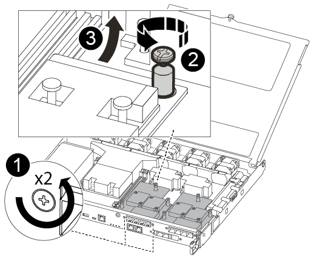

= Replace or install a mezzanine card - AFF A250
:icons: font
:imagesdir: ../media/

[.lead]
To replace a failed mezzanine card, you must remove the cables and any SFP or QSFP modules, replace the card, reinstall the SFP or QSFP modules and recable the cards. To install a new mezzanine card, you must have the appropriate cables and SFP or QSFP modules.

.About this task
* You can use this procedure with all versions of ONTAP supported by your system
* All other components in the system must be functioning properly; if not, you must contact technical support.

== Step 1: Shut down the impaired controller

include::../_include/shutdown_most_frus.adoc[]

== Step 2: Remove the controller module

Remove the controller module from the chassis when you replace a component inside the controller module.

Make sure that you label the cables so that you know where they came from.

. If you are not already grounded, properly ground yourself.
. Unplug the controller module power supplies from the source.
. Release the power cable retainers, and then unplug the cables from the power supplies.
. Insert your forefinger into the latching mechanism on either side of the controller module, press the lever with your thumb, and gently pull the controller a few inches out of the chassis.
+
NOTE: If you have difficulty removing the controller module, place your index fingers through the finger holes from the inside (by crossing your arms).
+
image::../media/drw_a250_pcm_remove_install.png[]
+
|===
a|
image:../media/legend_icon_01.png[]|
Lever
a|
image:../media/legend_icon_02.png[]
a|
Latching mechanism
|===

. Using both hands, grasp the controller module sides and gently pull it out of the chassis and set it on a flat, stable surface.
. Turn the thumbscrew on the front of the controller module anti-clockwise and open the controller module cover.
+
image::../media/drw_a250_open_controller_module_cover.png[]
+
|===
a|
image:../media/legend_icon_01.png[]|
Thumbscrew
a|
image:../media/legend_icon_02.png[]
a|
Controller module cover.
|===

== Step 3: Replace or install a mezzanine card

To replace a mezzanine card, you must remove the impaired card and install the replacement card; to install a mezzanine card, you must remove the faceplate and install the new card.

Use the following video or the tabulated steps to replace a mezzanine card:

video::d8e7d4d9-8d28-4be1-809b-ac5b01643676[panopto, title="Animation - Replace a mezzanine card"]

. To replace a mezzanine card:
. Locate and replace the impaired mezzanine card on your controller module.
+

+
|===
a|
image:../media/legend_icon_01.png[]|
Remove screws on the face of the controller module.
a|
image:../media/legend_icon_02.png[]
a|
Loosen the screw in the controller module.
a|
image:../media/legend_icon_03.png[]
a|
Remove the mezzanine card.
|===

 .. Unplug any cabling associated with the impaired mezzanine card.
+
Make sure that you label the cables so that you know where they came from.

 .. Remove any SFP or QSFP modules that might be in the impaired mezzanine card and set it aside.
 .. Using the #1 magnetic screwdriver, remove the screws from the face of the controller module and set them aside safely on the magnet.
 .. Using the #1 magnetic screwdriver, loosen the screw on the impaired mezzanine card.
 .. Using the #1 magnetic screwdriver, gently lift the impaired mezzanine card directly out of the socket and set it aside.
 .. Remove the replacement mezzanine card from the antistatic shipping bag and align it to the inside face of the controller module.
 .. Gently align the replacement mezzanine card into place.
 .. Using the #1 magnetic screwdriver, insert and tighten the screws on the face of the controller module and on the mezzanine card.
+
NOTE: Do not apply force when tightening the screw on the mezzanine card; you might crack it.

 .. Insert any SFP or QSFP modules that were removed from the impaired mezzanine card to the replacement mezzanine card.

. To install a mezzanine card:
. You install a new mezzanine card if your system does not have one.
 .. Using the #1 magnetic screwdriver, remove the screws from the face of the controller module and the faceplate covering the mezzanine card slot, and set them aside safely on the magnet.
 .. Remove the mezzanine card from the antistatic shipping bag and align it to the inside face of the controller module.
 .. Gently align the mezzanine card into place.
 .. Using the #1 magnetic screwdriver, insert and tighten the screws on the face of the controller module and on the mezzanine card.
+
NOTE: Do not apply force when tightening the screw on the mezzanine card; you might crack it.

== Step 4: Reinstall the controller module

After you replace a component within the controller module, you must reinstall the controller module in the system chassis and boot it.

. Close the controller module cover and tighten the thumbscrew.
+
image::../media/drw_a250_close_controller_module_cover.png[]
+
|===
a|
image:../media/legend_icon_01.png[]|
Controller module cover
a|
image:../media/legend_icon_02.png[]
a|
Thumbscrew
|===

. Insert the controller module into the chassis:
 .. Ensure the latching mechanism arms are locked in the fully extended position.
 .. Using both hands, align and gently slide the controller module into the latching mechanism arms until it stops.
 .. Place your index fingers through the finger holes from the inside of the latching mechanism.
 .. Press your thumbs down on the orange tabs on top of the latching mechanism and gently push the controller module over the stop.
 .. Release your thumbs from the top of the latching mechanisms and continue pushing until the latching mechanisms snap into place.
+
The controller module begins to boot as soon as it is fully seated in the chassis. Be prepared to interrupt the boot process.

+
The controller module should be fully inserted and flush with the edges of the chassis.
. Recable the system, as needed.
. Return the controller to normal operation by giving back its storage: `storage failover giveback -ofnode _impaired_node_name_`
. If automatic giveback was disabled, reenable it: `storage failover modify -node local -auto-giveback true`

== Step 5: Return the failed part to NetApp

include::../_include/complete_rma.adoc[]
