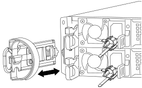
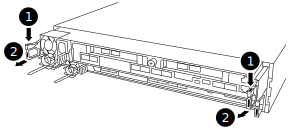
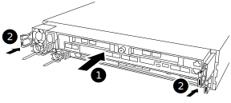

= Remove the controller module, replace the boot media and transfer the boot image to the boot media - AFF A320
:icons: font
:imagesdir: ../media/

To replace the boot media, you must remove the impaired controller module, install the replacement boot media, and transfer the boot image to a USB flash drive.

== Step 1: Remove the controller module
:icons: font
:imagesdir: ../media/

[.lead]
To access components inside the controller module, you must remove the controller module from the chassis.

. If you are not already grounded, properly ground yourself.
. Unplug the controller module power supply from the power source.
. Loosen the hook and loop strap binding the cables to the cable management device, and then unplug the system cables and SFPs (if needed) from the controller module, keeping track of where the cables were connected.
+

+
Leave the cables in the cable management device so that when you reinstall the cable management device, the cables are organized.

. Remove and set aside the cable management devices from the left and right sides of the controller module.
. Remove the controller module from the chassis:
+

+
.. Insert your forefinger into the latching mechanism on either side of the controller module.
.. Press down on the orange tab on top of the latching mechanism until it clears the latching pin on the chassis.
+
The latching mechanism hook should be nearly vertical and should be clear of the chassis pin.

.. Gently pull the controller module a few inches toward you so that you can grasp the controller module sides.
.. Using both hands, gently pull the controller module out of the chassis and set it on a flat, stable surface.

== Step 2: Replace the boot media
:icons: font
:imagesdir: ../media/

[.lead]
You must locate the boot media in the controller module, and then follow the directions to replace it.

. Open the air duct and locate the boot media using the following illustration or the FRU map on the controller module:

. Locate and remove the boot media from the controller module:
+
image::../media/drw_a320_boot_media_replace_animated_gif.svg[]
+
 .. Press the blue button at the end of the boot media until the lip on the boot media clears the blue button.
 .. Rotate the boot media up and gently pull the boot media out of the socket.
. Check the boot media to make sure that it is seated squarely and completely in the socket.
+
If necessary, remove the boot media and reseat it into the socket.

. Lock the boot media in place:
 .. Rotate the boot media down toward the motherboard.
 .. Placing a finger at the end of the boot media by the blue button, push down on the boot media end to engage the blue locking button.
 .. While pushing down on the boot media, lift the blue locking button to lock the boot media in place.
. Close the air duct.

== Step 3: Transfer the boot image to the boot media using a USB flash drive
:icons: font
:imagesdir: ../media/

[.lead]
The replacement boot media that you installed does not have a boot image, so you need to transfer a boot image using a USB flash drive.

* You must have a USB flash drive, formatted to MBR/FAT32, with at least 4GB capacity
* A copy of the same image version of ONTAP as what the impaired controller was running. You can download the appropriate image from the Downloads section on the NetApp Support Site
 ** If NVE is enabled, download the image with NetApp Volume Encryption, as indicated in the download button.
 ** If NVE is not enabled, download the image without NetApp Volume Encryption, as indicated in the download button.
* If your system is an HA pair, you must have a network connection.
* If your system is a stand-alone system you do not need a network connection, but you must perform an additional reboot when restoring the var file system.

. Download and copy the appropriate service image from the NetApp Support Site to the USB flash drive.
 .. Download the service image to your work space on your laptop.
 .. Unzip the service image.
+
NOTE: If you are extracting the contents using Windows, do not use winzip to extract the netboot image. Use another extraction tool, such as 7-Zip or WinRAR.
+
There are two folders in the unzipped service image file:

  *** boot
  *** efi

 .. Copy the efi folder to the top directory on the USB flash drive.
+
The USB flash drive should have the efi folder and the same Service Image (BIOS) version of what the impaired controller is running.

 .. Remove the USB flash drive from your laptop.
. If you have not already done so, close the air duct.
. Align the end of the controller module with the opening in the chassis, and then gently push the controller module halfway into the system.
. Reinstall the cable management device and recable the system, as needed.
+
When recabling, remember to reinstall the media converters (SFPs or QSFPs) if they were removed.

. Plug the power cable into the power supply and reinstall the power cable retainer.
. Insert the USB flash drive into the USB slot on the controller module.
+
Make sure that you install the USB flash drive in the slot labeled for USB devices, and not in the USB console port.

. Complete the reinstallation of the controller module:
+

 .. Make sure the latch arms are locked in the extended position.
 .. Using the latch arms, push the controller module into the chassis bay until it stops.
+
NOTE: Do not push down on the latching mechanism at the top of the latch arms. Doing so with raise the locking mechanism and prohibit sliding the controller module into the chassis.

 .. Press down and hold the orange tabs on top of the latching mechanism.
 .. Gently push the controller module into the chassis bay until it is flush with the edges of the chassis.
+
NOTE: The latching mechanism arms slide into the chassis.
+
The controller module begins to boot as soon as it is fully seated in the chassis.

 .. Release the latches to lock the controller module into place.
 .. If you have not already done so, reinstall the cable management device.

. Interrupt the boot process by pressing Ctrl-C to stop at the LOADER prompt.
+
If you miss this message, press Ctrl-C, select the option to boot to Maintenance mode, and then halt the node to boot to LOADER.

. Although the environment variables and bootargs are retained, you should check that all required boot environment variables and bootargs are properly set for your system type and configuration using the `printenv bootarg name` command and correct any errors using the `setenv variable-name <value\>` command.
.. Check the boot environment variables:
 *** `bootarg.init.boot_clustered`
 *** `partner-sysid`
 *** `bootarg.init.flash_optimized` for AFF C190/AFF A220 (All Flash FAS)
 *** `bootarg.init.san_optimized` for AFF A220 and All SAN Array
 *** `bootarg.init.switchless_cluster.enable`
.. If External Key Manager is enabled, check the bootarg values, listed in the `kenv` ASUP output:
 *** `bootarg.storageencryption.support <value>`
 *** `bootarg.keymanager.support <value>`
 *** `kmip.init.interface <value>`
 *** `kmip.init.ipaddr <value>`
 *** `kmip.init.netmask <value>`
 *** `kmip.init.gateway <value>`
.. If Onboard Key Manager is enabled, check the bootarg values, listed in the `kenv` ASUP output:
 *** `bootarg.storageencryption.support <value>`
 *** `bootarg.keymanager.support <value>`
 *** `bootarg.onboard_keymanager <value>`
 .. Save the environment variables you changed with the `savenv` command
 .. Confirm your changes using the `printenv variable-name` command.
. From the LOADER prompt, boot the recovery image from the USB flash drive: `boot_recovery`
+
The image is downloaded from the USB flash drive.

. When prompted, either enter the name of the image or accept the default image displayed inside the brackets on your screen.
. After the image is installed, start the restoration process:
 .. Record the IP address of the impaired node that is displayed on the screen.
 .. Press `y` when prompted to restore the backup configuration.
 .. Press `y` when prompted to overwrite /etc/ssh/ssh_host_dsa_key.
. From the partner node in advanced privilege level, start the configuration synchronization using the IP address recorded in the previous step: `system node restore-backup -node local -target-address impaired_node_IP_address`
. If the restore is successful, press `y` on the impaired node when prompted to use the restored copy?.
. Press `y` when you see confirm backup procedure was successful, and then press `y` when prompted to reboot the node.
. Verify that the environmental variables are set as expected.
 .. Take the node to the LOADER prompt.
+
From the ONTAP prompt, you can issue the command system node halt -skip-lif-migration-before-shutdown true -ignore-quorum-warnings true -inhibit-takeover true.

 .. Check the environment variable settings with the `printenv` command.
 .. If an environment variable is not set as expected, modify it with the `setenv __environment-variable-name__ __changed-value__` command.
 .. Save your changes using the saveenv command.
 .. Reboot the node.
. With the rebooted impaired node displaying the Waiting for Giveback... message, perform a giveback from the healthy node:
+
[options="header" cols="1,2"]
|===
| If your system is in...| Then...
a|
An HA pair
a|
After the impaired node is displaying the Waiting for Giveback... message, perform a giveback from the healthy node:

 .. From the healthy node: `storage failover giveback -ofnode partner_node_name`
+
The impaired node takes back its storage, finishes booting, and then reboots and is again taken over by the healthy node.
+
NOTE: If the giveback is vetoed, you can consider overriding the vetoes.
+
http://docs.netapp.com/ontap-9/topic/com.netapp.doc.dot-cm-hacg/home.html[ONTAP 9 High-Availability Configuration Guide]

 .. Monitor the progress of the giveback operation by using the storage failover show-giveback command.
 .. After the giveback operation is complete, confirm that the HA pair is healthy and that takeover is possible by using the storage failover show command.
 .. Restore automatic giveback if you disabled it using the storage failover modify command.

+
|===

. Exit advanced privilege level on the healthy node.
