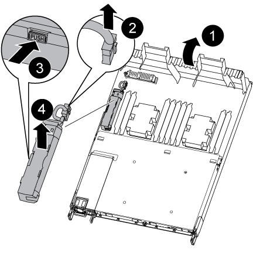
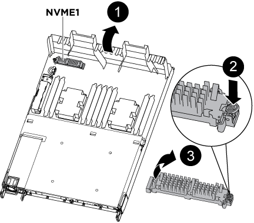
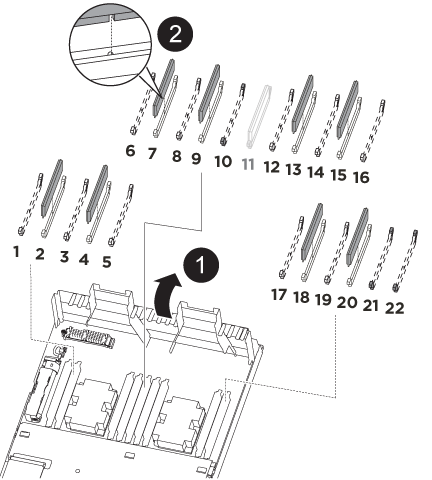
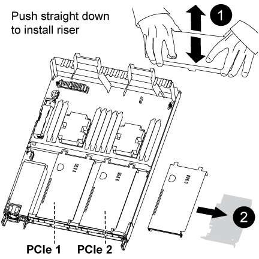

= Replace controller module  - AFF A320
:icons: font
:imagesdir: ../media/

[.lead]
To replace the controller module hardware, you must remove the impaired node, move FRU components to the replacement controller module, install the replacement controller module in the chassis, and then boot the system to Maintenance mode.

== Step 1: Remove the controller module

[.lead]
To access components inside the controller module, you must remove the controller module from the chassis.

You can use the following images or the written steps to remove the controller module from the chassis.

The following image shows removing the cables and cable management arms from the impaired controller module:

image::../media/drw_a320_controller_cable_unplug_animated_gif.png[]

The following image shows removing the impaired controller module from the chassis:

image::../media/drw_a320_controller_remove_animated_gif.png[]

. If you are not already grounded, properly ground yourself.
. Unplug the controller module power supply from the power source.
. Loosen the hook and loop strap binding the cables to the cable management device, and then unplug the system cables and SFPs (if needed) from the controller module, keeping track of where the cables were connected.
+
Leave the cables in the cable management device so that when you reinstall the cable management device, the cables are organized.

. Remove and set aside the cable management devices from the left and right sides of the controller module.
. Remove the controller module from the chassis:
 .. Insert your forefinger into the latching mechanism on either side of the controller module.
 .. Press down on the orange tab on top of the latching mechanism until it clears the latching pin on the chassis.
+
The latching mechanism hook should be nearly vertical and should be clear of the chassis pin.

 .. Gently pull the controller module a few inches toward you so that you can grasp the controller module sides.
 .. Using both hands, gently pull the controller module out of the chassis and set it on a flat, stable surface.

== Step 2: Move the power supplies

[.lead]
You must move the power supply from the impaired controller module to the replacement controller module when you replace a controller module.

. Rotate the cam handle such that it can be used to pull power supply out of the controller module while pressing the blue locking tab.

+
CAUTION: The power supply is short. Always use two hands to support it when removing it from the controller module so that it does not suddenly swing free from the controller module and injure you.
+

. Move the power supply to the new controller module, and then install it.
. Using both hands, support and align the edges of the power supply with the opening in the controller module, and then gently push the power supply into the controller module until the locking tab clicks into place.
+
The power supplies will only properly engage with the internal connector and lock in place one way.
+
NOTE: To avoid damaging the internal connector, do not use excessive force when sliding the power supply into the system.

== Step 3: Move the NVDIMM battery

[.lead]
To move the NVDIMM battery from the impaired controller module to the replacement controller module, you must perform a specific sequence of steps.

You can use the following illustration or the written steps to move the NVDIMM battery from the impaired controller module to the replacement controller module.

. Locate the NVDIMM battery in the controller module.
. Locate the battery plug and squeeze the clip on the face of the battery plug to release the plug from the socket, and then unplug the battery cable from the socket.
. Grasp the battery and press the blue locking tab marked PUSH, and then lift the battery out of the holder and controller module.
. Move the battery to the replacement controller module.
. Align the battery module with the opening for the battery, and then gently push the battery into slot until it locks into place.
+
NOTE: Do not plug the battery cable back into the motherboard until instructed to do so.

== Step 4: Move the boot media

[.lead]
You must locate the boot media, and then follow the directions to remove it from the impaired controller module and insert it into the replacement controller module.

You can use the following illustration or the written steps to move the boot media from the impaired controller module to the replacement controller module.

. Open the air duct and locate the boot media using the following illustration or the FRU map on the controller module:
. Locate and remove the boot media from the controller module:
 .. Press the blue button at the end of the boot media until the lip on the boot media clears the blue button.
 .. Rotate the boot media up and gently pull the boot media out of the socket.
. Move the boot media to the new controller module, align the edges of the boot media with the socket housing, and then gently push it into the socket.
. Check the boot media to make sure that it is seated squarely and completely in the socket.
+
If necessary, remove the boot media and reseat it into the socket.

. Lock the boot media in place:
 .. Rotate the boot media down toward the motherboard.
 .. Placing a finger at the end of the boot media by the blue button, push down on the boot media end to engage the blue locking button.
 .. While pushing down on the boot media, lift the blue locking button to lock the boot media in place.

== Step 5: Move the DIMMs

[.lead]
You need to locate the DIMMs, and then move them from the impaired controller module to the replacement controller module.

You must have the new controller module ready so that you can move the DIMMs directly from the impaired controller module to the corresponding slots in the replacement controller module.

You can use the following illustrations or the written steps to move the DIMMs from the impaired controller module to the replacement controller module.

. Locate the DIMMs on your controller module.
+
image::../media/drw_a320_dimm_map.png[]
+
|===
a|
image:../media/legend_icon_01.png[]|
Air duct
a|
image:../media/legend_icon_02.png[]
a|

 ** System DIMMs slots: 2,4, 7, 9, 13, 15, 18, and 20
 ** NVDIMM slot: 11
+
NOTE: The NVDIMM looks significantly different than system DIMMs.

+
|===

. Note the orientation of the DIMM in the socket so that you can insert the DIMM in the replacement controller module in the proper orientation.
. Verify that the NVDIMM battery is not plugged into the new controller module.
. Move the DIMMs from the impaired controller module to the replacement controller module:
+
NOTE: Make sure that you install the each DIMM into the same slot it occupied in the impaired controller module.

 .. Eject the DIMM from its slot by slowly pushing apart the DIMM ejector tabs on either side of the DIMM, and then slide the DIMM out of the slot.
+
NOTE: Carefully hold the DIMM by the edges to avoid pressure on the components on the DIMM circuit board.

 .. Locate the corresponding DIMM slot on the replacement controller module.
 .. Make sure that the DIMM ejector tabs on the DIMM socket are in the open position, and then insert the DIMM squarely into the socket.
+
The DIMMs fit tightly in the socket, but should go in easily. If not, realign the DIMM with the socket and reinsert it.

 .. Visually inspect the DIMM to verify that it is evenly aligned and fully inserted into the socket.
 .. Repeat these substeps for the remaining DIMMs.

. Plug the NVDIMM battery into the motherboard.
+
Make sure that the plug locks down onto the controller module.

== Step 6: Move the PCIe risers

[.lead]
You must move the PCIe risers, with the PCIe cards installed in them, from the impaired controller module to the replacement controller module.

You can use the following illustration or the written steps to move the PCIe risers from the impaired controller module to the replacement controller module.

. Remove the cover over the PCIe risers by unscrewing the blue thumbscrew on the cover, slide the cover toward you, rotate the cover upward, lift it off the controller module, and then set it aside.
. Remove the empty risers from the replacement controller module.
 .. Place your forefinger into the hole on the left side of the riser module and grasp the riser with your thumb.
 .. Lift the riser straight up and out of the bay, and then set it aside.
 .. Repeat these substeps for the second riser.
. Move the PCIe risers from the impaired controller module to the same riser bays on the replacement controller module:
 .. Remove a riser from the impaired controller module and move it to the replacement controller module.
 .. Lower the riser straight into the bay, so that it is square with the bay and the pins of the riser slide into the guide holes at the rear of the bay.
 .. Seat the riser into the motherboard socket straight down into the socket by applying even downward pressure along the edges of the riser until it seats.
+
The riser should seat smoothly with little resistence. Reseat the riser in the bay if you encounter significant resistance seating the riser into the socket.

 .. Repeat these substeps for the second riser.
 .. Reinstall the cover over the PCIe risers.

== Step 7: Install the controller module

[.lead]
After all of the components have been moved from the impaired controller module to the replacement controller module, you must install the replacement controller module into the chassis, and then boot it to Maintenance mode.

You can use the following illustration or the written steps to install the replacement controller module in the chassis.

image::../media/drw_a320_controller_install_animated_gif.png[]

. If you have not already done so, close the air duct at the rear of the controller module and reinstall the cover over the PCIe cards.
. Align the end of the controller module with the opening in the chassis, and then gently push the controller module halfway into the system.
+
NOTE: Do not completely insert the controller module in the chassis until instructed to do so.

. Cable the management and console ports only, so that you can access the system to perform the tasks in the following sections.
+
NOTE: You will connect the rest of the cables to the controller module later in this procedure.

. Complete the reinstallation of the controller module:
 .. Make sure the latch arms are locked in the extended position.
 .. Using the latch arms, push the controller module into the chassis bay until it stops.
 .. Press down and hold the orange tabs on top of the latching mechanism.
 .. Gently push the controller module into the chassis bay until it is flush with the edges of the chassis.
+
NOTE: The latching mechanism arms slide into the chassis.
+
The controller module begins to boot as soon as it is fully seated in the chassis.

 .. Release the latches to lock the controller module into place.
 .. Recable the power supply.
 .. If you have not already done so, reinstall the cable management device.
 .. Interrupt the normal boot process by pressing `Ctrl-C`.
