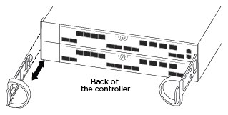
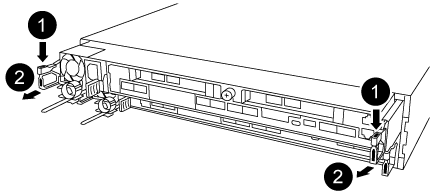
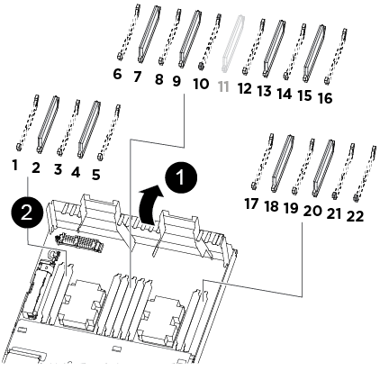
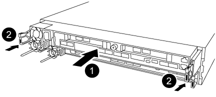

= Replace a DIMM - AFF A320
:icons: font
:imagesdir: ../media/

[.lead]
You must replace a DIMM in the controller module when your system registers an increasing number of correctable error correction codes (ECC); failure to do so causes a system panic.

All other components in the system must be functioning properly; if not, you must contact technical support.

You must replace the failed component with a replacement FRU component you received from your provider.

== Step 1: Shut down the controller

[.lead]
include::../_include/shutdown_most_frus.adoc[]

== Step 2: Remove the controller module

[.lead]
To access components inside the controller module, you must remove the controller module from the chassis.

. If you are not already grounded, properly ground yourself.
. Unplug the controller module power supply from the power source.
. Loosen the hook and loop strap binding the cables to the cable management device, and then unplug the system cables and SFPs (if needed) from the controller module, keeping track of where the cables were connected.
+

+
Leave the cables in the cable management device so that when you reinstall the cable management device, the cables are organized.

. Remove and set aside the cable management devices from the left and right sides of the controller module.
. Remove the controller module from the chassis:

 .. Insert your forefinger into the latching mechanism on either side of the controller module.
 .. Press down on the orange tab on top of the latching mechanism until it clears the latching pin on the chassis.
+
The latching mechanism hook should be nearly vertical and should be clear of the chassis pin.

 .. Gently pull the controller module a few inches toward you so that you can grasp the controller module sides.
 .. Using both hands, gently pull the controller module out of the chassis and set it on a flat, stable surface.

== Step 3: Replace system DIMMs

[.lead]
Replacing a system DIMM involves identifying the target DIMM through the associated error message, locating the target DIMM using the FRU map on the air duct, and then replacing the DIMM.

. Rotate the air duct to the open position.
. Locate the DIMMs on your controller module.
+

+
|===
a|
image:../media/legend_icon_01.png[] a|
Air duct
a|
image:../media/legend_icon_02.png[] a|

 ** System DIMMs slots: 2,4, 7, 9, 13, 15, 18, and 20
 ** NVDIMM slot: 11
+
NOTE: The NVDIMM looks significantly different than system DIMMs.

+
|===

. Note the orientation of the DIMM in the socket so that you can insert the replacement DIMM in the proper orientation.
. Eject the DIMM from its socket by slowly pushing apart the two DIMM ejector tabs on either side of the DIMM, and then slide the DIMM out of the socket.
+
NOTE: Carefully hold the DIMM by the edges to avoid pressure on the components on the DIMM circuit board.

. Remove the replacement DIMM from the antistatic shipping bag, hold the DIMM by the corners, and align it to the slot.
+
The notch among the pins on the DIMM should line up with the tab in the socket.

. Make sure that the DIMM ejector tabs on the connector are in the open position, and then insert the DIMM squarely into the slot.
+
The DIMM fits tightly in the slot, but should go in easily. If not, realign the DIMM with the slot and reinsert it.
+
NOTE: Visually inspect the DIMM to verify that it is evenly aligned and fully inserted into the slot.

. Push carefully, but firmly, on the top edge of the DIMM until the ejector tabs snap into place over the notches at the ends of the DIMM.
. Close the air duct.

== Step 4: Install the controller module

[.lead]
After you have replaced the component in the controller module, you must reinstall the controller module into the chassis, and then boot it to Maintenance mode.

. If you have not already done so, close the air duct at the rear of the controller module and reinstall the cover over the PCIe cards.
. Align the end of the controller module with the opening in the chassis, and then gently push the controller module halfway into the system.
+

+
NOTE: Do not completely insert the controller module in the chassis until instructed to do so.

. Cable the management and console ports only, so that you can access the system to perform the tasks in the following sections.
+
NOTE: You will connect the rest of the cables to the controller module later in this procedure.

. Complete the reinstallation of the controller module:
 .. Make sure the latch arms are locked in the extended position.
 .. Using the latch arms, push the controller module into the chassis bay until it stops.
 .. Press down and hold the orange tabs on top of the latching mechanism.
 .. Gently push the controller module into the chassis bay until it is flush with the edges of the chassis.
+
NOTE: The latching mechanism arms slide into the chassis.
+
The controller module begins to boot as soon as it is fully seated in the chassis.

 .. Release the latches to lock the controller module into place.
 .. Recable the power supply.
 .. If you have not already done so, reinstall the cable management device.
 .. Interrupt the normal boot process by pressing `Ctrl-C`.

== Step 5: Run diagnostics

[.lead]
After you have replaced a system DIMM in your system, you should run diagnostic tests on that component.

Your system must be at the LOADER prompt to start diagnostics.

All commands in the diagnostic procedures are issued from the controller where the component is being replaced.

. If the controller to be serviced is not at the LOADER prompt, reboot the controller: `system node halt -node node_name`
+
After you issue the command, you should wait until the system stops at the LOADER prompt.

. At the LOADER prompt, access the special drivers specifically designed for system-level diagnostics to function properly: `boot_diags`
. Select *Scan System* from the displayed menu to enable running the diagnostics tests.
. Select *Stress-Test system* from the displayed menu.
. Select an option from the displayed sub-menu and run the test.
. Proceed based on the result of the preceding step:
 ** If the test failed, correct the failure, and then rerun the test.
 ** If the test reported no failures, select Reboot from the menu to reboot the system.

== Step 6: Restore the controller module to operation after running diagnostics

[.lead]
After completing diagnostics, you must recable the system, give back the controller module, and then reenable automatic giveback.

. Recable the system, as needed.
+
If you removed the media converters (QSFPs or SFPs), remember to reinstall them if you are using fiber optic cables.

. Return the controller to normal operation by giving back its storage: `storage failover giveback -ofnode _impaired_node_name_`
. If automatic giveback was disabled, reenable it: `storage failover modify -node local -auto-giveback true`

== Step 7: Return the failed part to NetApp

[.lead]
include::../_include/complete_rma.adoc[]
