= Detailed guide - AFF A320
:icons: font
:imagesdir: ../media/

[.lead]
This guide gives detailed step-by-step instructions for installing a typical NetApp system. Use this guide if you want more detailed installation instructions.

== Prepare for installation

[.lead]
To install your AFF A320 system, you need to create an account, register the system, and get license keys. You also need to inventory the appropriate number and type of cables for your system and collect specific network information.

You need to have access to the Hardware Universe for information about site requirements as well as additional information on your configured system. You might also want to have access to the Release Notes for your version of ONTAP for more information about this system.

https://hwu.netapp.com[NetApp Hardware Universe]

http://mysupport.netapp.com/documentation/productlibrary/index.html?productID=62286[Find the Release Notes for your version of ONTAP 9]

You need to provide the following at your site:

* Rack space for the storage system
* Phillips #2 screwdriver
* Additional networking cables to connect your system to your network switch and laptop or console with a Web browser
* A laptop or console with an RJ-45 connection and access to a Web browser

. Unpack the contents of all boxes.
. Record the system serial number from the controllers.
+
image::../media/drw_ssn_label.png[]

. Set up your account:
 .. Log in to your existing account or create an account.
 .. Register your system.
+
https://mysupport.netapp.com/eservice/registerSNoAction.do?moduleName=RegisterMyProduct[NetApp Product Registration]
. Inventory and make a note of the number and types of cables you received.
+
The following table identifies the types of cables you might receive. If you receive a cable not listed in the table, see the Hardware Universe to locate the cable and identify its use.
+
https://hwu.netapp.com[NetApp Hardware Universe]
+
[options="header" cols="1,2,1,2"]
|===
| Type of cable...| Part number and length| Connector type| For...
a|
100 GbE cable (QSF(28)
a|
X66211A-05 (112-00595), 0.5m

X66211A-1 (112-00573), 1m

X66211A-2 (112-00574), 2m

X66211A-5 (112-00574), 5m
a|
image:../media/oie_cable100_gbe_qsfp28.png[]
a|
Storage, cluster interconnect/HA, and Ethernet data (order-dependent)
a|
40 GbE cable
a|
X66211A-1 (112-00573), 1m;

X66211A-3 (112-00543),3m;

X66211A-5 (112-00576), 5m
a|
image:../media/oie_cable_sfp_gbe_copper.png[]
a|
Storage, cluster interconnect/HA, and Ethernet data (order-dependent)
a|
Ethernet cable - MPO
a|
X66200-2 (112-00326), 2m

X66250-5 (112-00328), 5m

X66250-30 (112-00331), 30m
a|

a|
Ethernet cable (order dependent)
a|
Optical cables
a|
SR:

X6553-R6 (112-00188), 2m

X6554-R6 (112-00189), 15m

X6537-R6 (112-00091), 30m

LR:

X66250-3 (112-00342), 2m

X66260-5 (112-00344), 5m

X66260-30 (112-00354), 30m
a|
image:../media/oie_cable_fiber_lc_connector.png[]
a|
FC configurations (order-dependent)
a|
RJ-45 (order dependent)
a|
X6585-R6 (112-00291), 3m

X6562-R6 (112-00196), 5m
a|
image:../media/oie_cable_rj45.png[]
a|
Management network
a|
Micro-USB console cable
a|
Not applicable
a|
image:../media/oie_cable_micro_usb.png[]
a|
Console connection used during software setup if laptop or console does not support network discovery.
a|
Power cables
a|
Not applicable
a|
image:../media/oie_cable_power.png[]
a|
Powering up the system
|===

. Download and complete the _Cluster configuration worksheet_.
+
https://library.netapp.com/ecm/ecm_download_file/ECMLP2839002[Cluster Configuration Worksheet]

== Install the hardware

[.lead]
You need to install your system in a 4-post rack or NetApp system cabinet, as applicable.

. Install the rail kits, as needed.
. Install and secure your system using the instructions included with the rail kit.
+
NOTE: You need to be aware of the safety concerns associated with the weight of the system.
+
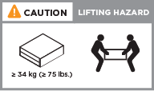

. Attach cable management devices (as shown).
+
image::../media/drw_a320_cable_management_arms.png[]

. Place the bezel on the front of the system.

== Cable controllers to your network

[.lead]
You can cable the controllers to your network by using the two-node switchless cluster method or by using the cluster interconnect network.

=== Option 1: Cable a two-node switchless cluster

[.lead]
The optional data ports, optional NIC cards, and management ports on the controller modules are connected to switches. The cluster interconnect/HA ports are cabled on both controller modules.

You must have contacted your network administrator for information about connecting the system to the switches.

Be sure to check the illustration arrow for the proper cable connector pull-tab orientation.

image::../media/oie_cable_pull_tab_up.png[]

NOTE: As you insert the connector, you should feel it click into place; if you do not feel it click, remove it, turn it around and try again.

. You can used the illustration or the step-by step instructions to complete the cabling between the controllers and to the switches:
+
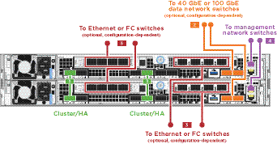
+
[options="header" cols="1,2"]
|===
| Step| Perform on each controller module
a|
image:../media/oie_legend_icon_1_lg.png[]
a|
Cable the cluster/HA ports to each other with the 100 GbE (QSFP28) cable:

** e0a to e0a
** e0d to e0d
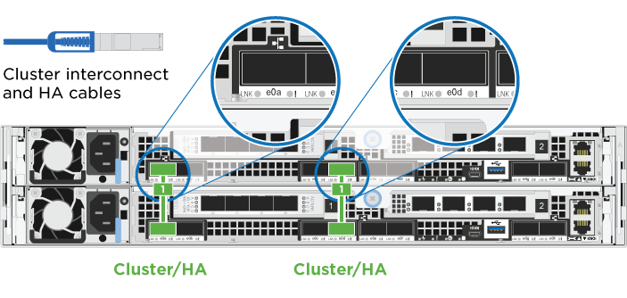

a|
image:../media/oie_legend_icon_2_o.png[]
a|
If you are using your onboard ports for a data network connection, connect the 100GbE or 40Gbe cables to the appropriate data network switches:

** e0g and e0h
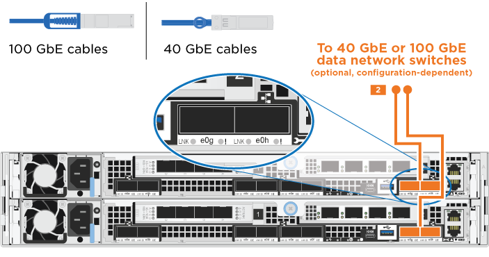

a|

a|
If you are using your NIC cards for Ethernet or FC connections, connect the NIC card(s) to the appropriate switches:

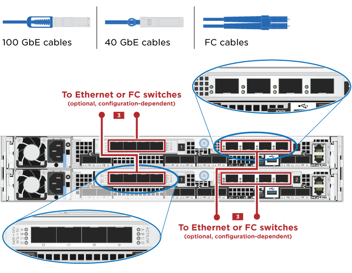
a|

a|
Cable the e0M ports to the management network switches with the RJ45 cables.

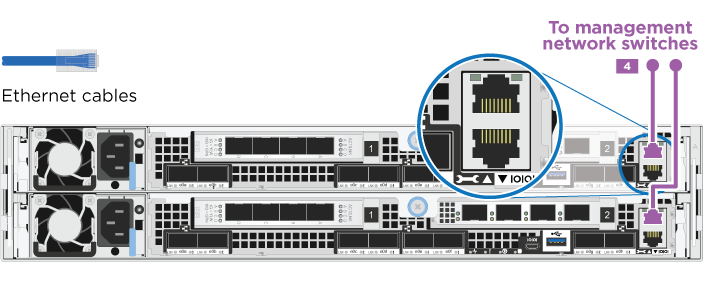
a|
image:../media/oie_legend_icon_attn_symbol.png[]
a|
DO NOT plug in the power cords at this point.
|===

. Cable your storage: link:install_detailed_guide.md#[Cabling controllers to drive shelves]

=== Option 2: Cabling a switched cluster

[.lead]
The optional data ports, optional NIC cards, and management ports on the controller modules are connected to switches. The cluster interconnect/HA ports are cabled on to the cluster/HA switch.

You must have contacted your network administrator for information about connecting the system to the switches.

Be sure to check the illustration arrow for the proper cable connector pull-tab orientation.

image::../media/oie_cable_pull_tab_up.png[]

NOTE: As you insert the connector, you should feel it click into place; if you do not feel it click, remove it, turn it around and try again.

. You can used the illustration or the step-by step instructions to complete the cabling between the controllers and to the switches:
+
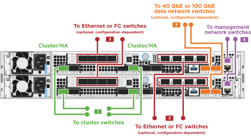
+
[options="header" cols="1,3"]
|===
| Step| Perform on each controller module
a|
image:../media/oie_legend_icon_1_lg.png[]
a|
Cable the cluster/HA ports to the cluster/HA switch with the 100 GbE (QSFP28) cable:

** e0a on both controllers to the cluster/HA switch
** e0d on both controllers to the cluster/HA switch
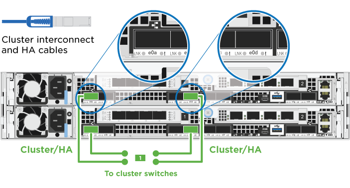

a|
image:../media/oie_legend_icon_2_o.png[]
a|
If you are using your onboard ports for a data network connection, connect the 100GbE or 40Gbe cables to the appropriate data network switches:

 ** e0g and e0h

a|

a|
If you are using your NIC cards for Ethernet or FC connections, connect the NIC card(s) to the appropriate switches:

a|

a|
Cable the e0M ports to the management network switches with the RJ45 cables.

a|
image:../media/oie_legend_icon_attn_symbol.png[]
a|
DO NOT plug in the power cords at this point.
|===

. Cable your storage: link:install_detailed_guide.md#[Cabling controllers to drive shelves]

== Cable controllers to drive shelves

[.lead]
You must cable the controllers to your shelves using the onboard storage ports.

=== Option 1: Cable the controllers to a single drive shelf

[.lead]
You must cable each controller to the NSM modules on the NS224 drive shelf.

Be sure to check the illustration arrow for the proper cable connector pull-tab orientation.

image::../media/oie_cable_pull_tab_up.png[]

NOTE: As you insert the connector, you should feel it click into place; if you do not feel it click, remove it, turn it around and try again.

. You can use the illustration or the step-by-step instructions to cable your controllers to a single shelf.
+
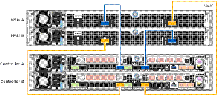
+
[options="header" cols="1,3"]
|===
|Step |Perform on each controller module
a|
image:../media/oie_legend_icon_1_mb.png[]
a|
Cable controller A to the shelf    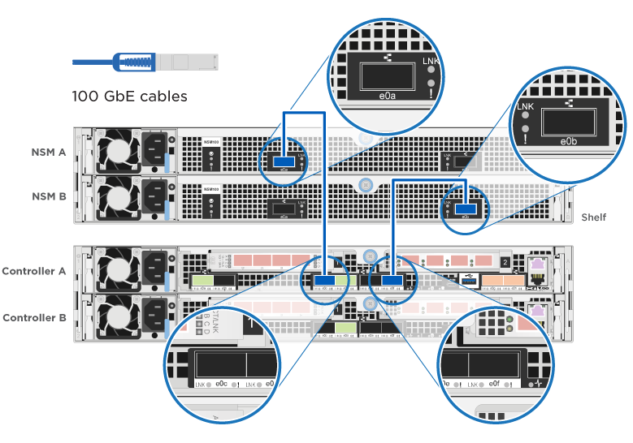
a|
image:../media/oie_legend_icon_2_lo.png[]
a|
Cable controller B to the shelf:    image:../media/drw_a320_storage_cabling_controller_b_single_shelf.png[]
|===

. To complete setting up your system, see link:install_detailed_guide.md#[Completing system setup and configuration].

=== Option 2: Cable the controllers to two drive shelves

[.lead]
You must cable each controller to the NSM modules on both NS224 drive shelves.

Be sure to check the illustration arrow for the proper cable connector pull-tab orientation.

image::../media/oie_cable_pull_tab_up.png[]

NOTE: As you insert the connector, you should feel it click into place; if you do not feel it click, remove it, turn it around and try again.

. You can use the following illustration or the written steps to cable your controllers to two drive shelves.
+
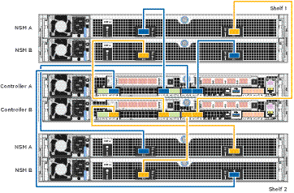
+
[options="header" cols="1-3"]
|===
| Step| Perform on each controller module
a|
image:../media/oie_legend_icon_1_mb.png[]
a|
Cable controller A to the shelves:    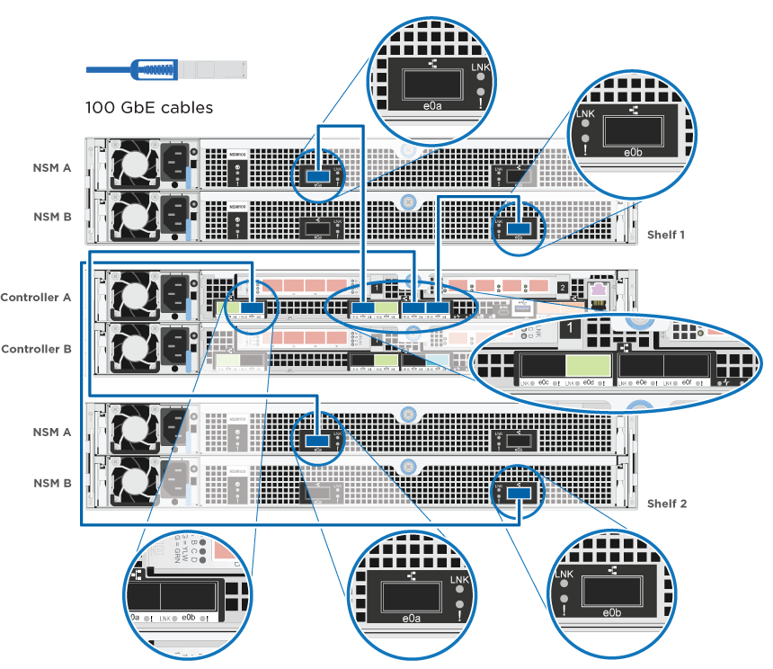
a|
image:../media/oie_legend_icon_2_lo.png[]
a|
Cable controller B to the shelves:    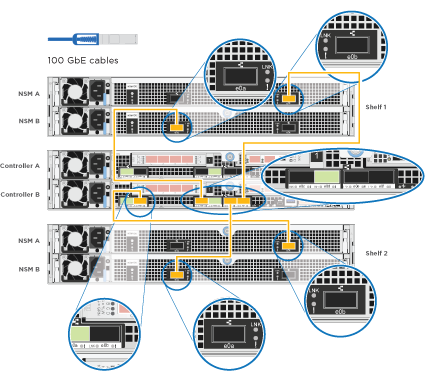
|===

. To complete setting up your system, see link:install_detailed_guide.md#[Completing system setup and configuration].

== Complete system setup and configuration

[.lead]
You can complete the system setup and configuration using cluster discovery with only a connection to the switch and laptop, or by connecting directly to a controller in the system and then connecting to the management switch.

=== Option 1: Completing system setup and configuration if network discovery is enabled

[.lead]
If you have network discovery enabled on your laptop, you can complete system setup and configuration using automatic cluster discovery.

. Plug the power cords into the controller power supplies, and then connect them to power sources on different circuits.
+
The system begins to boot. Initial booting may take up to eight minutes

. Make sure that your laptop has network discovery enabled.
+
See your laptop's online help for more information.

. Use the following animation to connect your laptop to the Management switch.
+
video::d61f983e-f911-4b76-8b3a-ab1b0066909b[panopto, title="Animation - Connect your laptop to the Management switch"]

. Select an ONTAP icon listed to discover:
+
image::../media/drw_autodiscovery_controler_select.png[]

 .. Open File Explorer.
 .. Click network in the left pane.
 .. Right click and select refresh.
 .. Double-click either ONTAP icon and accept any certificates displayed on your screen.
+
NOTE: XXXXX is the system serial number for the target node.
+
System Manager opens.

. Use System Manager guided setup to configure your system using the data you collected in the _NetApp ONTAP Configuration Guide_.
+
https://library.netapp.com/ecm/ecm_download_file/ECMLP2862613[ONTAP Configuration Guide]

. Verify the health of your system by running Config Advisor.
. After you have completed the initial configuration, go to the https://www.netapp.com/data-management/oncommand-system-documentation/[ONTAP & ONTAP System Manager Documentation Resources] page for information about configuring additional features in ONTAP.

=== Option 2: Completing system setup and configuration if network discovery is not enabled

[.lead]
If network discovery is not enabled on your laptop, you must complete the configuration and setup using this task.

. Cable and configure your laptop or console:
 .. Set the console port on the laptop or console to 115,200 baud with N-8-1.
+
NOTE: See your laptop or console's online help for how to configure the console port.

 .. Connect the console cable to the laptop or console using the console cable that came with your system, and then connect the laptop to the management switch on the management subnet.
+
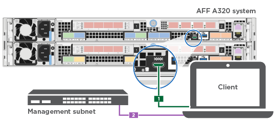

 .. Assign a TCP/IP address to the laptop or console, using one that is on the management subnet.
. Use the following animation to set one or more drive shelf IDs:
+
video::c600f366-4d30-481a-89d9-ab1b0066589b[panopto, title="Animation - Set drive shelf IDs"]

. Plug the power cords into the controller power supplies, and then connect them to power sources on different circuits.
+
The system begins to boot. Initial booting may take up to eight minutes

. Assign an initial node management IP address to one of the nodes.
+
[options="header" cols="1,3"]
|===
| If the management network has DHCP...| Then...
a|
Configured
a|
Record the IP address assigned to the new controllers.
a|
Not configured
a|

 .. Open a console session using PuTTY, a terminal server, or the equivalent for your environment.
+
NOTE: Check your laptop or console's online help if you do not know how to configure PuTTY.

 .. Enter the management IP address when prompted by the script.

+
|===

. Using System Manager on your laptop or console, configure your cluster:
 .. Point your browser to the node management IP address.
+
NOTE: The format for the address is +https://x.x.x.x+.

 .. Configure the system using the data you collected in the _NetApp ONTAP Configuration guide_.
+
https://library.netapp.com/ecm/ecm_download_file/ECMLP2862613[ONTAP Configuration Guide]
. Verify the health of your system by running Config Advisor.
. After you have completed the initial configuration, go to the https://www.netapp.com/data-management/oncommand-system-documentation/[ONTAP & ONTAP System Manager Documentation Resources] page for information about configuring additional features in ONTAP.
