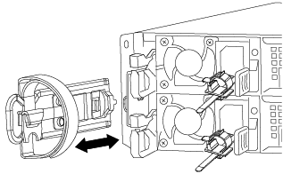
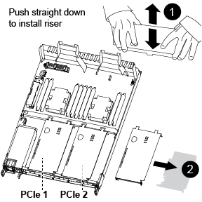

= Replace a PCIe card - AFF A320
:icons: font
:imagesdir: ../media/

[.lead]
To replace a PCIe card, you must disconnect the cables from the cards, remove the SFP and QSFP modules from the cards before removing the riser, reinstall the riser, and then reinstall the SFP and QSFP modules before cabling the cards.

* You can use this procedure with all versions of ONTAP supported by your system
* All other components in the system must be functioning properly; if not, you must contact technical support.

== Step 1: Shut down the impaired node

[.lead]
Shut down or take over the impaired controller using the appropriate procedure for your configuration.

=== Option 1: Most configurations

[.lead]
include::../_include/shutdown_most_frus.adoc[]

=== Option 2: Controller is in a MetroCluster

[.lead]
include::../_include/shutdown_any_mcc_supported.adoc[]

== Step 2: Remove the controller module

[.lead]
To access components inside the controller module, you must remove the controller module from the chassis.

. If you are not already grounded, properly ground yourself.
. Unplug the controller module power supply from the power source.
. Loosen the hook and loop strap binding the cables to the cable management device, and then unplug the system cables and SFPs (if needed) from the controller module, keeping track of where the cables were connected.
+

+
Leave the cables in the cable management device so that when you reinstall the cable management device, the cables are organized.

. Remove and set aside the cable management devices from the left and right sides of the controller module.
. Remove the controller module from the chassis:
+
image::../media/drw_a320_controller_remove_animated_gif.png[]
+
 .. Insert your forefinger into the latching mechanism on either side of the controller module.
 .. Press down on the orange tab on top of the latching mechanism until it clears the latching pin on the chassis.
+
The latching mechanism hook should be nearly vertical and should be clear of the chassis pin.

 .. Gently pull the controller module a few inches toward you so that you can grasp the controller module sides.
 .. Using both hands, gently pull the controller module out of the chassis and set it on a flat, stable surface.

== Step 3: Replace a PCIe card

[.lead]
You must remove the PCIe riser containing the failed PCIe card from the controller module, remove the failed PCIe card from the riser, install the replacement PCIe card in the riser, and then reinstall the riser into the controller module.

. Remove the cover over the PCIe risers by unscrewing the blue thumbscrew on the cover, slide the cover toward you, rotate the cover upward, lift it off the controller module, and then set it aside.
. Remove the riser with the failed PCIe card:
 .. Remove any SFP or QSFP modules that might be in the PCIe cards.
 .. Place your forefinger into the hole on the left side of the riser module and grasp the riser with your thumb.
 .. Lift the riser straight out of the socket and set it aside.
. Replace the card in the riser:
 .. Place the riser on a stable surface, and then turn the riser so that you can access the PCIe card.
 .. Place your thumbs just below the bottom edge of the PCIe card on either side of the socket, and then gently push up to release the card from the socket.
 .. Slide the card out of the riser and set it aside.
 .. Align the replacement card bezel with the edge of the riser and the outside edge of the card with the alignment guide on the left side of the riser.
 .. Gently slide the card until the card connector aligns with the riser socket, and then gently push the card down into the socket.
. Reinstall the riser in the controller module:
 .. Align the riser over the opening so that the front edges of the riser are directly over the openings on the riser bay.
 .. Aligning the back edge of the riser so that the pins on the underside of the riser are over the holes in the sheet metal at the back riser bay.
 .. Apply even downward pressure to seat the riser straight down into the socket on the controller module.
 .. Reinstall the PCIe riser cover on the controller module.

== Sep 4: Install the controller module

[.lead]
After you have replaced the component in the controller module, you must reinstall the controller module into the chassis, and then boot it to Maintenance mode.

. If you have not already done so, close the air duct at the rear of the controller module and reinstall the cover over the PCIe cards.
. Align the end of the controller module with the opening in the chassis, and then gently push the controller module halfway into the system.
+
image::../media/drw_a320_controller_install_animated_gif.png[]
+
NOTE: Do not completely insert the controller module in the chassis until instructed to do so.

. Cable the management and console ports only, so that you can access the system to perform the tasks in the following sections.
+
NOTE: You will connect the rest of the cables to the controller module later in this procedure.

. Complete the reinstallation of the controller module:
 .. Make sure the latch arms are locked in the extended position.
 .. Using the latch arms, push the controller module into the chassis bay until it stops.
 .. Press down and hold the orange tabs on top of the latching mechanism.
 .. Gently push the controller module into the chassis bay until it is flush with the edges of the chassis.
+
NOTE: The latching mechanism arms slide into the chassis.
+
The controller module begins to boot as soon as it is fully seated in the chassis.

 .. Release the latches to lock the controller module into place.
 .. Recable the power supply.
 .. If you have not already done so, reinstall the cable management device.
 .. Interrupt the normal boot process by pressing `Ctrl-C`.

== Step 5: Restore the controller module to operation

[.lead]
After completing diagnostics, you must recable the system, give back the controller module, and then reenable automatic giveback.

. Recable the system, as needed.
+
If you removed the media converters (QSFPs or SFPs), remember to reinstall them if you are using fiber optic cables.

. Return the node to normal operation by giving back its storage: `storage failover giveback -ofnode _impaired_node_name_`
. If automatic giveback was disabled, reenable it: `storage failover modify -node local -auto-giveback true`

== Step 6: Return the failed part to NetApp

[.lead]
include::../_include/complete_rma.adoc[]
