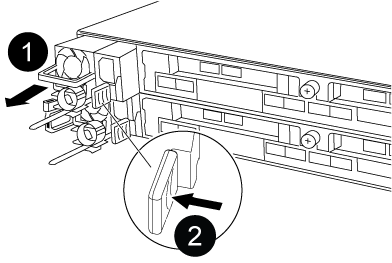

= Replace a power supply - AFF A320
:icons: font
:imagesdir: ../media/

[.lead]
Replacing a power supply (PSU) involves disconnecting the target PSU from the power source, unplugging the power cable, removing the old PSU and installing the replacement PSU, and then reconnecting the replacement PSU to the power source.

* The power supplies are redundant and hot-swappable.
* This procedure is written for replacing one power supply at a time.
+
NOTE: It is a best practice to replace the power supply within two minutes of removing it from the chassis. The system continues to function, but ONTAP sends messages to the console about the degraded power supply until the power supply is replaced.

* Power supplies are auto-ranging.

.Steps

. If you are not already grounded, properly ground yourself.
. Identify the power supply you want to replace, based on console error messages or through the LEDs on the power supplies.
. Disconnect the power supply:
 .. Open the power cable retainer, and then unplug the power cable from the power supply.
 .. Unplug the power cable from the power source.
. Remove the power supply:
 .. Rotate the cam handle so that it can be used to pull the power supply out of the chassis.
 .. Press the blue locking tab to release the power supply from the chassis.
 .. Using both hands, pull the power supply out of the chassis, and then set it aside.
. Using both hands, support and align the edges of the power supply with the opening in the controller module, and then gently push the power supply into the controller module until the locking tab clicks into place.
+
The power supplies will only properly engage with the internal connector and lock in place one way.
+
NOTE: To avoid damaging the internal connector, do not use excessive force when sliding the power supply into the system.

. Rotate the cam handle so that it is flush against the power supply.
. Reconnect the power supply cabling:
 .. Reconnect the power cable to the power supply and the power source.
 .. Secure the power cable to the power supply using the power cable retainer.

+
Once power is restored to the power supply, the status LED should be green.

include::../_include/complete_rma_step.adoc[]
