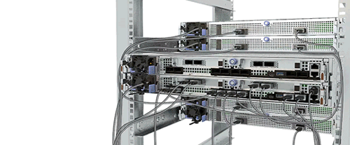
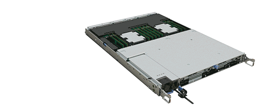

= Replace the real-time clock battery - AFF A320
:icons: font
:imagesdir: ../media/

[.lead]
You replace the real-time clock (RTC) battery in the controller module so that your system's services and applications that depend on accurate time synchronization continue to function.

* You can use this procedure with all versions of ONTAP supported by your system
* All other components in the system must be functioning properly; if not, you must contact technical support.

== Shut down the node

[.lead]
include::../_include/shutdown_most_frus.adoc[]

== Replace the RTC battery

[.lead]
You need to locate the RTC battery inside the controller module, and then follow the specific sequence of steps.

== Remove the controller module

[.lead]
To access components inside the controller module, you must remove the controller module from the chassis.

. If you are not already grounded, properly ground yourself.
. Unplug the controller module power supply from the power source.
. Loosen the hook and loop strap binding the cables to the cable management device, and then unplug the system cables and SFPs (if needed) from the controller module, keeping track of where the cables were connected.
+
image::../media/drw_a320_cable_management_arms.png[]
+
Leave the cables in the cable management device so that when you reinstall the cable management device, the cables are organized.

. Remove and set aside the cable management devices from the left and right sides of the controller module.
. Remove the controller module from the chassis:
+

+
 .. Insert your forefinger into the latching mechanism on either side of the controller module.
 .. Press down on the orange tab on top of the latching mechanism until it clears the latching pin on the chassis.
+
The latching mechanism hook should be nearly vertical and should be clear of the chassis pin.

 .. Gently pull the controller module a few inches toward you so that you can grasp the controller module sides.
 .. Using both hands, gently pull the controller module out of the chassis and set it on a flat, stable surface.

== Replace the RTC battery

. Remove the PCIe cover.
 .. Unscrew the blue thumbscrew located above the onboard ports at the back of the controller module.
 .. Slide the cover toward you and rotate the cover upward.
 .. Remove the cover and set it aside.
. Locate, remove, and then replace the RTC battery:
 .. Using the FRU map, locate the RTC battery on the controller module.
 .. Gently push the battery away from the holder, rotate it away from the holder, and then lift it out of the holder.
+
NOTE: Note the polarity of the battery as you remove it from the holder. The battery is marked with a plus sign and must be positioned in the holder correctly. A plus sign near the holder tells you how the battery should be positioned.

 .. Remove the replacement battery from the antistatic shipping bag.
 .. Note the polarity of the RTC battery, and then insert it into the holder by tilting the battery at an angle and pushing down.
. Visually inspect the battery to make sure that it is completely installed into the holder and that the polarity is correct.
. Reinstall the PCIe cover on the controller module.

== Reinstall the controller module and setting time/date after RTC battery replacement

[.lead]
After you replace a component within the controller module, you must reinstall the controller module in the system chassis, reset the time and date on the controller, and then boot it.

. If you have not already done so, close the air duct or controller module cover.
. Align the end of the controller module with the opening in the chassis, and then gently push the controller module halfway into the system.
+
Do not completely insert the controller module in the chassis until instructed to do so.

. Recable the system, as needed.
+
If you removed the media converters (QSFPs or SFPs), remember to reinstall them if you are using fiber optic cables.

. If the power supplies were unplugged, plug them back in and reinstall the power cable retainers.
. Complete the reinstallation of the controller module:
 .. Make sure the latch arms are locked in the extended position.
 .. Using the latch arms, push the controller module into the chassis bay until it stops.
+
NOTE: Do not push down on the latching mechanism at the top of the latch arms. Doing so with raise the locking mechanism and prohibit sliding the controller module into the chassis.

 .. Press down and hold the orange tabs on top of the latching mechanism.
 .. Gently push the controller module into the chassis bay until it is flush with the edges of the chassis.
+
NOTE: The latching mechanism arms slide into the chassis.
+
The controller module begins to boot as soon as it is fully seated in the chassis.

 .. Release the latches to lock the controller module into place.
 .. If you have not already done so, reinstall the cable management device.
 .. Halt the controller at the LOADER prompt.
. Reset the time and date on the controller:
 .. Check the date and time on the healthy node with the `show date` command.
 .. At the LOADER prompt on the target node, check the time and date.
 .. If necessary, modify the date with the `set date mm/dd/yyyy` command.
 .. If necessary, set the time, in GMT, using the `set time hh:mm:ss` command.
 .. Confirm the date and time on the target node.
. At the LOADER prompt, enter `bye` to reinitialize the PCIe cards and other components and let the node reboot.
. Return the node to normal operation by giving back its storage: `storage failover giveback -ofnode impaired_node_name`
. If automatic giveback was disabled, reenable it: `storage failover modify -node local -auto-giveback true`

== Return the failed part to NetApp

[.lead]
include::../_include/complete_rma.adoc[]
