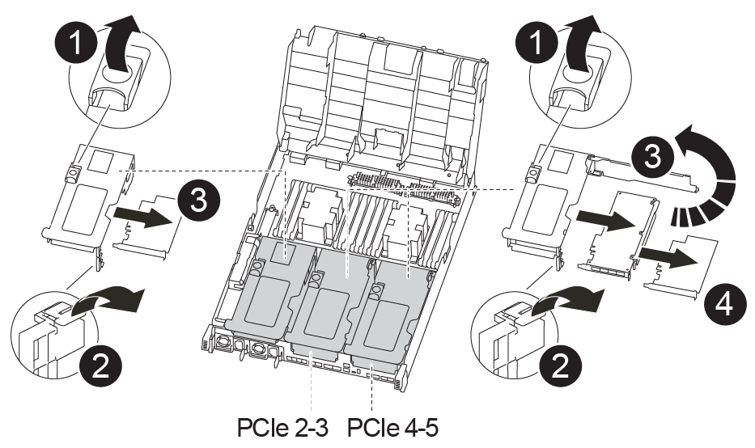
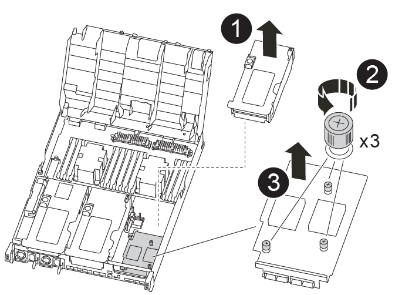

= Replace a PCIe or mezzanine card - AFF A400
:icons: font
:imagesdir: ../media/

[.lead]
To replace a PCIe or mezzanine card, you must disconnect the cables and any SFP and QSFP modules from the cards, replace the failed PCIe or mezzanine card, and then recable the cards.

* You can use this procedure with all versions of ONTAP supported by your system
* All other components in the system must be functioning properly; if not, you must contact technical support.

== Step 1: Shut down the impaired controller

[.lead]
You can shut down or take over the impaired controller using different procedures, depending on the storage system hardware configuration.

[role="tabbed-block"]
====

.Option 1: Most configurations

--

[.lead]
include::../_include/shutdown_most_frus.adoc[]

--

.Option 2: Controller is in a two-node MetroCluster

--

[.lead]
include::../_include/shutdown_2n_mcc.adoc[]

--
====

== Step 2: Remove the controller module

[.lead]
To access components inside the controller module, you must remove the controller module from the chassis.

You can use the following animations, illustration, or the written steps to remove the controller module from the chassis.

video::ca74d345-e213-4390-a599-aae10019ec82[panopto, title="Animation - Remove the controller module"]

image::../media/drw_A400_Remove_controller.png[]

. If you are not already grounded, properly ground yourself.
. Release the power cable retainers, and then unplug the cables from the power supplies.
. Loosen the hook and loop strap binding the cables to the cable management device, and then unplug the system cables and SFPs (if needed) from the controller module, keeping track of where the cables were connected.
+
Leave the cables in the cable management device so that when you reinstall the cable management device, the cables are organized.

. Remove the cable management device from the controller module and set it aside.
. Press down on both of the locking latches, and then rotate both latches downward at the same time.
+
The controller module moves slightly out of the chassis.

. Slide the controller module out of the chassis.
+
Make sure that you support the bottom of the controller module as you slide it out of the chassis.

. Place the controller module on a stable, flat surface.

== Step 3: Replace a PCIe card

[.lead]
To replace a PCIe card, you must locate the failed PCIe card, remove the riser that contains the card from the controller module, replace the card, and then reinstall the PCIe riser in the controller module.

You can use the following animation, illustration, or the written steps to replace a PCIe card.

video::84339f87-321c-400e-985e-aae10182cd24[panopto, title="Animation - Replace a PCIe card"]

. Remove the riser containing the card to be replaced:
 .. Open the air duct by pressing the locking tabs on the sides of the air duct, slide it toward the back of the controller module, and then rotate it to its completely open position.
 .. Remove any SFP or QSFP modules that might be in the PCIe cards.
 .. Rotate the riser locking latch on the left side of the riser up and toward air duct.
+
The riser raises up slightly from the controller module.

 .. Lift the riser up straight up and set it aside on a stable flat surface,
. Remove the PCIe card from the riser:
 .. Turn the riser so that you can access the PCIe card.
 .. Press the locking bracket on the side of the PCIe riser, and then rotate it to the open position.
 .. For risers 2 and 3 only, swing the side panel up.
 .. Remove the PCIe card from the riser by gently pushing up on the bracket and lift the card straight out of the socket.
. Install the replacement PCIe card in the riser by aligning the card with the socket, press the card into the socket and then close the side panel on the riser, if present.
+
Be sure that you properly align the card in the slot and exert even pressure on the card when seating it in the socket. The PCIe card must be fully and evenly seated in the slot.
+
NOTE: If you are installing a card in the bottom slot and cannot see the card socket well, remove the top card so that you can see the card socket, install the card, and then reinstall the card you removed from the top slot.

. Reinstall the riser:
 .. Align the riser with the pins to the side of the riser socket, lower the riser down on the pins.
 .. Push the riser squarely into the socket on the motherboard.
 .. Rotate the latch down flush with the sheet metal on the riser.

== Step 4: Replace the mezzanine card

[.lead]
The mezzanine card is located under riser number 3 (slots 4 and 5). You must remove that riser to access the mezzanine card, replace the mezzanine card, and then reinstall riser number 3. See the FRU map on the controller module for more information.

You can use the following animation, illustration, or the written steps to replace the mezzanine card.

video::4e00f5b1-8ca5-4cd6-9881-aadb01578e52[panopto, title="Animation - Replace the mezzanine card"]

. Remove riser number 3 (slots 4 and 5):
 .. Open the air duct by pressing the locking tabs on the sides of the air duct, slide it toward the back of the controller module, and then rotate it to its completely open position.
 .. Remove any SFP or QSFP modules that might be in the PCIe cards.
 .. Rotate the riser locking latch on the left side of the riser up and toward air duct.
+
The riser raises up slightly from the controller module.

 .. Lift the riser up, and then set it aside on a stable, flat surface.
. Replace the mezzanine card:
 .. Remove any QSFP or SFP modules from the card.
 .. Loosen the thumbscrews on the mezzanine card, and gently lift the card directly out of the socket and set it aside.
 .. Align the replacement mezzanine card over the socket and the guide pins and gently push the card into the socket.
 .. Tighten the thumbscrews on the mezzanine card.
. Reinstall the riser:
 .. Align the riser with the pins to the side of the riser socket, lower the riser down on the pins.
 .. Push the riser squarely into the socket on the motherboard.
 .. Rotate the latch down flush with the sheet metal on the riser.

== Step 5: Install the controller module

[.lead]
After you have replaced the component in the controller module, you must reinstall the controller module into the chassis, and then boot it to Maintenance mode.

You can use the following animation, illustration, or the written steps to install the controller module in the chassis.

video::0310fe80-b129-4685-8fef-ab19010e720a[panopto, title="Animation - Install the controller module"]

image::../media/drw_A400_Install_controller_source.png[]

. If you have not already done so, close the air duct.
. Align the end of the controller module with the opening in the chassis, and then gently push the controller module halfway into the system.
+
NOTE: Do not completely insert the controller module in the chassis until instructed to do so.

. Recable the system, as needed.
+
If you removed the media converters (QSFPs or SFPs), remember to reinstall them if you are using fiber optic cables.

. Complete the installation of the controller module:
 .. Plug the power cord into the power supply, reinstall the power cable locking collar, and then connect the power supply to the power source.
 .. Using the locking latches, firmly push the controller module into the chassis until it meets the midplane and is fully seated.
+
The locking latches rise when the controller module is fully seated.
+
NOTE: Do not use excessive force when sliding the controller module into the chassis to avoid damaging the connectors.
+
The controller module begins to boot as soon as it is fully seated in the chassis. Be prepared to interrupt the boot process.

 .. Fully seat the controller module in the chassis by rotating the locking latches upward, tilting them so that they clear the locking pins, gently push the controller all the way in, and then lower the locking latches into the locked position.
 .. If you have not already done so, reinstall the cable management device.
 .. Interrupt the normal boot process and boot to LOADER by pressing `Ctrl-C`.
+
NOTE: If your system stops at the boot menu, select the option to boot to LOADER.

 .. At the LOADER prompt, enter `bye` to reinitialize the PCIe cards and other components and let the controller reboot.
. Return the controller to normal operation by giving back its storage: `storage failover giveback -ofnode _impaired_node_name_`
. If automatic giveback was disabled, reenable it: `storage failover modify -node local -auto-giveback true`

== Step 6: Restore the controller module to operation

[.lead]
To restore the controller, you must recable the system, give back the controller module, and then reenable automatic giveback.

. Recable the system, as needed.
+
If you removed the media converters (QSFPs or SFPs), remember to reinstall them if you are using fiber optic cables.

. Return the controller to normal operation by giving back its storage: `storage failover giveback -ofnode _impaired_node_name_`
. If automatic giveback was disabled, reenable it: `storage failover modify -node local -auto-giveback true`

== Step 7: Switch back aggregates in a two-node MetroCluster configuration

[.lead]
include::../_include/2n_mcc_switchback.adoc[]

== Step 8: Return the failed part to NetApp

[.lead]
include::../_include/complete_rma.adoc[]
