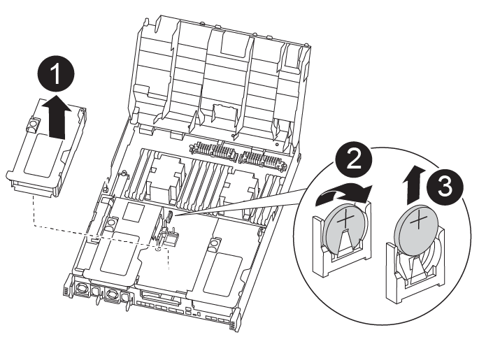

= Replace the real-time clock battery - AFF A400
:icons: font
:imagesdir: ../media/

[.lead]
You replace the real-time clock (RTC) battery in the controller module so that your system's services and applications that depend on accurate time synchronization continue to function.

* You can use this procedure with all versions of ONTAP supported by your system
* All other components in the system must be functioning properly; if not, you must contact technical support.

== Step 1: Shut down the impaired controller

[.lead]
You can shut down or take over the impaired controller using different procedures, depending on the storage system hardware configuration.

[role="tabbed-block"]
====

.Option 1: Most configurations

--

[.lead]
include::../_include/shutdown_most_frus.adoc[]

--

.Option 2: Controller is in a two-node MetroCluster

--

[.lead]
include::../_include/shutdown_2n_mcc.adoc[]

--
====

== Step 2: Remove the controller module

[.lead]
To access components inside the controller module, you must remove the controller module from the chassis.

You can use the following animations, illustration, or the written steps to remove the controller module from the chassis.

video::ca74d345-e213-4390-a599-aae10019ec82[panopto, title="Animation - Remove the controller module"]

image::../media/drw_A400_Remove_controller.png[]

. If you are not already grounded, properly ground yourself.
. Release the power cable retainers, and then unplug the cables from the power supplies.
. Loosen the hook and loop strap binding the cables to the cable management device, and then unplug the system cables and SFPs (if needed) from the controller module, keeping track of where the cables were connected.
+
Leave the cables in the cable management device so that when you reinstall the cable management device, the cables are organized.

. Remove the cable management device from the controller module and set it aside.
. Press down on both of the locking latches, and then rotate both latches downward at the same time.
+
The controller module moves slightly out of the chassis.

. Slide the controller module out of the chassis.
+
Make sure that you support the bottom of the controller module as you slide it out of the chassis.

. Place the controller module on a stable, flat surface.

== Step 3: Replace the RTC battery

[.lead]
You need to locate the RTC battery inside the controller module, and then follow the specific sequence of steps. See the FRU map inside the controller module for the location of the RTC battery.

You can use the following animation, illustration, or the written steps to replace the RTC battery.

video::80fe7a9b-de6f-46e0-a18b-aadb0157263d[panopto, title="Animation - Replace the RTC battery"]

. If you are not already grounded, properly ground yourself.
. Open the air duct:
 .. Press the locking tabs on the sides of the air duct in toward the middle of the controller module.
 .. Slide the air duct toward the back of the controller module, and then rotate it upward to its completely open position.
. Locate, remove, and then replace the RTC battery:
 .. Using the FRU map, locate the RTC battery on the controller module.
 .. Gently push the battery away from the holder, rotate it away from the holder, and then lift it out of the holder.
+
NOTE: Note the polarity of the battery as you remove it from the holder. The battery is marked with a plus sign and must be positioned in the holder correctly. A plus sign near the holder tells you how the battery should be positioned.

 .. Remove the replacement battery from the antistatic shipping bag.
 .. Note the polarity of the RTC battery, and then insert it into the holder by tilting the battery at an angle and pushing down.
. Visually inspect the battery to make sure that it is completely installed into the holder and that the polarity is correct.
. Close the air duct.

== Step 4: Reinstall the controller module and setting time/date after RTC battery replacement

[.lead]
After you replace a component within the controller module, you must reinstall the controller module in the system chassis, reset the time and date on the controller, and then boot it.

You can use the following animation, illustration, or the written steps to install the controller module in the chassis.

video::0310fe80-b129-4685-8fef-ab19010e720a[panopto, title="Animation - Install the controller module"]

image::../media/drw_A400_Install_controller_source.png[]

. If you have not already done so, close the air duct or controller module cover.
. Align the end of the controller module with the opening in the chassis, and then gently push the controller module halfway into the system.
+
Do not completely insert the controller module in the chassis until instructed to do so.

. Recable the system, as needed.
+
If you removed the media converters (QSFPs or SFPs), remember to reinstall them if you are using fiber optic cables.

. If the power supplies were unplugged, plug them back in and reinstall the power cable retainers.
. Complete the installation of the controller module:
 .. Using the locking latches, firmly push the controller module into the chassis until it meets the midplane and is fully seated.
+
The locking latches rise when the controller module is fully seated.
+
NOTE: Do not use excessive force when sliding the controller module into the chassis to avoid damaging the connectors.
+
The controller module begins to boot as soon as it is fully seated in the chassis. Be prepared to interrupt the boot process.

 .. Fully seat the controller module in the chassis by rotating the locking latches upward, tilting them so that they clear the locking pins, gently push the controller all the way in, and then lower the locking latches into the locked position.
 .. If you have not already done so, reinstall the cable management device.
 .. Interrupt the normal boot process and boot to LOADER by pressing `Ctrl-C`.
+
NOTE: If your system stops at the boot menu, select the option to boot to LOADER.

. Reset the time and date on the controller:
 .. Check the date and time on the healthy controller with the `show date` command.
 .. At the LOADER prompt on the target controller, check the time and date.
 .. If necessary, modify the date with the `set date mm/dd/yyyy` command.
 .. If necessary, set the time, in GMT, using the `set time hh:mm:ss` command.
 .. Confirm the date and time on the target controller.
. At the LOADER prompt, enter `bye` to reinitialize the PCIe cards and other components and let the controller reboot.
. Return the controller to normal operation by giving back its storage: `storage failover giveback -ofnode _impaired_node_name_`
. If automatic giveback was disabled, reenable it: `storage failover modify -node local -auto-giveback true`

== Step 5: Switch back aggregates in a two-node MetroCluster configuration

[.lead]
include::../_include/2n_mcc_switchback.adoc[]

== Step 6: Return the failed part to NetApp

[.lead]
include::../_include/complete_rma.adoc[]
