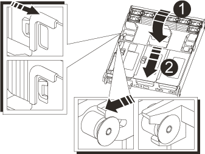

= Transfer the boot image to the boot media - AFF A700s
:icons: font
:imagesdir: ../media/

[.lead]
You can install the system image to the replacement boot media using by using either the image on second boot media installed in the controller module, the primary method to restore the system image, or by transferring the boot image to the boot media using a USB flash drive when the secondary boot media restore failed or if the image.tgz file is not found on the secondary boot media.

== Option 1: Transfer files to the boot media using backup recovery from the second boot media
:icons: font
:imagesdir: ../media/

[.lead]
You can install the system image to the replacement boot media using the image on second boot media installed in the controller module. This is the primary method for transferring the boot media files to the replacement boot media in systems with two boot media in the controller module.

The image on the secondary boot media must contain an `image.tgz` file and must not be reporting failures. If image.tgz file is missing or the boot media reports failures, you cannot use this procedure. You must transfer the boot image to the replacement boot media using the USB flash drive replacement procedure.

.Steps

. If you are not already grounded, properly ground yourself.
. If you have not already done so, close the air duct:
 .. Swing the air duct all the way down to the controller module.
 .. Slide the air duct toward the risers until the locking tabs click into place.
 .. Inspect the air duct to make sure that it is properly seated and locked into place.
+

+
|===
a|
image:../media/legend_icon_01.gif[] a|
Air duct
a|
image:../media/legend_icon_02.gif[]
a|
Risers
|===
. Align the end of the controller module with the opening in the chassis, and then gently push the controller module halfway into the system.
. Reinstall the cable management device and recable the system, as needed.
+
When recabling, remember to reinstall the media converters (SFPs) if they were removed.

. Recable the power supply, and then connect it to the power source.
+
Make sure that you reattach the power cable locking collar on the power cord.

. Gently push the controller module all the way into the system until the controller module locking hooks begin to rise, firmly push on the locking hooks to finish seating the controller module, and then swing the locking hooks into the locked position over the pins on the controller module.
+
The node begins to boot as soon as it is completely installed into the chassis.

. Interrupt the boot process by pressing Ctrl-C to stop at the LOADER prompt.
+
If you miss this message, press Ctrl-C, select the option to boot to Maintenance mode, and then halt the node to boot to LOADER.

. From the LOADER prompt, boot the recovery image from the secondary boot media: `boot_recovery`
+
The image is downloaded from the secondary boot media.

. When prompted, either enter the name of the image or accept the default image displayed inside the brackets on your screen.
. After the image is installed, start the restoration process:
 .. Record the IP address of the impaired node that is displayed on the screen.
 .. Press `y` when prompted to restore the backup configuration.
 .. Press `y` when prompted to confirm that the backup procedure was successful.
. From the partner node in advanced privilege level, start the configuration synchronization using the IP address recorded in the previous step: `system node restore-backup -node local -target-address impaired_node_IP_address`
. After the configuration synchronization is complete without errors, press `y` when prompted to confirm that the backup procedure was successful.
. Press `y` when prompted whether to use the restored copy, and then press `y` when prompted to reboot the node.
. Exit advanced privilege level on the healthy node.

== Option 2: Transfer the boot image to the boot media using a USB flash drive
:icons: font
:imagesdir: ../media/

[.lead]
This procedure should only be used if the secondary boot media restore failed or if the image.tgz file is not found on the secondary boot media.

* You must have a USB flash drive, formatted to FAT32, with at least 4GB capacity.
* A copy of the same image version of ONTAP as what the impaired controller was running. You can download the appropriate image from the Downloads section on the NetApp Support Site
 ** If NVE is enabled, download the image with NetApp Volume Encryption, as indicated in the download button.
 ** If NVE is not enabled, download the image without NetApp Volume Encryption, as indicated in the download button.
* If your system is an HA pair, you must have a network connection.
* If your system is a stand-alone system you do not need a network connection, but you must perform an additional reboot when restoring the var file system.

.Steps

. If you are not already grounded, properly ground yourself.
. If you have not already done so, close the air duct:
 .. Swing the air duct all the way down to the controller module.
 .. Slide the air duct toward the risers until the locking tabs click into place.
 .. Inspect the air duct to make sure that it is properly seated and locked into place.
+

+
|===
a|
image:../media/legend_icon_01.gif[] a|
Air duct
a|
image:../media/legend_icon_02.gif[]
a|
Risers
|===

. Align the end of the controller module with the opening in the chassis, and then gently push the controller module halfway into the system.
. Reinstall the cable management device and recable the system, as needed.
+
When recabling, remember to reinstall the media converters (SFPs) if they were removed.

. Recable the power supply, and then connect it to the power source.
+
Make sure that you reattach the power cable locking collar on the power cord.

. Insert the USB flash drive into the USB slot on the controller module.
+
Make sure that you install the USB flash drive in the slot labeled for USB devices, and not in the USB console port.

. Gently push the controller module all the way into the system until the controller module locking hooks begin to rise, firmly push on the locking hooks to finish seating the controller module, and then swing the locking hooks into the locked position over the pins on the controller module.
+
The node begins to boot as soon as it is completely installed into the chassis.

. Interrupt the boot process by pressing Ctrl-C to stop at the LOADER prompt.
+
If you miss this message, press Ctrl-C, select the option to boot to Maintenance mode, and then halt the node to boot to LOADER.

. Although the environment variables and bootargs are retained, you should check that all required boot environment variables and bootargs are properly set for your system type and configuration using the `printenv bootarg name` command and correct any errors using the `setenv variable-name <value\>` command.
.. Check the boot environment variables:
 *** `bootarg.init.boot_clustered`
 *** `partner-sysid`
 *** `bootarg.init.flash_optimized` for AFF C190/AFF A220 (All Flash FAS)
 *** `bootarg.init.san_optimized` for AFF A220 and All SAN Array
 *** `bootarg.init.switchless_cluster.enable`
.. If External Key Manager is enabled, check the bootarg values, listed in the `kenv` ASUP output:
 *** `bootarg.storageencryption.support <value>`
 *** `bootarg.keymanager.support <value>`
 *** `kmip.init.interface <value>`
 *** `kmip.init.ipaddr <value>`
 *** `kmip.init.netmask <value>`
 *** `kmip.init.gateway <value>`
.. If Onboard Key Manager is enabled, check the bootarg values, listed in the `kenv` ASUP output:
 *** `bootarg.storageencryption.support <value>`
 *** `bootarg.keymanager.support <value>`
 *** `bootarg.onboard_keymanager <value>`
 .. Save the environment variables you changed with the `savenv` command
 .. Confirm your changes using the `printenv variable-name` command.
. From the LOADER prompt, boot the recovery image from the USB flash drive: `boot_recovery`
+
The image is downloaded from the USB flash drive.

. When prompted, either enter the name of the image or accept the default image displayed inside the brackets on your screen.
. After the image is installed, start the restoration process:
 .. Record the IP address of the impaired node that is displayed on the screen.
 .. Press `y` when prompted to restore the backup configuration.
 .. Press `y` when prompted to confirm that the backup procedure was successful.
. Press `y` when prompted whether to use the restored copy, and then press `y` when prompted to reboot the node.
. From the partner node in advanced privilege level, start the configuration synchronization using the IP address recorded in the previous step: `system node restore-backup -node local -target-address impaired_node_IP_address`
. After the configuration synchronization is complete without errors, press `y` when prompted to confirm that the backup procedure was successful.
. Press `y` when prompted whether to use the restored copy, and then press `y` when prompted to reboot the node.
. Verify that the environmental variables are set as expected.
 .. Take the node to the LOADER prompt.
+
From the ONTAP prompt, you can issue the command system node halt -skip-lif-migration-before-shutdown true -ignore-quorum-warnings true -inhibit-takeover true.

 .. Check the environment variable settings with the `printenv` command.
 .. If an environment variable is not set as expected, modify it with the `setenv __environment-variable-name__ __changed-value__` command.
 .. Save your changes using the `savenev` command.
 .. Reboot the node.
. With the rebooted impaired node displaying the Waiting for Giveback... message, perform a giveback from the healthy node:
+
[options="header" cols="1,2"]
|===
| If your system is in...| Then...
a|
An HA pair
a|
After the impaired node is displaying the Waiting for Giveback... message, perform a giveback from the healthy node:

 .. From the healthy node: `storage failover giveback -ofnode partner_node_name`
+
The impaired node takes back its storage, finishes booting, and then reboots and is again taken over by the healthy node.
+
NOTE: If the giveback is vetoed, you can consider overriding the vetoes.
+
http://docs.netapp.com/ontap-9/topic/com.netapp.doc.dot-cm-hacg/home.html[ONTAP 9 High-Availability Configuration Guide]

 .. Monitor the progress of the giveback operation by using the storage failover show-giveback command.
 .. After the giveback operation is complete, confirm that the HA pair is healthy and that takeover is possible by using the `storage failover show` command.
 .. Restore automatic giveback if you disabled it using the storage failover modify command.

+
|===

. Exit advanced privilege level on the healthy node.
