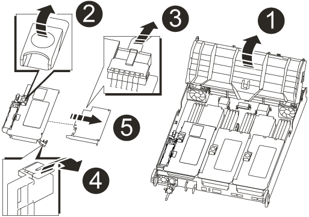
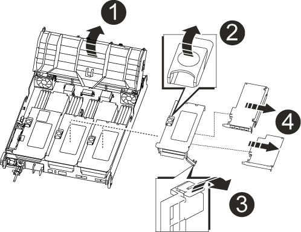
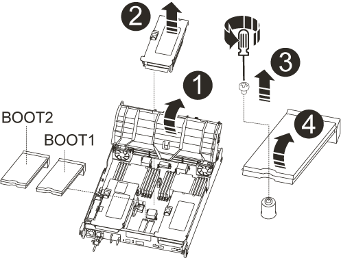
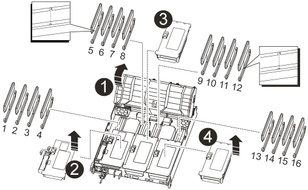
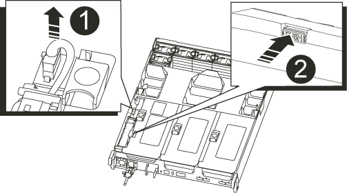
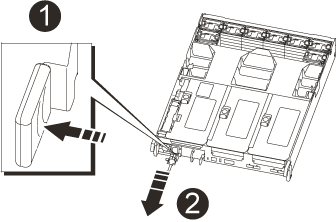

= Replace the ontroller module hardware - AFF A700s
:icons: font
:imagesdir: ../media/

[.lead]
To replace the controller module hardware, you must remove the impaired controller, move FRU components to the replacement controller module, install the replacement controller module in the chassis, and then boot the system to Maintenance mode.

== Step 1: Remove the controller module

You must remove the controller module from the chassis when you replace the controller module or replace a component inside the controller module.

. If you are not already grounded, properlcontrolleround yourself.
. Loosen the hook and loop strap binding the cables to the cable management device, and then unplug the system cables and SFPs (if needed) from the controller module, keeping track of where the cables were connected.
+
Leave the cables in the cable management device so that when you reinstall the cable management device, the cables are organized.

. Unplug the controller module power supply from the source, and then unplug the cable from the power supply.
. Remove the cable management device from the controller module and set it aside.
. Press down on both of the locking latches, and then rotate both latches downward at the same time.
+
The controller module moves slightly out of the chassis.
+
image::../media/drw_a700s_pcm_remove.png[]
+
[cols="1,4"]
|===
a|
image:../media/legend_icon_01.png[]|
Locking latch
a|
image:../media/legend_icon_02.png[]
a|
Locking pin
|===

. Slide the controller module out of the chassis.
+
Make sure that you support the bottom of the controller module as you slide it out of the chassis.

. Place the controller module on a stable, flat surface, and then open the air duct:
 .. Press in the locking tabs on the sides of the air duct toward the middle of the controller module.
 .. Slide the air duct toward the fan modules, and then rotate it upward to its completely open position.
+
image::../media/drw_a700s_open_air_duct.png[]
+
[cols="1,4"]
|===
a|
image:../media/legend_icon_01.png[]|
Air duct locking tabs
a|
image:../media/legend_icon_02.png[]
a|
Risers
a|
image:../media/legend_icon_03.png[]
a|
Air duct
|===

== Step 2: Move the NVRAM card

As part of the controller replacement process, you must remove the NVRAM card from Riser 1 in the impaired controller module and install the card into Riser 1 of the replacement controller module. You should only reinstall Riser 1 into the replacement controller module after you have moved the DIMMs from the impaired controller module to the replacement controller module.

. Remove the NVRAM riser, Riser 1, from the controller module:
 .. Rotate the riser locking latch on the left side of the riser up and toward the fans.
+
The NVRAM riser raises up slightly from the controller module.

 .. Lift the NVRAM riser up, shift it toward the fans so that the sheet metal lip on the riser clears the edge of the controller module, lift the riser straight up out of the controller module, and then place it on a stable, flat surface so that you can access the NVRAM card.
+

+
[cols="1,4"]
|===
a|
image:../media/legend_icon_01.png[]|
Air duct
a|
image:../media/legend_icon_02.png[]
a|
Riser 1 locking latch
a|
image:../media/legend_icon_03.png[]
a|
NVRAM battery cable plug connecting to the NVRAM card
a|
image:../media/legend_icon_04.png[]
a|
Card locking bracket
a|
image:../media/legend_icon_05.png[]
a|
NVRAM card
|===
. Remove the NVRAM card from the riser module:
 .. Turn the riser module so that you can access the NVRAM card.
 .. Unplug the NVRAM battery cable that is attached to the NVRAM card.
 .. Press the locking bracket on the side of the NVRAM riser, and then rotate it to the open position.
 .. Remove the NVRAM card from the riser module.
. Remove the NVRAM riser from the replacement controller module.
. Install the NVRAM card into the NVRAM riser:
 .. Align the card with the card guide on the riser module and the card socket in the riser.
 .. Slide the card squarely into the card socket.
+
NOTE: Make sure that the card is completely and squarely seated into the riser socket.

 .. Connect the battery cable to the socket on the NVRAM card.
 .. Swing the locking latch into the locked position and make sure that it locks in place.

== Step 3: Move PCIe cards

As part of the controller replacement process, you must remove both PCIe riser modules, Riser 2 (the middle riser) and Riser 3 (riser on the far right) from the impaired controller module, remove the PCIe cards from the riser modules, and install them in the same riser modules in the replacement controller module. You will install the riser modules into the replacement controller module once the DIMMs have been moved to the replacement controller module.

. Remove the PCIe riser from the controller module:
 .. Remove any SFP modules that might be in the PCIe cards.
 .. Rotate the module locking latch on the left side of the riser up and toward the fan modules.
+
The PCIe riser raises up slightly from the controller module.

 .. Lift the PCIe riser up, shift it toward the fans so that the sheet metal lip on the riser clears the edge of the controller module, lift the riser out of the controller module, and then place it on a stable, flat surface.
+

+
[cols="1,4"]
|===
a|
image:../media/legend_icon_01.png[]|
Air duct
a|
image:../media/legend_icon_02.png[]
a|
Riser locking latch
a|
image:../media/legend_icon_03.png[]
a|
Card locking bracket
a|
image:../media/legend_icon_04.png[]
a|
Riser 2 (middle riser) and PCI cards in riser slots 2 and 3.
|===
. Remove the PCIe card from the riser:
 .. Turn the riser so that you can access the PCIe card.
 .. Press the locking bracket on the side of the PCIe riser, and then rotate it to the open position.
 .. Remove the PCIe card from the riser.
. Remove the corresponding riser from the replacement controller module.
. Install the PCIe card into the same slot in PCIe riser:
 .. Align the card with the card guide on the riser and the card socket in the riser, and then slide it squarely into the socket in the riser.
+
NOTE: Make sure that the card is completely and squarely seated into the riser socket.

 .. Swing the locking latch into place until it clicks into the locked position.
. Repeat the preceding steps for Riser 3 and PCIe cards in slots 4 and 5 in the impaired controller module.

== Step 4: Move the boot media

There are two boot media devices in the AFF A700s, a primary and a secondary or backup boot media. You must move them from the impaired controller to the _replacement_ controller and install them into their respective slots in the _replacement_ controller.

The boot media are located under Riser 2, the middle PCIe riser module. This PCIe module must be removed to gain access to the boot media.

. Locate the boot media:
 .. Open the air duct, if needed.
 .. If needed, remove Riser 2, the middle PCIe module, by unlocking the locking latch and then removing the riser from the controller module.

+

+

[cols="1,4"]
|===
a|
image:../media/legend_icon_01.png[]|
Air duct
a|
image:../media/legend_icon_02.png[]
a|
Riser 2 (middle PCIe module)
a|
image:../media/legend_icon_03.png[]
a|
Boot media screw
a|
image:../media/legend_icon_04.png[]
a|
Boot media
|===
. Remove the boot media from the controller module:
 .. Using a #1 Phillips head screwdriver, remove the screw holding down the boot media and set the screw aside in a safe place.
 .. Grasping the sides of the boot media, gently rotate the boot media up, and then pull the boot media straight out of the socket and set it aside.
. Move the boot media to the new controller module and install it:
+
NOTE: Install the boot media into the same socket in the replacement controller module as it was installed in the impaired controller module; primary boot media socket (slot 1) to primary boot media socket, and secondary boot media socket (slot 2) to secondary boot media socket.

 .. Align the edges of the boot media with the socket housing, and then gently push it squarely into the socket.
 .. Rotate the boot media down toward the motherboard.
 .. Secure the boot media to the motherboard using the boot media screw.
+
Do not over-tighten the screw or you might damage the boot media.

== Step 5: Move the fans

You must move the fans from the impaired controller module to the replacement module when replacing a failed controller module.

. Remove the fan module by pinching the locking tabs on the side of the fan module, and then lifting the fan module straight out of the controller module.
+
image::../media/drw_a700s_replace_fan.png[]
+
[cols="1,4"]
|===
a|
image:../media/legend_icon_01.png[]|
Fan locking tabs
a|
image:../media/legend_icon_02.png[]
a|
Fan module
|===

. Move the fan module to the replacement controller module, and then install the fan module by aligning its edges with the opening in the controller module, and then sliding the fan module into the controller module until the locking latches click into place.
. Repeat these steps for the remaining fan modules.

== Step 6: Move system DIMMs

[.lead]
To move the DIMMs, locate and move them from the impaired controller into the replacement controller and follow the specific sequence of steps.

. Locate the DIMMs on your controller module.
+

+
[cols="1,4"]
|===
a|
image:../media/legend_icon_01.png[]|
Air duct
a|
image:../media/legend_icon_02.png[]
a|
Riser 1 and DIMM bank 1-4
a|
image:../media/legend_icon_03.png[]
a|
Riser 2 and DIMM banks 5-8 and 9-12
a|
image:../media/legend_icon_04.png[]
a|
Riser 3 and DIMM bank 13-16
|===

. Note the orientation of the DIMM in the socket so that you can insert the DIMM in the replacement controller module in the proper orientation.
. Eject the DIMM from its slot by slowly pushing apart the two DIMM ejector tabs on either side of the DIMM, and then slide the DIMM out of the slot.
+
NOTE: Carefully hold the DIMM by the edges to avoid pressure on the components on the DIMM circuit board.

. Locate the slot where you are installing the DIMM.
. Make sure that the DIMM ejector tabs on the connector are in the open position, and then insert the DIMM squarely into the slot.
+
The DIMM fits tightly in the slot, but should go in easily. If not, realign the DIMM with the slot and reinsert it.
+
NOTE: Visually inspect the DIMM to verify that it is evenly aligned and fully inserted into the slot.

. Push carefully, but firmly, on the top edge of the DIMM until the ejector tabs snap into place over the notches at the ends of the DIMM.
. Repeat these steps for the remaining DIMMs.

== Step 7: Install the NVRAM module

To install the NVRAM module, you must follow the specific sequence of steps.

. Install the riser into the controller module:
 .. Align the lip of the riser with the underside of the controller module sheet metal.
 .. Guide the riser along the pins in the controller module, and then lower the riser into the controller module.
 .. Swing the locking latch down and click it into the locked position.
+
When locked, the locking latch is flush with the top of the riser and the riser sits squarely in the controller module.

 .. Reinsert any SFP modules that were removed from the PCIe cards.

== Step 8: Move the NVRAM battery

When replacing the controller module, you must move the NVRAM battery from the impaired controller module to the replacement controller module

. Locate the NVRAM battery on the left side of the riser module, Riser 1.
+

+
[cols="1,4"]
|===
a|
image:../media/legend_icon_01.png[]|
NVRAM battery plug
a|
image:../media/legend_icon_02.png[]
a|
Blue NVRAM battery locking tab
|===

. Locate the battery plug and squeeze the clip on the face of the battery plug to release the plug from the socket, and then unplug the battery cable from the socket.
. Grasp the battery and press the blue locking tab marked PUSH, and then lift the battery out of the holder and controller module.
. Move the battery pack to the replacement controller module, and then install it in the NVRAM riser:
 .. Slide the battery pack down along the sheet metal side wall until the support tabs on the side wall hook into the slots on the battery pack, and the battery pack latch engages and locks into place.
 .. Press firmly down on the battery pack to make sure that it is locked into place.
 .. Plug the battery plug into the riser socket and make sure that the plug locks into place.

== Step 9: Install a PCIe riser

To install a PCIe riser, you must follow a specific sequence of steps.

. If you are not already grounded, properly ground yourself.
. Install the riser into the controller module:
 .. Align the lip of the riser with the underside of the controller module sheet metal.
 .. Guide the riser along the pins in the controller module, and then lower the riser into the controller module.
 .. Swing the locking latch down and click it into the locked position.
+
When locked, the locking latch is flush with the top of the riser and the riser sits squarely in the controller module.

 .. Reinsert any SFP modules that were removed from the PCIe cards.
. Repeat the preceding steps for Riser 3 and PCIe cards in slots 4 and 5 in the impaired controller module.

== Step 10: Move the power supply

You must move the power supply and power supply blank from the impaired controller module to the replacement controller module when you replace a controller module.

. If you are not already grounded, properly ground yourself.
. Rotate the cam handle such that it can be used to pull power supply out of the controller module while pressing the locking tab.
+
CAUTION: The power supply is short. Always use two hands to support it when removing it from the controller module so that it does not suddenly swing free from the controller module and injure you.
+

+
|===
a|
image:../media/legend_icon_01.png[]|
Blue power supply locking tab
a|
image:../media/legend_icon_02.png[]
a|
Power supply
|===

. Move the power supply to the new controller module, and then install it.
. Using both hands, support and align the edges of the power supply with the opening in the controller module, and then gently push the power supply into the controller module until the locking tab clicks into place.
+
The power supplies will only properly engage with the internal connector and lock in place one way.
+
NOTE: To avoid damaging the internal connector, do not use excessive force when sliding the power supply into the system.

. Remove the PSU blanking panel from the impaired controller module, and then install it in the replacement controller module.

== Step 11: Install the controller module

After all the components have been moved from the impaired controller module to the replacement controller module, you must install the replacement controller module into the chassis and then boot it to Maintenance mode.

. If you are not already grounded, properly ground yourself.
. If you have not already done so, close the air duct:
 .. Swing the air duct all the way down to the controller module.
 .. Slide the air duct toward the risers until the locking tabs click into place.
 .. Inspect the air duct to make sure that it is properly seated and locked into place.

+
image::../media/drw_a700s_close_air_duct.png[]

+

|===
a|
image:../media/legend_icon_01.png[]|
Locking tabs
a|
image:../media/legend_icon_02.png[]
a|
Slide plunger
|===
. Align the end of the controller module with the opening in the chassis, and then gently push the controller module halfway into the system.
+
NOTE: Do not completely insert the controller module in the chassis until instructed to do so.

. Cable the management and console ports only, so that you can access the system to perform the tasks in the following sections.
+
NOTE: You will connect the rest of the cables to the controller module later in this procedure.

. Complete the reinstallation of the controller module:
 .. Firmly push the controller module into the chassis until it meets the midplane and is fully seated.
+
The locking latches rise when the controller module is fully seated.
+
NOTE: Do not use excessive force when sliding the controller module into the chassis to avoid damaging the connectors.
+
The controller module begins to boot as soon as it is fully seated in the chassis. Be prepared to interrupt the boot process.

.. Rotate the locking latches upward, tilting them so that they clear the locking pins, and then lower them into the locked position.
.. Interrupt the boot process by pressing `Ctrl-C`.
. Plug the system cables and transceiver modules into the controller module and reinstall the cable management device.
. Plug the power cables into the power supplies and reinstall the power cable retainers.

. If your system is configured to support 10 GbE cluster interconnect and data connections on 40 GbE NICs or onboard ports, convert these ports to 10 GbE connections by using the nicadmin convert command from Maintenance mode.
+
NOTE: Be sure to exit Maintenance mode after completing the conversion.
