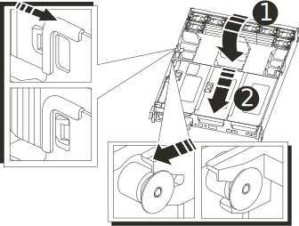

= Reinstall the controller module - AFF A700s
:icons: font
:imagesdir: ../media/

[.lead]
After you replace a component within the controller module, you must reinstall the controller module in the system chassis and boot it.

. If you are not already grounded, properly ground yourself.
. If you have not already done so, close the air duct:
 .. Swing the air duct all the way down to the controller module.
 .. Slide the air duct toward the risers until the locking tabs click into place.
 .. Inspect the air duct to make sure that it is properly seated and locked into place.
+

+
|===
a|
image:../media/legend_icon_01.gif[] a|
Locking tabs
a|
image:../media/legend_icon_02.gif[]
a|
Slide plunger
|===
+
. Align the end of the controller module with the opening in the chassis, and then gently push the controller module halfway into the system.
+
NOTE: Do not completely insert the controller module in the chassis until instructed to do so.

. Recable the system, as needed.
+
If you removed the media converters (QSFPs or SFPs), remember to reinstall them if you are using fiber optic cables.

. Plug the power cord into the power supply, reinstall the power cable locking collar, and then connect the power supply to the power source.
. Complete the reinstallation of the controller module:
 .. If you have not already done so, reinstall the cable management device.
 .. Firmly push the controller module into the chassis until it meets the midplane and is fully seated.
+
The locking latches rise when the controller module is fully seated.
+
NOTE: Do not use excessive force when sliding the controller module into the chassis to avoid damaging the connectors.
+
The controller module begins to boot as soon as it is fully seated in the chassis.

 .. Rotate the locking latches upward, tilting them so that they clear the locking pins, and then lower them into the locked position.
. If your system is configured to support 10 GbE cluster interconnect and data connections on 40 GbE NICs or onboard ports, convert these ports to 10 GbE connections by using the nicadmin convert command from Maintenance mode.
+
NOTE: Be sure to exit Maintenance mode after completing the conversion.

. Return the node to normal operation by giving back its storage: `storage failover giveback -ofnode _impaired_node_name_`
. If automatic giveback was disabled, reenable it: `storage failover modify -node local -auto-giveback true`
