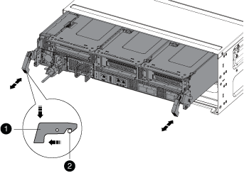
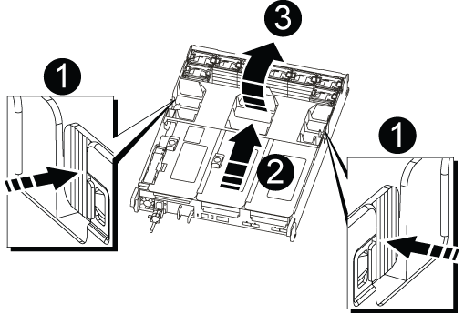
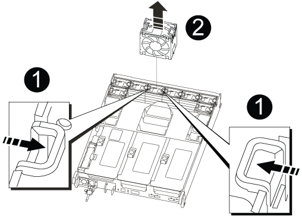

= Replace a fan - AFF A800
:icons: font
:imagesdir: ../media/

[.lead]
To replace a fan, remove the failed fan module and replace it with a new fan module.

== Step 1: Shut down the impaired controller - AFF A700s
:icons: font
:imagesdir: ../media/

[.lead]
include::../_include/shutdown_no_mcc.adoc[]

== Step 2: Remove the controller module - AFF A700s
:icons: font
:imagesdir: ../media/

[.lead]
You must remove the controller module from the chassis when you replace the controller module or replace a component inside the controller module.

. If you are not already grounded, properly ground yourself.
. Loosen the hook and loop strap binding the cables to the cable management device, and then unplug the system cables and SFPs (if needed) from the controller module, keeping track of where the cables were connected.
+
Leave the cables in the cable management device so that when you reinstall the cable management device, the cables are organized.

. Unplug the controller module power supply from the source, and then unplug the cable from the power supply.
. Remove the cable management device from the controller module and set it aside.
. Press down on both of the locking latches, and then rotate both latches downward at the same time.
+
The controller module moves slightly out of the chassis.
+

+
|===
a|
image:../media/legend_icon_01.png[] a|
Locking latch
a|
image:../media/legend_icon_02.png[]
a|
Locking pin
|===

. Slide the controller module out of the chassis.
+
Make sure that you support the bottom of the controller module as you slide it out of the chassis.

. Place the controller module on a stable, flat surface, and then open the air duct:
 .. Press in the locking tabs on the sides of the air duct toward the middle of the controller module.
 .. Slide the air duct toward the fan modules, and then rotate it upward to its completely open position.
+

+
[cols="1,4"]
|===
a|
image:../media/legend_icon_01.png[]
a|
Air duct locking tabs
a|
image:../media/legend_icon_02.png[]
a|
Risers
a|
image:../media/legend_icon_03.png[]
a|
Air duct
|===

== Step 3: Replace the fan - AFF A700s
:icons: font
:imagesdir: ../media/

[.lead]
To replace a fan, remove the failed fan module and replace it with a new fan module.

. If you are not already grounded, properly ground yourself.
. Identify the fan module that you must replace by checking the console error messages.
. Remove the fan module by pinching the locking tabs on the side of the fan module, and then lifting the fan module straight out of the controller module.
+

+
|===
a|
image:../media/legend_icon_01.png[] a|
Fan locking tabs
a|
image:../media/legend_icon_02.png[]
a|
Fan module
|===

. Align the edges of the replacement fan module with the opening in the controller module, and then slide the replacement fan module into the controller module until the locking latches click into place.

== Step 4: Reinstall the controller module - AFF A700s
:icons: font
:imagesdir: ../media/

[.lead]
After you replace a component within the controller module, you must reinstall the controller module in the system chassis and boot it.

. If you are not already grounded, properly ground yourself.
. If you have not already done so, close the air duct:
 .. Swing the air duct all the way down to the controller module.
 .. Slide the air duct toward the risers until the locking tabs click into place.
 .. Inspect the air duct to make sure that it is properly seated and locked into place.
+
image::../media/drw_a700s_close_air_duct.png[]
+
|===
a|
image:../media/legend_icon_01.png[] a|
Locking tabs
a|
image:../media/legend_icon_02.png[]
a|
Slide plunger
|===
+
. Align the end of the controller module with the opening in the chassis, and then gently push the controller module halfway into the system.
+
NOTE: Do not completely insert the controller module in the chassis until instructed to do so.

. Recable the system, as needed.
+
If you removed the media converters (QSFPs or SFPs), remember to reinstall them if you are using fiber optic cables.

. Plug the power cord into the power supply, reinstall the power cable locking collar, and then connect the power supply to the power source.
. Complete the reinstallation of the controller module:
 .. If you have not already done so, reinstall the cable management device.
 .. Firmly push the controller module into the chassis until it meets the midplane and is fully seated.
+
The locking latches rise when the controller module is fully seated.
+
NOTE: Do not use excessive force when sliding the controller module into the chassis to avoid damaging the connectors.
+
The controller module begins to boot as soon as it is fully seated in the chassis.

 .. Rotate the locking latches upward, tilting them so that they clear the locking pins, and then lower them into the locked position.
. If your system is configured to support 10 GbE cluster interconnect and data connections on 40 GbE NICs or onboard ports, convert these ports to 10 GbE connections by using the nicadmin convert command from Maintenance mode.
+
NOTE: Be sure to exit Maintenance mode after completing the conversion.

. Return the controller to normal operation by giving back its storage: `storage failover giveback -ofnode _impaired_node_name_`
. If automatic giveback was disabled, reenable it: `storage failover modify -node local -auto-giveback true`

== Step 4: Return the failed part to NetApp - AFF A700s
:icons: font
:imagesdir: ../media/

[.lead]
include::../_include/complete_rma.adoc[]
