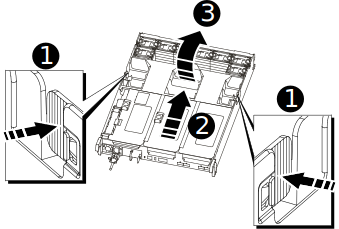
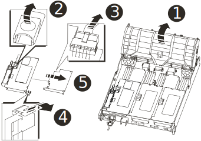

= Replace the NVRAM module and/or NVRAM DIMMs - AFF A700s
:icons: font
:imagesdir: ../media/

[.lead]
To replace a failed NVRAM card, you must remove the NVRAM riser, Riser 1, from the controller module, remove the failed card from the riser, install the new NVRAM card in the riser, and then reinstall the riser in the controller module. Because the system ID is derived from the NVRAM card, if replacing the module, disks belonging to the system are reassigned to the new system ID.

*Before you begin*

* All disk shelves must be working properly.
* If your system is in an HA pair, the partner node must be able to take over the node associated with the NVRAM module that is being replaced.
* This procedure uses the following terminology:
 ** The impaired node is the node on which you are performing maintenance.
 ** The healthy node is the HA partner of the impaired node.
* This procedure includes steps for automatically or manually reassigning disks to the controller module associated with the new NVRAM module. You must reassign the disks when directed to in the procedure. Completing the disk reassignment before giveback can cause issues.
* You must replace the failed component with a replacement FRU component you received from your provider.
* You cannot change any disks or disk shelves as part of this procedure.

*Steps*

== Shut down the impaired node

[.lead]
include::../_include/shutdown_most_frus.adoc[]
* If you are using NetApp Storage Encryption, you must have reset the MSID using the instructions in the "`Returning SEDs to unprotected mode`" section of the _ONTAP 9 NetApp Encryption Power Guide_.
+
https://docs.netapp.com/ontap-9/topic/com.netapp.doc.pow-nve/home.html[ONTAP 9 NetApp Encryption Power Guide]

== Remove the controller module

[.lead]
You must remove the controller module from the chassis when you replace the controller module or replace a component inside the controller module.

. If you are not already grounded, properly ground yourself.
. Loosen the hook and loop strap binding the cables to the cable management device, and then unplug the system cables and SFPs (if needed) from the controller module, keeping track of where the cables were connected.
+
Leave the cables in the cable management device so that when you reinstall the cable management device, the cables are organized.

. Unplug the controller module power supply from the source, and then unplug the cable from the power supply.
. Remove the cable management device from the controller module and set it aside.
. Press down on both of the locking latches, and then rotate both latches downward at the same time.
+
The controller module moves slightly out of the chassis.
+
image::../media/drw_a700s_pcm_remove.svg[]
+
[cols="1,4"]
|===
a|
image:../media/legend_icon_01.gif[] a|
Locking latch
a|
image:../media/legend_icon_02.gif[]
a|
Locking pin
|===

. Slide the controller module out of the chassis.
+
Make sure that you support the bottom of the controller module as you slide it out of the chassis.

. Place the controller module on a stable, flat surface, and then open the air duct:
 .. Press in the locking tabs on the sides of the air duct toward the middle of the controller module.
 .. Slide the air duct toward the fan modules, and then rotate it upward to its completely open position.
+

+
[cols="1,4"]
|===
a|
image:../media/legend_icon_01.gif[]
a|
Air duct locking tabs
a|
image:../media/legend_icon_02.gif[]
a|
Risers
a|
image:../media/legend_icon_03.gif[]
a|
Air duct
|===

== Remove the NVRAM card

[.lead]
Replacing the NVRAM consist of removing the NVRAM riser, Riser 1, from the controller module, disconnecting the NVRAM battery from the NVRAM card, removing the failed NVRAM card and installing the replacement NVRAM card, and then reinstalling the NVRAM riser back into the controller module.

. If you are not already grounded, properly ground yourself.
. Remove the NVRAM riser, Riser 1, from the controller module:
 .. Rotate the riser locking latch on the left side of the riser up and toward the fans.
+
The NVRAM riser raises up slightly from the controller module.

 .. Lift the NVRAM riser up, shift it toward the fans so that the sheet metal lip on the riser clears the edge of the controller module, lift the riser straight up out of the controller module, and then place it on a stable, flat surface so that you can access the NVRAM card.
+

+
[cols="1,4"]
|===
a|
image:../media/legend_icon_01.gif[]
a|
Air duct
a|
image:../media/legend_icon_02.gif[]
a|
Riser 1 locking latch
a|
image:../media/legend_icon_03.gif[]
a|
NVRAM battery cable plug connecting to the NVRAM card
a|

a|
Card locking bracket
a|

a|
NVRAM card
|===
. Remove the NVRAM card from the riser module:
 .. Turn the riser module so that you can access the NVRAM card.
 .. Unplug the NVRAM battery cable that is attached to the NVRAM card.
 .. Press the locking bracket on the side of the NVRAM riser, and then rotate it to the open position.
 .. Remove the NVRAM card from the riser module.
. Install the NVRAM card into the NVRAM riser:
 .. Align the card with the card guide on the riser module and the card socket in the riser.
 .. Slide the card squarely into the card socket.
+
NOTE: Make sure that the card is completely and squarely seated into the riser socket.

 .. Connect the battery cable to the socket on the NVRAM card.
 .. Swing the locking latch into the locked position and make sure that it locks in place.
. Install the riser into the controller module:
 .. Align the lip of the riser with the underside of the controller module sheet metal.
 .. Guide the riser along the pins in the controller module, and then lower the riser into the controller module.
 .. Swing the locking latch down and click it into the locked position.
+
When locked, the locking latch is flush with the top of the riser and the riser sits squarely in the controller module.

 .. Reinsert any SFP modules that were removed from the PCIe cards.

== Reinstall the controller module and booting the system

[.lead]
After you replace a FRU in the controller module, you must reinstall the controller module and reboot it.

For HA pairs with two controller modules in the same chassis, the sequence in which you install the controller module is especially important because it attempts to reboot as soon as you completely seat it in the chassis.

. If you are not already grounded, properly ground yourself.
. Align the end of the controller module with the opening in the chassis, and then gently push the controller module halfway into the system.
+
NOTE: Do not completely insert the controller module in the chassis until instructed to do so.

. Recable the system, as needed.
+
If you removed the media converters (QSFPs or SFPs), remember to reinstall them if you are using fiber optic cables.

. Plug the power cord into the power supply, reinstall the power cable locking collar, and then connect the power supply to the power source.
. Complete the reinstallation of the controller module:
 .. If you have not already done so, reinstall the cable management device.
 .. Firmly push the controller module into the chassis until it meets the midplane and is fully seated.
+
The locking latches rise when the controller module is fully seated.
+
NOTE: Do not use excessive force when sliding the controller module into the chassis to avoid damaging the connectors.
+
The controller module begins to boot as soon as it is fully seated in the chassis. Be prepared to interrupt the boot process.

 .. Rotate the locking latches upward, tilting them so that they clear the locking pins, and then lower them into the locked position.
 .. Interrupt the boot process by pressing `Ctrl-C` when you see Press Ctrl-C for Boot Menu.
 .. Select the option to boot to Maintenance mode from the displayed menu.

== Reassign disks

[.lead]
Depending on your configuration, you must either verify the reassignment of disks to the new controller module or manually reassign the disks. If the storage system is in an HA pair, the system ID of the new controller module is automatically assigned to the disks when the giveback occurs at the end of the procedure. In a stand-alone system, you must manually reassign the ID to the disks.

You must use the correct procedure for your configuration:

[options="header" cols="1,2"]
|===
| Controller module redundancy| Then use this procedure...
a|
HA pair
a|
link:nvram_or_nvram_dimm_replacement.md#[Verifying the system ID change on an HA system]
|===

=== Verify the system ID change on an HA system

[.lead]
You must confirm the system ID change when you boot the replacement node and then verify that the change was implemented.

This procedure applies only to systems running ONTAP in an HA pair.

. If the replacement node is in Maintenance mode (showing the `*>` prompt, exit Maintenance mode and go to the LOADER prompt: `halt`
. From the LOADER prompt on the replacement node, boot the node, entering `y` if you are prompted to override the system ID due to a system ID mismatch:``boot_ontap``
. Wait until the Waiting for giveback... message is displayed on the replacement node console and then, from the healthy node, verify that the new partner system ID has been automatically assigned: storage failover show
+
In the command output, you should see a message that the system ID has changed on the impaired node, showing the correct old and new IDs. In the following example, node2 has undergone replacement and has a new system ID of 151759706.
+
----
node1> storage failover show
                                    Takeover
Node              Partner           Possible     State Description
------------      ------------      --------     -------------------------------------
node1             node2             false        System ID changed on partner (Old:
                                                  151759755, New: 151759706), In takeover
node2             node1             -            Waiting for giveback (HA mailboxes)
----

. From the healthy node, verify that any coredumps are saved:
 .. Change to the advanced privilege level: `set -privilege advanced`
+
You can respond `Y` when prompted to continue into advanced mode. The advanced mode prompt appears (*>).

 .. Save any coredumps: `system node run -node local-node-name partner savecore`
 .. Wait for savecore command to complete before issuing the giveback.
+
You can enter the following command to monitor the progress of the savecore command: `system node run -node local-node-name partner savecore -s`

 .. Return to the admin privilege level: `set -privilege admin`
. Give back the node:
 .. From the healthy node, give back the replaced node's storage: `storage failover giveback -ofnode replacement_node_name`
+
The replacement node takes back its storage and completes booting.
+
If you are prompted to override the system ID due to a system ID mismatch, you should enter `y`.
+
NOTE: If the giveback is vetoed, you can consider overriding the vetoes.
+
http://mysupport.netapp.com/documentation/productlibrary/index.html?productID=62286[Find the High-Availability Configuration Guide for your version of ONTAP 9]

 .. After the giveback has been completed, confirm that the HA pair is healthy and that takeover is possible: storage failover show
+
The output from the storage failover show command should not include the System ID changed on partner message.
. Verify that the disks were assigned correctly: storage disk show -ownership
+
The disks belonging to the replacement node should show the new system ID. In the following example, the disks owned by node1 now show the new system ID, 1873775277:
+
----
node1> storage disk show -ownership

Disk  Aggregate Home  Owner  DR Home  Home ID    Owner ID  DR Home ID Reserver  Pool
----- ------    ----- ------ -------- -------    -------    -------  ---------  ---
1.0.0  aggr0_1  node1 node1  -        1873775277 1873775277  -       1873775277 Pool0
1.0.1  aggr0_1  node1 node1           1873775277 1873775277  -       1873775277 Pool0
.
.
.
----

. Verify that the expected volumes are present for each node: `vol show -node node-name`
. If you disabled automatic takeover on reboot, enable it from the healthy node: `storage failover modify -node replacement-node-name -onreboot true`

== Restore Storage and Volume Encryption functionality

[.lead]
include::../_include/restore_storage_encryption.adoc[]

== Return the failed part to NetApp

[.lead]
include::../_include/complete_rma.adoc[]
