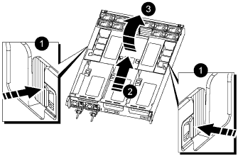

= Remove the controller module - AFF A800
:icons: font
:imagesdir: ../media/

[.lead]
You must remove the controller module from the chassis when you replace the controller module or replace a component inside the controller module.

. If you are not already grounded, properly ground yourself.
. Unplug the controller module power supplies from the source.
. Release the power cable retainers, and then unplug the cables from the power supplies.
. Loosen the hook and loop strap binding the cables to the cable management device, and then unplug the system cables and SFP and QSFP modules (if needed) from the controller module, keeping track of where the cables were connected.
+
Leave the cables in the cable management device so that when you reinstall the cable management device, the cables are organized.

. Remove the cable management device from the controller module and set it aside.
. Press down on both of the locking latches, and then rotate both latches downward at the same time.
+
The controller module moves slightly out of the chassis.
+
image::../media/drw_a800_pcm_remove.gif[]
+
[cols="1,3"]
|===
a|
image:../media/legend_icon_01.gif[]
a|
Locking latch
a|
image:../media/legend_icon_02.gif[]
a|
Locking pin
|===

. Slide the controller module out of the chassis.
+
Make sure that you support the bottom of the controller module as you slide it out of the chassis.

. Place the controller module on a stable, flat surface, and then open the air duct:
 .. Press in the locking tabs on the sides of the air duct toward the middle of the controller module.
 .. Slide the air duct toward the fan modules, and then rotate it upward to its completely open position.
+

+
[cols="1,3"]
|===
a|
image:../media/legend_icon_01.gif[]
a|
Air duct locking tabs
a|
image:../media/legend_icon_02.gif[]
a|
Slide air duct towards fan modules
a|
image:../media/legend_icon_03.gif[]
a|
Rotate air duct towards fan modules
|===
