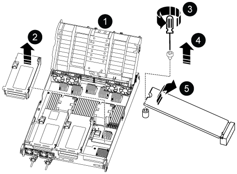

= Replace the boot media - AFF A800
:icons: font
:imagesdir: ../media/

[.lead]
To replace the boot media, you must remove the impaired controller module, install the replacement boot media, and transfer the boot image to a USB flash drive.

== Step 1: Remove the controller module

You must remove the controller module from the chassis when you replace the controller module or replace a component inside the controller module.

. If you are not already grounded, properly ground yourself.
. Unplug the controller module power supplies from the source.
. Release the power cable retainers, and then unplug the cables from the power supplies.
. Loosen the hook and loop strap binding the cables to the cable management device, and then unplug the system cables and SFP and QSFP modules (if needed) from the controller module, keeping track of where the cables were connected.
+
Leave the cables in the cable management device so that when you reinstall the cable management device, the cables are organized.

. Remove the cable management device from the controller module and set it aside.
. Press down on both of the locking latches, and then rotate both latches downward at the same time.
+
The controller module moves slightly out of the chassis.
+
image::../media/drw_a800_pcm_remove.png[]
+
[cols="1,4"]
|===
a|
image:../media/legend_icon_01.png[]
a|
Locking latch
a|
image:../media/legend_icon_02.png[]
a|
Locking pin
|===

. Slide the controller module out of the chassis.
+
Make sure that you support the bottom of the controller module as you slide it out of the chassis.

. Place the controller module on a stable, flat surface, and then open the air duct:
 .. Press in the locking tabs on the sides of the air duct toward the middle of the controller module.
 .. Slide the air duct toward the fan modules, and then rotate it upward to its completely open position.

image::../media/drw_a800_open_air_duct.png[]

[cols="1,4"]
|===
a|
image:../media/legend_icon_01.png[]
a|
Air duct locking tabs
a|
image:../media/legend_icon_02.png[]
a|
Slide air duct towards fan modules
a|
image:../media/legend_icon_03.png[]
a|
Rotate air duct towards fan modules
|===

== Step 2: Replace the boot media

You locate the failed boot media in the controller module by removing Riser 3 on the controller module before you can replace the boot media.

You need a Phillips head screwdriver to remove the screw that holds the boot media in place.

. Locate the boot media:
+

+
[cols="1,4"]
|===
a|
image:../media/legend_icon_01.png[] a|
Air duct
a|
image:../media/legend_icon_02.png[]
a|
Riser 3
a|
image:../media/legend_icon_03.png[]
a|
Phillips #1 screwdriver
a|
image:../media/legend_icon_04.png[]
a|
Boot media screw
a|
image:../media/legend_icon_05.png[]
a|Boot media
|===

. Remove the boot media from the controller module:
.. Using a #1 Phillips head screwdriver, remove the screw holding down the boot media and set the screw aside in a safe place.
.. Grasping the sides of the boot media, gently rotate the boot media up, and then pull the boot media straight out of the socket and set it aside.
. Install the replacement boot media into the controller module:
.. Align the edges of the boot media with the socket housing, and then gently push it squarely into the socket.
.. Rotate the boot media down toward the motherboard.
.. Secure the boot media to the motherboard using the boot media screw.
+
Do not over-tighten the screw or you might damage the boot media.
. Reinstall the riser into the controller module.
. Close the air duct:
.. Rotate the air duct downward.
.. Slide the air duct toward the risers until it clicks into place.

== Step 3: Transfer the boot image to the boot media

The replacement boot media that you installed is without a boot image so you need to transfer a boot image using a USB flash drive.

.Before you begin

 * You must have a USB flash drive, formatted to FAT32, with at least 4GB capacity.
 * A copy of the same image version of ONTAP as what the impaired controller was running. You can download the appropriate image from the Downloads section on the NetApp Support Site
  ** If NVE is enabled, download the image with NetApp Volume Encryption, as indicated in the download button.
  ** If NVE is not enabled, download the image without NetApp Volume Encryption, as indicated in the download button.
 * If your system is an HA pair, you must have a network connection.
 * If your system is a stand-alone system you do not need a network connection, but you must perform an additional reboot when restoring the var file system.

.Steps
 . Download and copy the appropriate service image from the NetApp Support Site to the USB flash drive.
  .. Download the service image to your work space on your laptop.
  .. Unzip the service image.
+

NOTE: If you are extracting the contents using Windows, do not use WinZip to extract the netboot image. Use another extraction tool, such as 7-Zip or WinRAR.

+

There are two folders in the unzipped service image file:

+

   *** boot
   *** efi

  .. Copy the efi folder to the top directory on the USB flash drive.
  +
 The USB flash drive should have the efi folder and the same Service Image (BIOS) version of what the impaired controller is running.

  .. Remove the USB flash drive from your laptop.
 . If you have not already done so, close the air duct:
  .. Swing the air duct all the way down to the controller module.
  .. Slide the air duct toward the risers until the locking tabs click into place.
  .. Inspect the air duct to make sure that it is properly seated and locked into place.
+
image::../media/drw_a800_close_air_duct.png[]
+
[cols="1,4"]
|===
a|
image:../media/legend_icon_01.png[]
a|
Air duct
a|
image:../media/legend_icon_02.png[]
a|
Risers
|===

 . Align the end of the controller module with the opening in the chassis, and then gently push the controller module halfway into the system.
 . Reinstall the cable management device and recable the system, as needed.
+
When recabling, remember to reinstall the media converters (SFPs or QSFPs) if they were removed.

 . Plug the power cable into the power supply and reinstall the power cable retainer.
 . Insert the USB flash drive into the USB slot on the controller module.
+
Make sure that you install the USB flash drive in the slot labeled for USB devices, and not in the USB console port.

 . Gently push the controller module all the way into the system until the controller module locking hooks begin to rise, firmly push on the locking hooks to finish seating the controller module, and then swing the locking hooks into the locked position over the pins on the controller module.
+
The controller begins to boot as soon as it is completely installed into the chassis.

 . Interrupt the boot process by pressing Ctrl-C to stop at the LOADER prompt.
+
If you miss this message, press Ctrl-C, select the option to boot to Maintenance mode, and then halt the controller to boot to LOADER.
