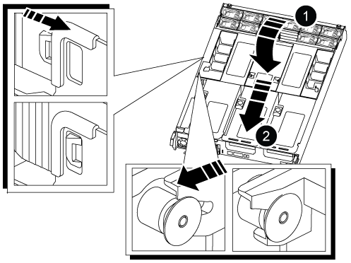

= Transfer the boot image to the boot media - AFF A800
:icons: font
:imagesdir: ../media/

[.lead]
The replacement boot media that you installed is without a boot image so you need to transfer a boot image using a USB flash drive.

* You must have a USB flash drive, formatted to FAT32, with at least 4GB capacity.
* A copy of the same image version of ONTAP as what the impaired controller was running. You can download the appropriate image from the Downloads section on the NetApp Support Site
 ** If NVE is enabled, download the image with NetApp Volume Encryption, as indicated in the download button.
 ** If NVE is not enabled, download the image without NetApp Volume Encryption, as indicated in the download button.
* If your system is an HA pair, you must have a network connection.
* If your system is a stand-alone system you do not need a network connection, but you must perform an additional reboot when restoring the var file system.

. Download and copy the appropriate service image from the NetApp Support Site to the USB flash drive.
 .. Download the service image to your work space on your laptop.
 .. Unzip the service image.
+
NOTE: If you are extracting the contents using Windows, do not use WinZip to extract the netboot image. Use another extraction tool, such as 7-Zip or WinRAR.
+
There are two folders in the unzipped service image file:
+
  *** `boot`
  *** `efi`

 .. Copy the `efi` folder to the top directory on the USB flash drive.
+
The USB flash drive should have the efi folder and the same Service Image (BIOS) version of what the impaired controller is running.

 .. Remove the USB flash drive from your laptop.
. If you have not already done so, close the air duct:
 .. Swing the air duct all the way down to the controller module.
 .. Slide the air duct toward the risers until the locking tabs click into place.
 .. Inspect the air duct to make sure that it is properly seated and locked into place.
+

+
|===
a|
image:../media/legend_icon_01.png[]
a|
Air duct
a|
image:../media/legend_icon_02.png[]
a|
Risers
|===
. Align the end of the controller module with the opening in the chassis, and then gently push the controller module halfway into the system.
. Reinstall the cable management device and recable the system, as needed.
+
When recabling, remember to reinstall the media converters (SFPs or QSFPs) if they were removed.

. Plug the power cable into the power supply and reinstall the power cable retainer.
. Insert the USB flash drive into the USB slot on the controller module.
+
Make sure that you install the USB flash drive in the slot labeled for USB devices, and not in the USB console port.

. Gently push the controller module all the way into the system until the controller module locking hooks begin to rise, firmly push on the locking hooks to finish seating the controller module, and then swing the locking hooks into the locked position over the pins on the controller module.
+
The controller begins to boot as soon as it is completely installed into the chassis.

. Interrupt the boot process by pressing Ctrl-C to stop at the LOADER prompt.
+
If you miss this message, press Ctrl-C, select the option to boot to Maintenance mode, and then `halt` the controller to boot to LOADER.

. Although the environment variables and bootargs are retained, you should check that all required boot environment variables and bootargs are properly set for your system type and configuration using the `printenv bootarg name` command and correct any errors using the `setenv variable-name <value>` command.
.. Check the boot environment variables:
 *** `bootarg.init.boot_clustered`
 *** `partner-sysid`
 *** `bootarg.init.flash_optimized` for AFF C190/AFF A220 (All Flash FAS)
 *** `bootarg.init.san_optimized` for AFF A220 and All SAN Array
 *** `bootarg.init.switchless_cluster.enable`
.. If External Key Manager is enabled, check the bootarg values, listed in the `kenv` ASUP output:
 *** `bootarg.storageencryption.support <value>`
 *** `bootarg.keymanager.support <value>`
 *** `kmip.init.interface <value>`
 *** `kmip.init.ipaddr <value>`
 *** `kmip.init.netmask <value>`
 *** `kmip.init.gateway <value>`
.. If Onboard Key Manager is enabled, check the bootarg values, listed in the `kenv` ASUP output:
 *** `bootarg.storageencryption.support <value>`
 *** `bootarg.keymanager.support <value>`
 *** `bootarg.onboard_keymanager <value>`
 .. Save the environment variables you changed with the `savenv` command
 .. Confirm your changes using the `printenv _variable-name_` command.
