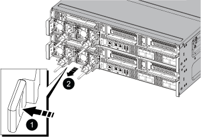
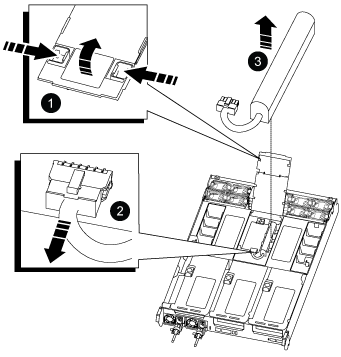
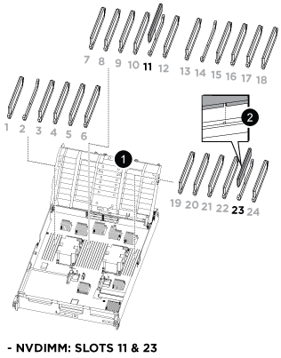
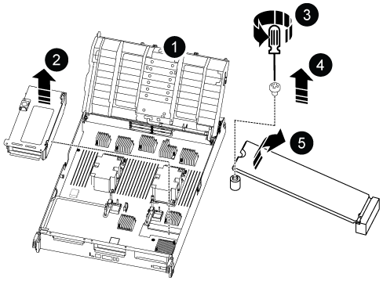

= Replace the controller module hardware - AFF A800
:icons: font
:imagesdir: ../media/

[.lead]
To replace the controller module hardware, you must remove the impaired controller, move FRU components to the replacement controller module, install the replacement controller module in the chassis, and then boot the system to Maintenance mode.

== Step 1: Remove the controller module

You must remove the controller module from the chassis when you replace the controller module or replace a component inside the controller module.

. If you are not already grounded, properly ground yourself.
. Unplug the controller module power supplies from the source.
. Release the power cable retainers, and then unplug the cables from the power supplies.
. Loosen the hook and loop strap binding the cables to the cable management device, and then unplug the system cables and SFP and QSFP modules (if needed) from the controller module, keeping track of where the cables were connected.
+
Leave the cables in the cable management device so that when you reinstall the cable management device, the cables are organized.

. Remove the cable management device from the controller module and set it aside.
. Press down on both of the locking latches, and then rotate both latches downward at the same time.
+
The controller module moves slightly out of the chassis.
+
image::../media/drw_a800_pcm_remove.png[]
+
[cols="1,4"]
|===
a|
image:../media/legend_icon_01.png[]|
Locking latch
a|
image:../media/legend_icon_02.png[]
a|
Locking pin
|===

. Slide the controller module out of the chassis.
+
Make sure that you support the bottom of the controller module as you slide it out of the chassis.

. Place the controller module on a stable, flat surface, and then open the air duct:
 .. Press in the locking tabs on the sides of the air duct toward the middle of the controller module.
 .. Slide the air duct toward the fan modules, and then rotate it upward to its completely open position.
+
image::../media/drw_a800_open_air_duct.png[]
+
[cols="1,4"]
|===
a|
image:../media/legend_icon_01.png[]
a|
Air duct locking tabs
a|
image:../media/legend_icon_02.png[]|
Slide air duct towards fan modules
a|
image:../media/legend_icon_03.png[]
a|
Rotate air duct towards fan modules
|===

== Step 2: Move the power supplies

You must move the power supplies from the impaired controller module to the replacement controller module when you replace a controller module.

. Rotate the cam handle such that it can be used to pull power supply out of the controller module while pressing the locking tab.
+
CAUTION: The power supply is short. Always use two hands to support it when removing it from the controller module so that it does not suddenly swing free from the controller module and injure you.
+

+
[cols="1,4"]
|===
a|
image:../media/legend_icon_01.png[]|
Blue power supply locking tab
a|
image:../media/legend_icon_02.png[]
a|
Power supply
|===

. Move the power supply to the new controller module, and then install it.
. Using both hands, support and align the edges of the power supply with the opening in the controller module, and then gently push the power supply into the controller module until the locking tab clicks into place.
+
The power supplies will only properly engage with the internal connector and lock in place one way.
+
NOTE: To avoid damaging the internal connector, do not use excessive force when sliding the power supply into the system.

== Step 3: Move the fans

You must move the fans from the impaired controller module to the replacement module when replacing a failed controller module.

. Remove the fan module by pinching the locking tabs on the side of the fan module, and then lifting the fan module straight out of the controller module.
+
image::../media/drw_a800_replace_fan.png[]
+
|===
a|
image:../media/legend_icon_01.png[]|
Fan locking tabs
a|
image:../media/legend_icon_02.png[]
a|
Fan module
|===

. Move the fan module to the replacement controller module, and then install the fan module by aligning its edges with the opening in the controller module, and then sliding the fan module into the controller module until the locking latches click into place.
. Repeat these steps for the remaining fan modules.

== Step 4: Move the NVDIMM battery

When replacing the controller module, you must move the NVRAM battery from the impaired controller module to the replacement controller module

. Open the air duct cover and locate the NVDIMM battery in the riser.
+

+
[cols="1,4"]
|===
a|
image:../media/legend_icon_01.png[]|
Air duct riser
a|
image:../media/legend_icon_02.png[]
a|
NVDIMM battery plug
a|
image:../media/legend_icon_03.png[]
a|
NVDIMM battery pack
|===
*Attention:* The NVDIMM battery control board LED blinks while destaging contents to the flash memory when you halt the system. After the destage is complete, the LED turns off.

. Locate the battery plug and squeeze the clip on the face of the battery plug to release the plug from the socket, and then unplug the battery cable from the socket.
. Grasp the battery and lift the battery out of the air duct and controller module.
. Move the battery pack to the replacement controller module and then install it in the NVDIMM air duct:
 .. Insert the battery pack into the slot and press firmly down on the battery pack to make sure that it is locked into place.
 .. Plug the battery plug into the riser socket and make sure that the plug locks into place.

== Step 5: Remove the PCIe risers

As part of the controller replacement process, you must remove the PCIe modules from the impaired controller module. You must install them into the same location in the replacement controller module once the NVDIMMS and DIMMs have moved to the replacement controller module.

. Remove the PCIe riser from the controller module:
 .. Remove any SFP or QSFP modules that might be in the PCIe cards.
 .. Rotate the riser locking latch on the left side of the riser up and toward the fan modules.
+
The riser raises up slightly from the controller module.

 .. Lift the riser up, shift it toward the fans so that the sheet metal lip on the riser clears the edge of the controller module, lift the riser out of the controller module, and then place it on a stable, flat surface.
+
image::../media/drw_a800_riser_2_3_remove.png[]
+
[cols="1,4"]
|===
a|
image:../media/legend_icon_01.png[]|
Air duct
a|
image:../media/legend_icon_02.png[]
a|
Riser 1 (left riser), Riser 2 (middle riser), and 3 (right riser) locking latches
|===
. Repeat the preceding step for the remaining risers in the impaired controller module.
. Repeat the above steps with the empty risers in the replacement controller and put them away.

== Step 6: Move system DIMMs

To move the DIMMs, locate and move them from the impaired controller into the replacement controller and follow the specific sequence of steps.

. Note the orientation of the DIMM in the socket so that you can insert the DIMM in the replacement controller module in the proper orientation.
. Eject the DIMM from its slot by slowly pushing apart the two DIMM ejector tabs on either side of the DIMM, and then slide the DIMM out of the slot.
+
NOTE: Carefully hold the DIMM by the edges to avoid pressure on the components on the DIMM circuit board.

. Locate the slot where you are installing the DIMM.
. Insert the DIMM squarely into the slot.
+
The DIMM fits tightly in the slot, but should go in easily. If not, realign the DIMM with the slot and reinsert it.
+
NOTE: Visually inspect the DIMM to verify that it is evenly aligned and fully inserted into the slot.

. Push carefully, but firmly, on the top edge of the DIMM until the ejector tabs snap into place over the notches at the ends of the DIMM.
. Repeat these steps for the remaining DIMMs.

== Step 7: Move the NVDIMMs

[.lead]
To move the NVDIMMs, locate and move them from the impaired controller into the replacement controller and follow the specific sequence of steps.

. Locate the NVDIMMs on your controller module.
+

+
[cols="1,4"]
|===
a|
image:../media/legend_icon_01.png[]|
Air duct
a|
image:../media/legend_icon_02.png[]
a|
NVDIMMs
|===

. Note the orientation of the NVDIMM in the socket so that you can insert the NVDIMM in the replacement controller module in the proper orientation.
. Eject the NVDIMM from its slot by slowly pushing apart the two NVDIMM ejector tabs on either side of the NVDIMM, and then slide the NVDIMM out of the socket and set it aside.
+
NOTE: Carefully hold the NVDIMM by the edges to avoid pressure on the components on the NVDIMM circuit board.

. Locate the slot where you are installing the NVDIMM.
. Insert the NVDIMM squarely into the slot.
+
The NVDIMM fits tightly in the slot, but should go in easily. If not, realign the NVDIMM with the slot and reinsert it.
+
NOTE: Visually inspect the NVDIMM to verify that it is evenly aligned and fully inserted into the slot.

. Push carefully, but firmly, on the top edge of the NVDIMM until the ejector tabs snap into place over the notches at the ends of the NVDIMM.
. Repeat the preceding steps to move the other NVDIMM.

== Step 8: Move the boot media

There is one boot media device in the AFF A800. You must move it from the impaired controller and install it in the _replacement_ controller.

The boot media is located under Riser 3.

. Locate the boot media:
+

+
[cols="1,4"]
|===
a|
image:../media/legend_icon_01.png[]|
Air duct
a|
image:../media/legend_icon_02.png[]
a|
Riser 3
a|
image:../media/legend_icon_03.png[]
a|
Phillips #1 screwdriver
a|
image:../media/legend_icon_04.png[]
a|
Boot media screw
a|
image:../media/legend_icon_05.png[]
a|
Boot media
|===

. Remove the boot media from the controller module:
 .. Using a #1 Phillips head screwdriver, remove the screw holding down the boot media and set the screw aside in a safe place.
 .. Grasping the sides of the boot media, gently rotate the boot media up, and then pull the boot media straight out of the socket and set it aside.
. Move the boot media to the new controller module and install it:
 .. Align the edges of the boot media with the socket housing, and then gently push it squarely into the socket.
 .. Rotate the boot media down toward the motherboard.
 .. Secure the boot media to the motherboard using the boot media screw.
+
Do not over-tighten the screw or you might damage the boot media.

== Step 9: Install the PCIe risers

You install the PCIe risers in the replacement controller module after moving the DIMMs, NVDIMMs, and boot media.

. Install the riser into the replacement controller module:
 .. Align the lip of the riser with the underside of the controller module sheet metal.
 .. Guide the riser along the pins in the controller module, and then lower the riser into the controller module.
 .. Swing the locking latch down and click it into the locked position.
+
When locked, the locking latch is flush with the top of the riser and the riser sits squarely in the controller module.

 .. Reinsert any SFP or QSFP modules that were removed from the PCIe cards.
. Repeat the preceding step for the remaining PCIe risers.

== Step 10: Install the controller module

After all of the components have been moved from the impaired controller module to the replacement controller module, you must install the replacement controller module into the chassis and then boot it to Maintenance mode.

. If you have not already done so, close the air duct:
 .. Swing the air duct all the way down to the controller module.
 .. Slide the air duct toward the risers until the locking tabs click into place.
 .. Inspect the air duct to make sure that it is properly seated and locked into place.
+
image::../media/drw_a700s_close_air_duct.png[]
+
[cols="1,4"]
|===
a|
image:../media/legend_icon_01.png[]|
Locking tabs
a|
image:../media/legend_icon_02.png[]
a|
Slide plunger
|===
. Align the end of the controller module with the opening in the chassis, and then gently push the controller module halfway into the system.
+
NOTE: Do not completely insert the controller module in the chassis until instructed to do so.

. Cable the management and console ports only, so that you can access the system to perform the tasks in the following sections.
+
NOTE: You will connect the rest of the cables to the controller module later in this procedure.

. Complete the reinstallation of the controller module:
 .. Firmly push the controller module into the chassis until it meets the midplane and is fully seated.
+
The locking latches rise when the controller module is fully seated.
+
NOTE: Do not use excessive force when sliding the controller module into the chassis to avoid damaging the connectors.
+
The controller module begins to boot as soon as it is fully seated in the chassis. Be prepared to interrupt the boot process.

 .. Rotate the locking latches upward, tilting them so that they clear the locking pins, and then lower them into the locked position.
 .. Interrupt the normal boot process by pressing `Ctrl-C`.

. Plug the system cables and transceiver modules into the controller module and reinstall the cable management device.
. Plug the power cables into the power supplies and reinstall the power cable retainers.
