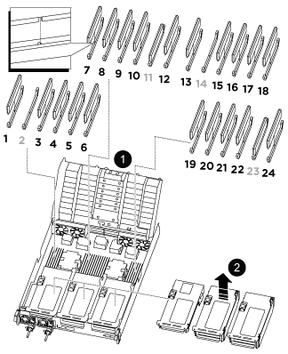
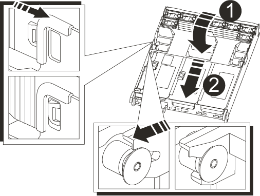

= Replace a DIMM - AFF A800
:icons: font
:imagesdir: ../media/

[.lead]
You must replace a DIMM in the controller module when your system registers an increasing number of correctable error correction codes (ECC); failure to do so causes a system panic.

All other components in the system must be functioning properly; if not, you must contact technical support.

You must replace the failed component with a replacement FRU component you received from your provider.

== Step 1: Shut down the impaired controller

include::../_include/recable_system_after_controller_rep.adoc[]

== Step 2: Remove the controller module

You must remove the controller module from the chassis when you replace the controller module or replace a component inside the controller module.

. If you are not already grounded, properly ground yourself.
. Unplug the controller module power supplies from the source.
. Release the power cable retainers, and then unplug the cables from the power supplies.
. Loosen the hook and loop strap binding the cables to the cable management device, and then unplug the system cables and SFP and QSFP modules (if needed) from the controller module, keeping track of where the cables were connected.
+
Leave the cables in the cable management device so that when you reinstall the cable management device, the cables are organized.

. Remove the cable management device from the controller module and set it aside.
. Press down on both of the locking latches, and then rotate both latches downward at the same time.
+
The controller module moves slightly out of the chassis.
+
image::../media/drw_a800_pcm_remove.png[]
+
[cols="1,4"]
|===
a|
image:../media/legend_icon_01.png[]|
Locking latch
a|
image:../media/legend_icon_02.png[]
a|
Locking pin
|===

. Slide the controller module out of the chassis.
+
Make sure that you support the bottom of the controller module as you slide it out of the chassis.

. Place the controller module on a stable, flat surface, and then open the air duct:
 .. Press in the locking tabs on the sides of the air duct toward the middle of the controller module.
 .. Slide the air duct toward the fan modules, and then rotate it upward to its completely open position.
+
image::../media/drw_a800_open_air_duct.png[]
+
[cols="1,4"]
|===
a|
image:../media/legend_icon_01.png[]|
Air duct locking tabs
a|
image:../media/legend_icon_02.png[]
a|
Slide air duct towards fan modules
a|
image:../media/legend_icon_03.png[]
a|
Rotate air duct towards fan modules
|===

== Step 3: Replace a DIMM

To replace a DIMM, you must locate it in the controller module using the DIMM map label on top of the air duct and then replace it following the specific sequence of steps.

. When removing a DIMM, unlock the locking latch on the applicable riser, and then remove the riser.
+

+
[cols="1,4"]
|===
a|
image:../media/legend_icon_01.png[]|
Air duct cover
a|
image:../media/legend_icon_02.png[]
a|
Riser 1 and DIMM bank 1, and 3-6
a|
Riser 2 and DIMM bank 7-10, 12-13, and 15-18
a|
Riser 3 and DIMM 19 -22 and 24
|===
*Note:* Slot 2 and 14 are left empty. Do not attempt to install DIMMs into these slots.

. Note the orientation of the DIMM in the socket so that you can insert the replacement DIMM in the proper orientation.
. Eject the DIMM from its slot by slowly pushing apart the two DIMM ejector tabs on either side of the DIMM, and then slide the DIMM out of the slot.
+
NOTE: Carefully hold the DIMM by the edges to avoid pressure on the components on the DIMM circuit board.

. Remove the replacement DIMM from the antistatic shipping bag, hold the DIMM by the corners, and align it to the slot.
+
The notch among the pins on the DIMM should line up with the tab in the socket.

. Insert the DIMM squarely into the slot.
+
The DIMM fits tightly in the slot, but should go in easily. If not, realign the DIMM with the slot and reinsert it.
+
NOTE: Visually inspect the DIMM to verify that it is evenly aligned and fully inserted into the slot.

. Push carefully, but firmly, on the top edge of the DIMM until the ejector tabs snap into place over the notches at the ends of the DIMM.
. Reinstall any risers that you removed from the controller module.
. Close the air duct.

== Step 4: Reinstall the controller module and booting the system

After you replace a FRU in the controller module, you must reinstall the controller module and reboot it.

. If you have not already done so, close the air duct:
 .. Swing the air duct all the way down to the controller module.
 .. Slide the air duct toward the risers until the locking tabs click into place.
 .. Inspect the air duct to make sure that it is properly seated and locked into place.
+

+
[cols="1,4"]
|===
a|
image:../media/legend_icon_01.png[]|
Locking tabs
a|
image:../media/legend_icon_02.png[]
a|
Slide plunger
|===
. Align the end of the controller module with the opening in the chassis, and then gently push the controller module halfway into the system.
+
NOTE: Do not completely insert the controller module in the chassis until instructed to do so.

. Recable the system, as needed.
+
If you removed the media converters (QSFPs or SFPs), remember to reinstall them if you are using fiber optic cables.

. Plug the power cord into the power supply, reinstall the power cable locking collar, and then connect the power supply to the power source.
. Complete the reinstallation of the controller module:
 .. Firmly push the controller module into the chassis until it meets the midplane and is fully seated.
+
The locking latches rise when the controller module is fully seated.
+
NOTE: Do not use excessive force when sliding the controller module into the chassis to avoid damaging the connectors.
+
The controller module begins to boot as soon as it is fully seated in the chassis. Be prepared to interrupt the boot process.

 .. Rotate the locking latches upward, tilting them so that they clear the locking pins, and then lower them into the locked position.
 .. If you have not already done so, reinstall the cable management device.
 .. Interrupt the normal boot process by pressing `Ctrl-C`.

== Step 5: Run diagnostics

After you have replaced a component in your system, you should run diagnostic tests on that component.

Your system must be at the LOADER prompt to start diagnostics.

All commands in the diagnostic procedures are issued from the controller where the component is being replaced.

. If the controller to be serviced is not at the LOADER prompt, reboot the controller: `system node halt -node node_name`
+
After you issue the command, you should wait until the system stops at the LOADER prompt.

. At the LOADER prompt, access the special drivers specifically designed for system-level diagnostics to function properly: `boot_diags`
. Select *Scan System* from the displayed menu to enable running the diagnostics tests.
. Select *Test Memory* from the displayed menu.
. Proceed based on the result of the preceding step:
 ** If the test failed, correct the failure, and then rerun the test.
 ** If the test reported no failures, select Reboot from the menu to reboot the system.

== Step 6: Return the failed part to NetApp

include::../_include/complete_rma.adoc[]
