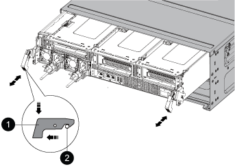
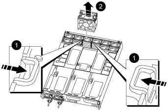

= Replace a fan - AFF A800
:icons: font
:imagesdir: ../media/

[.lead]
To replace a fan, remove the failed fan module and replace it with a new fan module.

== Step 1: Shut down the impaired controller

include::../_include/shutdown_most_frus.adoc[]

== Step 2: Remove the controller module

You must remove the controller module from the chassis when you replace a fan module.

. If you are not already grounded, properly ground yourself.
. Unplug the controller module power supplies from the source.
. Release the power cable retainers, and then unplug the cables from the power supplies.
. Loosen the hook and loop strap binding the cables to the cable management device, and then unplug the system cables from the controller module, keeping track of where the cables were connected.
+
Leave the cables in the cable management device so that when you reinstall the cable management device, the cables are organized.

. Remove the cable management device from the controller module and set it aside.
. Press down on both of the locking latches, and then rotate both latches downward at the same time.
+
The controller module moves slightly out of the chassis.
+

+
|===
a|
image:../media/legend_icon_01.png[]|
Locking latch
a|
image:../media/legend_icon_02.png[]
a|
Locking pin
|===

. Slide the controller module out of the chassis.
+
Make sure that you support the bottom of the controller module as you slide it out of the chassis.

. Set the controller module aside in a safe place.

== Step 3: Replace a fan

To replace a fan, remove the failed fan module and replace it with a new fan module.

. Identify the fan module that you must replace by checking the console error messages or by locating the lit LED for the fan module on the motherboard.
. Remove the fan module by pinching the locking tabs on the side of the fan module, and then lifting the fan module straight out of the controller module.
+

+
|===
a|
image:../media/legend_icon_01.png[]|
Fan locking tabs
a|
image:../media/legend_icon_02.png[]
a|
Fan module
|===

. Align the edges of the replacement fan module with the opening in the controller module, and then slide the replacement fan module into the controller module until the locking latches click into place.

== Step 4: Reinstall the controller module

After you replace a component within the controller module, you must reinstall the controller module in the system chassis and boot it.

. Align the end of the controller module with the opening in the chassis, and then gently push the controller module halfway into the system.
+
NOTE: Do not completely insert the controller module in the chassis until instructed to do so.

. Recable the system, as needed.
. Plug the power cables into the power supplies and reinstall the power cable retainers.
. Complete the reinstallation of the controller module:
 .. Firmly push the controller module into the chassis until it meets the midplane and is fully seated.
+
The locking latches rise when the controller module is fully seated.
+
NOTE: Do not use excessive force when sliding the controller module into the chassis to avoid damaging the connectors.
+
The controller module begins to boot as soon as it is fully seated in the chassis.

 .. Rotate the locking latches upward, tilting them so that they clear the locking pins, and then lower them into the locked position.
 .. If you have not already done so, reinstall the cable management device.
. Return the controller to normal operation by giving back its storage: `storage failover giveback -ofnode _impaired_node_name_`
. If automatic giveback was disabled, reenable it: `storage failover modify -controller local -auto-giveback true`

== Step 5: Return the failed part to NetApp

include::../_include/complete_rma.adoc[]
