= Detailed steps - AFF A800
:icons: font
:imagesdir: ../media/

[.lead]
This section gives detailed step-by-step instructions for installing an AFF A800 system.

== Step 1: Prepare for installation

To install your AFF A800 system, you need to create an account and register the system. You also need to inventory the appropriate number and type of cables for your system and collect specific network information.

You need to have access to the link:https://hwu.netapp.com[NetApp Hardware Universe^] (HWU) for information about site requirements as well as additional information on your configured system. You might also want to have access to the link:http://mysupport.netapp.com/documentation/productlibrary/index.html?productID=62286[Release Notes for your version of ONTAP^] for more information about this system.

.What you need
You need to provide the following at your site:

* Rack space for the storage system
* Phillips #2 screwdriver
* Additional networking cables to connect your system to your network switch and laptop or console with a Web browser

. Unpack the contents of all boxes.
. Record the system serial number from the controllers.
+
image::../media/drw_ssn_label.png[]

.Steps
. Set up your account:
 .. Log in to your existing account or create an account.
 .. Register (link:https://mysupport.netapp.com/eservice/registerSNoAction.do?moduleName=RegisterMyProduct[NetApp Product Registration^]) your system.
. Download and install link:https://mysupport.netapp.com/site/tools/tool-eula/activeiq-configadvisor[NetApp Downloads: Config Advisor^] on your laptop.
. Inventory and make a note of the number and types of cables you received.
+
The following table identifies the types of cables you might receive. If you receive a cable not listed in the table, see the link:https://hwu.netapp.com[NetApp Hardware Universe^] to locate the cable and identify its use.
+
[options="header" cols="1,2,1,2"]
|===
| Connector type| Part number and length| Type of cable...| For...
.3+a|
100 GbE cable
a|
X66211A-05 (112-00595), 0.5m
.5+a|
image:../media/oie_cable100_gbe_qsfp28.png[]
a|
HA interconnect
a|
X66211A-05 (112-00595), 0.5m;

X66211-1 (112-00573), 1m
a|
Cluster interconnect network
a|
X66211-2 (112-00574), 2m;

X66211-5 (112-00576), 5m
a|
Storage, Data
a|
10 GbE cable
a|
X6566B-3-R6 (112-00300), 3m;

X6566B-5-R6 (112-00301), 5m
a|
Data
a|
25 GbE cable
a|
X66240A-2 (112-00598), 2m;

X66240A-5 (112-00600), 5m
a|
Data
a|
RJ-45 (order dependent)
a|
Not applicable
a|
image:../media/oie_cable_rj45.png[]
a|
Management
a|
Fibre Channel
a|
X66250-2 (112-00342) 2m;

X66250-5 (112-00344) 5m;

X66250-15 (112-00346) 15m;

X66250-30 (112-00347) 30m
a|

a|

a|
Micro-USB console cable
a|
Not applicable
a|
image:../media/oie_cable_micro_usb.png[]
a|
Console connection during software setup
a|
Power cables
a|
Not applicable
a|
image:../media/oie_cable_power.png[]
a|
Powering up the system
|===

. Download and complete the link:https://library.netapp.com/ecm/ecm_download_file/ECMLP2839002[Cluster Configuration Worksheet^].

== Step 2: Install the hardware

You need to install your system in a 4-post rack or NetApp system cabinet, as applicable.

.Steps
. Install the rail kits, as needed.
+
link:../com.netapp.doc.hw-rail-superrail/home.html[Installing SuperRail into a four-post rack^]

. Install and secure your system using the instructions included with the rail kit.
+
NOTE: You need to be aware of the safety concerns associated with the weight of the system.
+
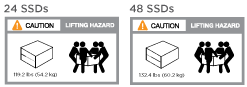

. Attach cable management devices (as shown).
+
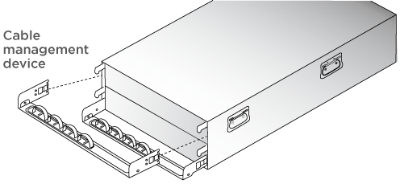

. Place the bezel on the front of the system.

== Step 3: Cable controllers

There is required cabling for your platform's cluster using the two-node switchless cluster method or the cluster interconnect network method. There is optional cabling to the Fibre Channel or iSCSI host networks or direct-attached storage. This cabling is not exclusive; you can have cable to a host network and storage.

=== Required cabling: Cable controllers to a cluster

Cable the controllers to a cluster by using the two-node switchless cluster method or by using the cluster interconnect network.

==== Option 1: Cable a two-node switchless cluster

Management network ports on the controllers are connected to switches. The HA interconnect and cluster interconnect ports are cabled on both controllers.

.Before you begin
Contact your network administrator for information about connecting the system to the switches.

Be sure to check the illustration arrow for the proper cable connector pull-tab orientation.

image::../media/oie_cable_pull_tab_up.png[]

NOTE: As you insert the connector, you should feel it click into place; if you do not feel it click, remove it, turn it around and try again.

.Steps
. Use the animation or the tabulated steps to complete the cabling between the controllers and the switches:
+

video::edc42447-f721-4cbe-b080-ab0c0123a139[panopto, title="Animation - Cable a two-node switchless cluster"]

+
[options="header" cols="10,90"]
|===
| Step| Perform on each controller module
a|

a|
Cable the HA interconnect ports:

** e0b to e0b
** e1b to e1b
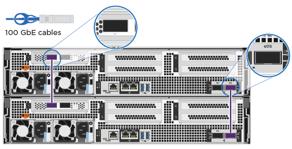

a|

a|
Cable the cluster interconnect ports:

** e0a to e0a
** e1a to e1a
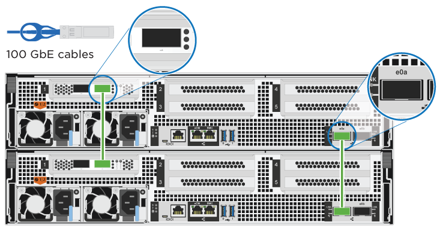
a|
image:../media/oie_legend_icon_3_lp.png[]
a|
Cable the management ports to the management network switches    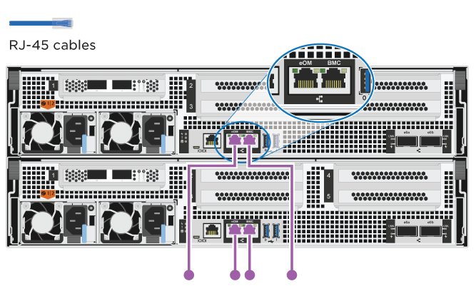
a|
image:../media/oie_legend_icon_attn_symbol.png[]
a|
DO NOT plug in the power cords at this point.
|===

. To perform optional cabling, see:

 ** <<Option 1: Connect to a Fibre Channel host>>
 ** <<Option 2: Connect to a 10GbE host>>
 ** <<Option 3: Connect to a single direct-attached NS224 drive shelf>>
 ** <<Option 4: Connect to two direct-attached NS224 drive shelves>>

. To complete setting up your system, see link:install-detailed-guide.html#step-4-complete-system-setup-and-configuration[Step 4: Complete system setup and configuration].

==== Option 2: Cable a switched cluster

Cluster interconnect and management network ports on the controllers are connected to switches while the HA interconnect ports are cabled on both controllers.

.Before you begin
Contact your network administrator for information about connecting the system to the switches.

Be sure to check the illustration arrow for the proper cable connector pull-tab orientation.

image::../media/oie_cable_pull_tab_up.png[]

NOTE: As you insert the connector, you should feel it click into place; if you do not feel it click, remove it, turn it around and try again.

.Steps
. Use the animation or the tabulated steps to complete the cabling between the controllers and the switches:
+

video::49e48140-4c5a-4395-a7d7-ab0c0123a10e[panopto, title="Animation - Cable a switched cluster"]

+
[options="header" cols="10,90"]
|===
| Step| Perform on each controller module
a|

a|
Cable the HA interconnect ports:

** e0b to e0b
** e1b to e1b

a|

a|
Cable the cluster interconnect ports to the 100 GbE cluster interconnect switches.
** e0a
** e1a
image:../media/drw_affa800_switched_clust_cabling.png[]
a|
image:../media/oie_legend_icon_3_lp.png[]
a|
Cable the management ports to the management network switches    

a|
image:../media/oie_legend_icon_attn_symbol.png[]
a|
DO NOT plug in the power cords at this point.
|===

. To perform optional cabling, see:

 ** <<Option 1: Connect to a Fibre Channel host>>
 ** <<Option 2: Connect to a 10GbE host>>
 ** <<Option 3: Connect to a single direct-attached NS224 drive shelf>>
 ** <<Option 4: Connect to two direct-attached NS224 drive shelves>>

. To complete setting up your system, see link:install-detailed-guide.html#step-4-complete-system-setup-and-configuration[Step 4: Complete system setup and configuration].

=== Optional cabling: Cable configuration-dependent options

You have configuration-dependent optional cabling to the Fibre Channel or iSCSI host networks or direct-attached storage. This cabling is not exclusive; you can have cabling to a host network and storage.

==== Option 1: Cable to a Fibre Channel host network

Fibre Channel ports on the controllers are connected to Fibre Channel host network switches.

.Before you begin
Contact your network administrator for information about connecting the system to the switches.

Be sure to check the illustration arrow for the proper cable connector pull-tab orientation.

image::../media/oie_cable_pull_tab_up.png[]

NOTE: As you insert the connector, you should feel it click into place; if you do not feel it click, remove it, turn it around and try again.

[options="header" cols="10,90"]
|===
| Step| Perform on each controller module
a|
1
a|
Cable ports 2a through 2d to the FC host switches.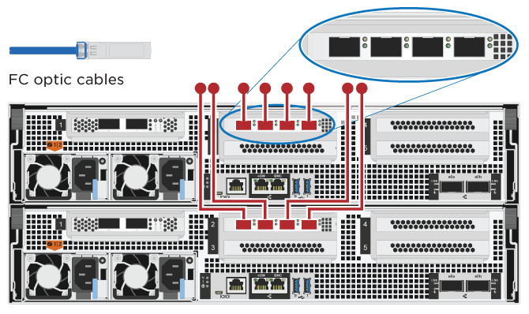

a|
2
a|
To perform other optional cabling, choose from:

* <<Option 3: Connect to a single direct-attached NS224 drive shelf>>
* <<Option 4: Connect to two direct-attached NS224 drive shelves>>

a|
3
a|
To complete setting up your system, see link:install-detailed-guide.html#step-4-complete-system-setup-and-configuration[Step 4: Complete system setup and configuration].

|===

==== Option 2: Cable to a 10GbE host network

10GbE ports on the controllers are connected to 10GbE host network switches.

.Before you begin
Contact your network administrator for information about connecting the system to the switches.

Be sure to check the illustration arrow for the proper cable connector pull-tab orientation.

image::../media/oie_cable_pull_tab_up.png[]

NOTE: As you insert the connector, you should feel it click into place; if you do not feel it click, remove it, turn it around and try again.

[options="header" cols="10,90"]
|===
| Step| Perform on each controller module
a|
1
a|
Cable ports e4a through e4d to the 10GbE host network switches.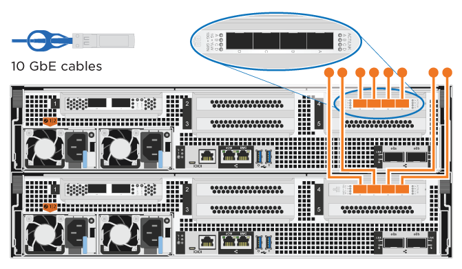

a|
2
a|
To perform other optional cabling, choose from:

* <<Option 3: Connect to a single direct-attached NS224 drive shelf>>
* <<Option 4: Connect to two direct-attached NS224 drive shelves>>

a|
3
a|
To complete setting up your system, see link:install-detailed-guide.html#step-4-complete-system-setup-and-configuration[Step 4: Complete system setup and configuration].

|===

==== Option 3: Cable the controllers to a single drive shelf

You must cable each controller to the NSM modules on the NS224 drive shelf.

.Before you begin
Be sure to check the illustration arrow for the proper cable connector pull-tab orientation.

image::../media/oie_cable_pull_tab_up.png[]

NOTE: As you insert the connector, you should feel it click into place; if you do not feel it click, remove it, turn it around and try again.

Use the animation or the tabulated steps to cable your controllers to a single shelf:

video::09dade4f-00bd-4d41-97d7-ab0c0123a0b4[panopto, title="Animation - Cable the controllers to a single drive shelf"]

[options="header" cols="10,90"]
|===
| Step| Perform on each controller module
a|

a|
Cable controller A to the shelf:    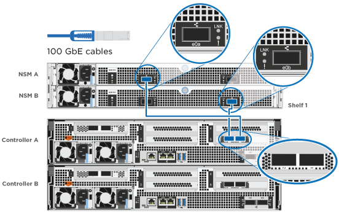
a|

a|
Cable controller B to the shelf:    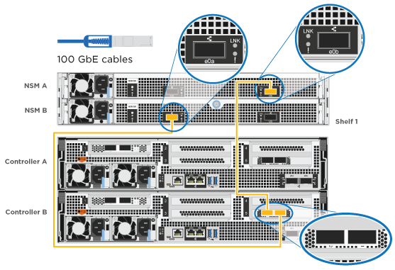
|===

To complete setting up your system, see link:install-detailed-guide.html#step-4-complete-system-setup-and-configuration[Step 4: Complete system setup and configuration].

==== Option 4: Cable the controllers to two drive shelves

You must cable each controller to the NSM modules on both NS224 drive shelves.

.Before you begin
Be sure to check the illustration arrow for the proper cable connector pull-tab orientation.

image::../media/oie_cable_pull_tab_up.png[]

NOTE: As you insert the connector, you should feel it click into place; if you do not feel it click, remove it, turn it around and try again.

Use the animation or the tabulated steps to cable your controllers to two drive shelves:

video::fe50ac38-9375-4e6b-85af-ab0c0123a0e0[panopto, title="Animation - Cable the controllers to two drive shelves"]

[options="header" cols="10,90"]
|===
| Step| Perform on each controller module
a|

a|
Cable controller A to the shelves:    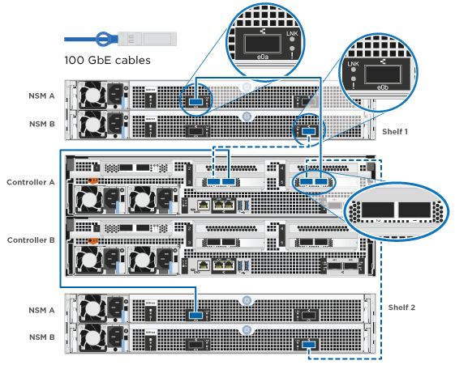
a|

a|
Cable controller B to the shelves:    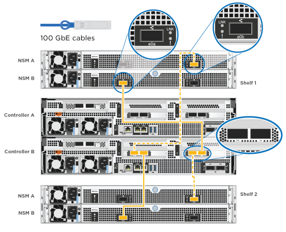
|===

To complete setting up your system, see link:install-detailed-guide.html#step-4-complete-system-setup-and-configuration[Step 4: Complete system setup and configuration].

== Step 4: Complete system setup and configuration

Complete the system setup and configuration using cluster discovery with only a connection to the switch and laptop, or by connecting directly to a controller in the system and then connecting to the management switch.

=== Option 1: Complete system setup and configuration if network discovery is enabled

If you have network discovery enabled on your laptop, you can complete system setup and configuration using automatic cluster discovery.

.Steps
. Plug the power cords into the controller power supplies, and then connect them to power sources on different circuits.
+
The system begins to boot. Initial booting may take up to eight minutes.

. Make sure that your laptop has network discovery enabled.
+
See your laptop's online help for more information.

. Use the animation to connect your laptop to the Management switch:
+
video::d61f983e-f911-4b76-8b3a-ab1b0066909b[panopto, title="Animation - Connect your laptop to the Management switch"]

. Select an ONTAP icon listed to discover:
+
image::../media/drw_autodiscovery_controler_select.png[]

 .. Open File Explorer.
 .. Click *Network* in the left pane.
 .. Right-click and select *refresh*.
 .. Double-click either ONTAP icon and accept any certificates displayed on your screen.
+
NOTE: XXXXX is the system serial number for the target node.
+
System Manager opens.

. Use System Manager guided setup to configure your system using the data you collected in the link:https://library.netapp.com/ecm/ecm_download_file/ECMLP2862613[ONTAP Configuration Guide^].
. Verify the health of your system by running Config Advisor.
. After you have completed the initial configuration, go to the link:https://www.netapp.com/data-management/oncommand-system-documentation/[ONTAP & ONTAP System Manager Documentation Resources^] page for information about configuring additional features in ONTAP.

=== Option 2: Complete system setup and configuration if network discovery is not enabled

If network discovery is not enabled on your laptop, you must complete the configuration and setup using this task.

.Steps
. Cable and configure your laptop or console:
 .. Set the console port on the laptop or console to 115,200 baud with N-8-1.
+
NOTE: See your laptop or console's online help for how to configure the console port.

 .. Connect the console cable to the laptop or console, and connect the console port on the controller using the console cable that came with your system.
+
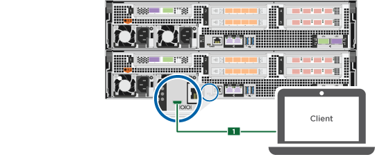

 .. Connect the laptop or console to the switch on the management subnet.
+
image::../media/drw_client_mgmt_subnet_affa800.png[]

 .. Assign a TCP/IP address to the laptop or console, using one that is on the management subnet.
. Plug the power cords into the controller power supplies, and then connect them to power sources on different circuits.
+
The system begins to boot. Initial booting may take up to eight minutes.

. Assign an initial node management IP address to one of the nodes.
+
[options="header" cols="1,2"]
|===
| If the management network has DHCP...| Then...
a|
Configured
a|
Record the IP address assigned to the new controllers.
a|
Not configured
a|

 .. Open a console session using PuTTY, a terminal server, or the equivalent for your environment.
+
NOTE: Check your laptop or console's online help if you do not know how to configure PuTTY.

 .. Enter the management IP address when prompted by the script.

+
|===

. Using System Manager on your laptop or console, configure your cluster:
 .. Point your browser to the node management IP address.
+
NOTE: The format for the address is +https://x.x.x.x+.

 .. Configure the system using the data you collected in the link:https://library.netapp.com/ecm/ecm_download_file/ECMLP2862613[ONTAP Configuration Guide^].
. Verify the health of your system by running Config Advisor.
. After you have completed the initial configuration, go to the link:https://www.netapp.com/data-management/oncommand-system-documentation/[ONTAP & ONTAP System Manager Documentation Resources^] page for information about configuring additional features in ONTAP.
