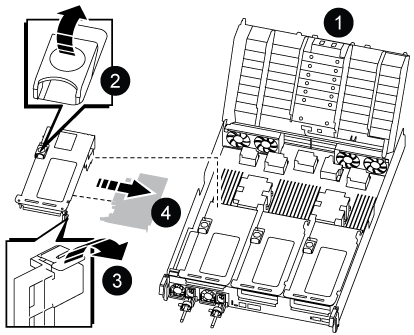
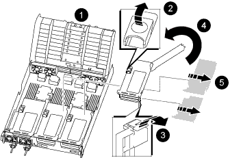

= Replace a PCIe card - AFF A800
:icons: font
:imagesdir: ../media/

[.lead]
To replace a PCIe card, you must disconnect the cables from the cards, remove the SFP and QSFP modules from the cards before removing the riser, reinstall the riser, and then reinstall the SFP and QSFP modules before cabling the cards.

* You can use this procedure with all versions of ONTAP supported by your system
* All other components in the system must be functioning properly; if not, you must contact technical support.

== Step 1: Shut down the impaired controller

include::../_include/shutdown_most_frus.adoc[]

== Step 2: Remove the controller module

You must remove the controller module from the chassis when you replace the controller module or replace a component inside the controller module.

. If you are not already grounded, properly ground yourself.
. Unplug the controller module power supplies from the source.
. Release the power cable retainers, and then unplug the cables from the power supplies.
. Loosen the hook and loop strap binding the cables to the cable management device, and then unplug the system cables and SFP and QSFP modules (if needed) from the controller module, keeping track of where the cables were connected.
+
Leave the cables in the cable management device so that when you reinstall the cable management device, the cables are organized.

. Remove the cable management device from the controller module and set it aside.
. Press down on both of the locking latches, and then rotate both latches downward at the same time.
+
The controller module moves slightly out of the chassis.
+
image::../media/drw_a800_pcm_remove.png[]
+
[cols="1,4"]
|===
a|
image:../media/legend_icon_01.png[]|
Locking latch
a|
image:../media/legend_icon_02.png[]
a|
Locking pin
|===

. Slide the controller module out of the chassis.
+
Make sure that you support the bottom of the controller module as you slide it out of the chassis.

. Place the controller module on a stable, flat surface, and then open the air duct:
 .. Press in the locking tabs on the sides of the air duct toward the middle of the controller module.
 .. Slide the air duct toward the fan modules, and then rotate it upward to its completely open position.
+
image::../media/drw_a800_open_air_duct.png[]
+
[cols="1,4"]
|===
a|
image:../media/legend_icon_01.png[]|
Air duct locking tabs
a|
image:../media/legend_icon_02.png[]
a|
Slide air duct towards fan modules
a|
image:../media/legend_icon_03.png[]
a|
Rotate air duct towards fan modules
|===

== Step 3: Replace a PCIe card

To replace a PCIe card, you must remove the cabling and any QSFPs and SFPs from the ports on the PCIe cards in the target riser, remove the riser from the controller module, remove and replace the PCIe card, reinstall the riser and any QSFPs and SFPs onto the ports, and cable the ports.

. Determine if the card you are replacing is from Riser 1 or if it is from Riser 2 or 3.
 ** If you are replacing the 100GbE PCIe card in Riser 1, use Steps 2 - 3 and Steps 6 - 7.
 ** If you are replacing a PCIe card from Riser 2 or 3, use Steps 4 through 7.
. Remove Riser 1 from the controller module:
 .. Remove the QSFP modules that might be in the PCIe card.
 .. Rotate the riser locking latch on the left side of the riser up and toward the fan modules.
+
The riser raises up slightly from the controller module.

 .. Lift the riser up, shift it toward the fans so that the sheet metal lip on the riser clears the edge of the controller module, lift the riser out of the controller module, and then place it on a stable, flat surface.
+

+
[cols="1,4"]
|===
a|
image:../media/legend_icon_01.png[]|
Air duct
a|
image:../media/legend_icon_02.png[]
a|
Riser locking latch
a|
image:../media/legend_icon_03.png[]
a|
Card locking bracket
a|
image:../media/legend_icon_04.png[]
a|
Riser 1 (left riser) with 100GbE PCIe card in slot 1.
|===
. Remove the PCIe card from Riser 1:
 .. Turn the riser so that you can access the PCIe card.
 .. Press the locking bracket on the side of the PCIe riser, and then rotate it to the open position.
 .. Remove the PCIe card from the riser.
. Remove the PCIe riser from the controller module:
 .. Remove any SFP or QSFP modules that might be in the PCIe cards.
 .. Rotate the riser locking latch on the left side of the riser up and toward the fan modules.
+
The riser raises up slightly from the controller module.

 .. Lift the riser up, shift it toward the fans so that the sheet metal lip on the riser clears the edge of the controller module, lift the riser out of the controller module, and then place it on a stable, flat surface.
+

+
[cols="1,4"]
|===
a|
image:../media/legend_icon_01.png[]|
Air duct
a|
image:../media/legend_icon_02.png[]
a|
Riser 2 (middle riser) or 3 (right riser) locking latch
a|
image:../media/legend_icon_03.png[]
a|
Card locking bracket
a|
image:../media/legend_icon_04.png[]
a|
Side panel on riser 2 or 3
a|
image:../media/legend_icon_05.png[]
a|
PCIe cards in riser 2 or 3
|===
. Remove the PCIe card from the riser:
 .. Turn the riser so that you can access the PCIe cards.
 .. Press the locking bracket on the side of the PCIe riser, and then rotate it to the open position.
 .. Swing the side panel off the riser.
 .. Remove the PCIe card from the riser.
. Install the PCIe card into the same slot in the riser:
 .. Align the card with the card socket in the riser, and then slide it squarely into the socket in the riser.
+
NOTE: Make sure that the card is completely and squarely seated into the riser socket.

 .. For Riser 2 or 3, close the side panel.
 .. Swing the locking latch into place until it clicks into the locked position.
. Install the riser into the controller module:
 .. Align the lip of the riser with the underside of the controller module sheet metal.
 .. Guide the riser along the pins in the controller module, and then lower the riser into the controller module.
 .. Swing the locking latch down and click it into the locked position.
+
When locked, the locking latch is flush with the top of the riser and the riser sits squarely in the controller module.

 .. Reinsert any SFP modules that were removed from the PCIe cards.

== Step 4: Reinstall the controller module

After you replace a component within the controller module, you must reinstall the controller module in the system chassis and boot it.

. If you have not already done so, close the air duct:
 .. Swing the air duct all the way down to the controller module.
 .. Slide the air duct toward the risers until the locking tabs click into place.
 .. Inspect the air duct to make sure that it is properly seated and locked into place.
+
image::../media/drw_a800_close_air_duct.png[]
+
[cols="1,4"]
|===
a|
image:../media/legend_icon_01.png[]|
Locking tabs
a|
image:../media/legend_icon_02.png[]
a|
Slide plunger
|===
. Align the end of the controller module with the opening in the chassis, and then gently push the controller module halfway into the system.
+
NOTE: Do not completely insert the controller module in the chassis until instructed to do so.

. Recable the system, as needed.
. Plug the power cables into the power supplies and reinstall the power cable retainers.
. Complete the reinstallation of the controller module:
 .. Firmly push the controller module into the chassis until it meets the midplane and is fully seated.
+
The locking latches rise when the controller module is fully seated.
+
NOTE: Do not use excessive force when sliding the controller module into the chassis to avoid damaging the connectors.
+
The controller module begins to boot as soon as it is fully seated in the chassis.

 .. Rotate the locking latches upward, tilting them so that they clear the locking pins, and then lower them into the locked position.
 .. If you have not already done so, reinstall the cable management device.
. Return the controller to normal operation by giving back its storage: `storage failover giveback -ofnode _impaired_node_name_`
. If automatic giveback was disabled, reenable it: `storage failover modify -node local -auto-giveback true`

== Step 5: Return the failed part to NetApp

include::../_include/complete_rma.adoc[]
