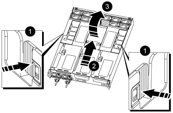
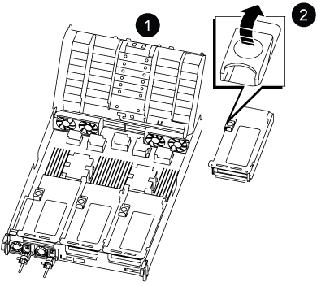
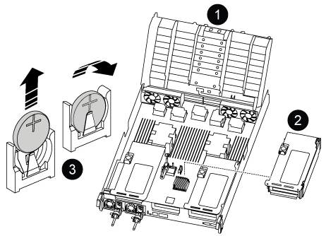

= Replace the real-time clock battery - AFF A800
:icons: font
:imagesdir: ../media/

[.lead]
You replace the real-time clock (RTC) battery in the controller module so that your system's services and applications that depend on accurate time synchronization continue to function.

* You can use this procedure with all versions of ONTAP supported by your system
* All other components in the system must be functioning properly; if not, you must contact technical support.

== Step 1: Shut down the impaired controller

include::../_include/shutdown_most_frus.adoc[]

== Step 2: Remove the controller module

You must remove the controller module from the chassis when you replace the controller module or replace a component inside the controller module.

. If you are not already grounded, properly ground yourself.
. Unplug the controller module power supplies from the source.
. Release the power cable retainers, and then unplug the cables from the power supplies.
. Loosen the hook and loop strap binding the cables to the cable management device, and then unplug the system cables and SFP and QSFP modules (if needed) from the controller module, keeping track of where the cables were connected.
+
Leave the cables in the cable management device so that when you reinstall the cable management device, the cables are organized.

. Remove the cable management device from the controller module and set it aside.
. Press down on both of the locking latches, and then rotate both latches downward at the same time.
+
The controller module moves slightly out of the chassis.
+
image::../media/drw_a800_pcm_remove.png[]
|===
a|
image:../media/legend_icon_01.png[]|
Locking latch
a|
image:../media/legend_icon_02.png[]
a|
Locking pin
|===

. Slide the controller module out of the chassis.
+
Make sure that you support the bottom of the controller module as you slide it out of the chassis.

. Place the controller module on a stable, flat surface, and then open the air duct:
 .. Press in the locking tabs on the sides of the air duct toward the middle of the controller module.
 .. Slide the air duct toward the fan modules, and then rotate it upward to its completely open position.
+

+
[cols="1,4"]
|===
a|
image:../media/legend_icon_01.png[]|
Air duct locking tabs
a|
image:../media/legend_icon_02.png[]
a|
Slide air duct towards fan modules
a|
image:../media/legend_icon_03.png[]
a|
Rotate air duct towards fan modules
|===

== Step 3: Remove the PCIe risers

You must remove one or more PCIe risers when replacing specific hardware components in the controller module.

. Remove the PCIe riser from the controller module:
 .. Remove any SFP or QSFP modules that might be in the PCIe cards.
 .. Rotate the riser locking latch on the left side of the riser up and toward the fan modules.
+
The riser raises up slightly from the controller module.

 .. Lift the riser up, shift it toward the fans so that the sheet metal lip on the riser clears the edge of the controller module, lift the riser out of the controller module, and then place it on a stable, flat surface.
+

+
[cols="1,4"]
|===
a|
image:../media/legend_icon_01.png[]|
Air duct
a|
image:../media/legend_icon_02.png[]
a|
Riser 2 (middle riser) locking latch
|===

== Step 4: Replace the RTC battery

To replace the RTC battery, locate it inside the controller and follow the specific sequence of steps.

. Locate the RTC battery under Riser 2.
+

+
[cols="1,4"]
|===
a|
image:../media/legend_icon_01.png[]|
Air duct
a|
image:../media/legend_icon_02.png[]
a|
Riser 2
a|
image:../media/legend_icon_03.png[]
a|
RTC battery and housing
|===

. Gently push the battery away from the holder, rotate it away from the holder, and then lift it out of the holder.
+
NOTE: Note the polarity of the battery as you remove it from the holder. The battery is marked with a plus sign and must be positioned in the holder correctly. A plus sign near the holder tells you how the battery should be positioned.

. Remove the replacement battery from the antistatic shipping bag.
. Note the polarity of the RTC battery, and then insert it into the holder by tilting the battery at an angle and pushing down.
. Visually inspect the battery to make sure that it is completely installed into the holder and that the polarity is correct.

== Step 5: Install the PCIe risers

You reinstall the PCIe risers after replacing the hardware components in the impaired controller.

. Install the riser into the controller module:
 .. Align the lip of the riser with the underside of the controller module sheet metal.
 .. Guide the riser along the pins in the controller module, and then lower the riser into the controller module.
 .. Swing the locking latch down and click it into the locked position.
+
When locked, the locking latch is flush with the top of the riser and the riser sits squarely in the controller module.

 .. Reinsert any SFP modules that were removed from the PCIe cards.

== Step 6: Reinstall the controller module and setting time/date after RTC battery replacement

After you replace a component within the controller module, you must reinstall the controller module in the system chassis, reset the time and date on the controller, and then boot it.

. If you have not already done so, close the air duct or controller module cover.
. Align the end of the controller module with the opening in the chassis, and then gently push the controller module halfway into the system.
+
Do not completely insert the controller module in the chassis until instructed to do so.

. Recable the system, as needed.
+
If you removed the media converters (QSFPs or SFPs), remember to reinstall them if you are using fiber optic cables.

. If the power supplies were unplugged, plug them back in and reinstall the power cable retainers.
. Complete the reinstallation of the controller module:
 .. Firmly push the controller module into the chassis until it meets the midplane and is fully seated.
+
The locking latches rise when the controller module is fully seated.
+
NOTE: Do not use excessive force when sliding the controller module into the chassis to avoid damaging the connectors.
+
The controller module begins to boot as soon as it is fully seated in the chassis.

 .. Rotate the locking latches upward, tilting them so that they clear the locking pins, and then lower them into the locked position.
 .. If you have not already done so, reinstall the cable management device.
 .. Halt the controller at the LOADER prompt.
. Reset the time and date on the controller:
 .. Check the date and time on the healthy controller with the `show date` command.
 .. At the LOADER prompt on the target controller, check the time and date.
 .. If necessary, modify the date with the `set date mm/dd/yyyy` command.
 .. If necessary, set the time, in GMT, using the `set time hh:mm:ss` command.
 .. Confirm the date and time on the target controller.
. At the LOADER prompt, enter `bye` to reinitialize the PCIe cards and other components and let the controller reboot.
. Return the controller to normal operation by giving back its storage: `storage failover giveback -ofnode _impaired_node_name_`
. If automatic giveback was disabled, reenable it: `storage failover modify -node local -auto-giveback true`

== Step 7: Return the failed part to NetApp

include::../_include/complete_rma.adoc[]
