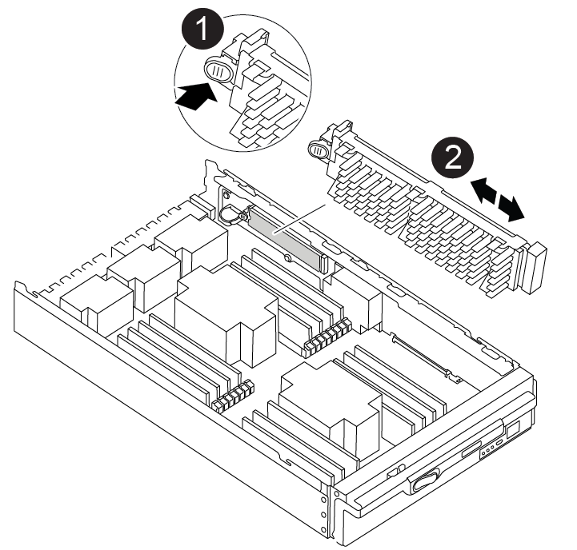

= Remove the controller, replace the boot media, and transfer the boot image - AFF A900

[.lead]
You must remove and open the controller module, locate and replace the boot media in the controller, and then transfer the image to the replacement boot media.

== Step 1: Remove the controller module
:icons: font
:imagesdir: ../media/

[.lead]
To access components inside the controller, you must first remove the controller module from the system and then remove the cover on the controller module.

.Steps
. If you are not already grounded, properly ground yourself.
. Unplug the cables from the impaired controller module, and keep track of where the cables were connected.
. Slide the terra cotta button on the cam handle downward until it unlocks.

+
video::256721fd-4c2e-40b3-841a-adf2000df5fa[panopto, title="Animation - Remove the controller"]
+
image::../media/drw_a900_remove_PCM.png[]
+
[cols="10,90"]
|===
a|
image:../media/legend_icon_01.png[]
a|
Cam handle release button
a|
image:../media/legend_icon_02.png[]
a|
Cam handle
|===

. Rotate the cam handle so that it completely disengages the controller module from the chassis, and then slide the controller module out of the chassis.
+
Make sure that you support the bottom of the controller module as you slide it out of the chassis.

. Place the controller module lid-side up on a stable, flat surface, press the blue button on the cover, slide the cover to the back of the controller module, and then swing the cover up and lift it off of the controller module.
+
image::../media/drw_a900_PCM_open.png[]
+
[cols="10,90"]
|===
a|
image:../media/legend_icon_01.png[] a|
Controller module cover locking button
|===

== Step 2: Replace the boot media
:icons: font
:imagesdir: ../media/

[.lead]
You must locate the boot media in the controller and follow the directions to replace it.

.Steps
. Lift the black air duct at the back of the controller module and then locate the boot media using the following illustration or the FRU map on the controller module:

+
video::c5080658-765e-4d29-8456-adf2000e1495[panopto, title="Animation - Replace boot media"]
+

+
[cols="10,90"]
|===
a|
image:../media/legend_icon_01.png[] a|
Press release tab
a|
image:../media/legend_icon_02.png[]
a|
Boot media
|===

. Press the blue button on the boot media housing to release the boot media from its housing, and then gently pull it straight out of the boot media socket.
+
NOTE: Do not twist or pull the boot media straight up, because this could damage the socket or the boot media.

. Align the edges of the replacement boot media with the boot media socket, and then gently push it into the socket.
. Check the boot media to make sure that it is seated squarely and completely in the socket.
+
If necessary, remove the boot media and reseat it into the socket.

. Push the boot media down to engage the locking button on the boot media housing.
. Reinstall the controller module lid by aligning the pins on the lid with the slots on the motherboard carrier, and then slide the lid into place.

== Step 3: Transfer the boot image to the boot media
:icons: font
:imagesdir: ../media/

[.lead]
You can install the system image to the replacement boot media using a USB flash drive with the image installed on it. However, you must restore the var file system during this procedure.

.Before you begin
* You must have a USB flash drive, formatted to FAT32, with at least 4GB capacity.
* A copy of the same image version of ONTAP as what the impaired controller was running. You can download the appropriate image from the Downloads section on the NetApp Support Site
 ** If NVE is enabled, download the image with NetApp Volume Encryption, as indicated in the download button.
 ** If NVE is not enabled, download the image without NetApp Volume Encryption, as indicated in the download button.
* If your system is a stand-alone system you do not need a network connection, but you must perform an additional reboot when restoring the var file system.

.Steps

. Align the end of the controller module with the opening in the chassis, and then gently push the controller module halfway into the system.
. Recable the controller module, as needed.
. Insert the USB flash drive into the USB slot on the controller module.
+
Make sure that you install the USB flash drive in the slot labeled for USB devices, and not in the USB console port.

. Push the controller module all the way into the system, making sure that the cam handle clears the USB flash drive, firmly push the cam handle to finish seating the controller module, and then push the cam handle to the closed position.
+
The controller begins to boot as soon as it is completely installed into the chassis.

. Interrupt the boot process to stop at the LOADER prompt by pressing Ctrl-C when you see Starting AUTOBOOT press Ctrl-C to abort....
+
If you miss this message, press Ctrl-C, select the option to boot to Maintenance mode, and then halt the controller to boot to LOADER.

. Set your network connection type at the LOADER prompt:
 ** If you are configuring DHCP: `ifconfig e0a -auto`
+
NOTE: The target port you configure is the target port you use to communicate with the impaired controller from the healthy controller during var file system restore with a network connection. You can also use the e0M port in this command.

 ** If you are configuring manual connections: `ifconfig e0a -addr=filer_addr -mask=netmask -gw=gateway-dns=dns_addr-domain=dns_domain`
  *** filer_addr is the IP address of the storage system.
  *** netmask is the network mask of the management network that is connected to the HA partner.
  *** gateway is the gateway for the network.
  *** dns_addr is the IP address of a name server on your network.
  *** dns_domain is the Domain Name System (DNS) domain name.
+
If you use this optional parameter, you do not need a fully qualified domain name in the netboot server URL. You need only the server's host name.

+
NOTE: Other parameters might be necessary for your interface. You can enter help ifconfig at the firmware prompt for details.
. If the controller is in a stretch or fabric-attached MetroCluster, you must restore the FC adapter configuration:
 .. Boot to Maintenance mode: `boot_ontap maint`
 .. Set the MetroCluster ports as initiators: `ucadmin modify -m fc -t iniitator adapter_name`
 .. Halt to return to Maintenance mode: `halt`

+
The changes will be implemented when the system is booted.
