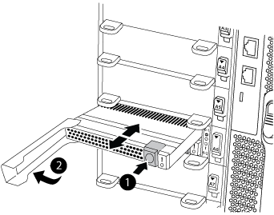

= Replace the caching module or add/replace a core dump module - FAS9500
:icons: font
:imagesdir: ../media/

[.lead]
You must replace the caching module in the controller module when your system registers a single AutoSupport (ASUP) message that the module has gone offline; failure to do so results in performance degradation. If AutoSupport is not enabled, you can locate the failed caching module by the fault LED on the front of the module. You can also add or replace the 1TB, X9170A core dump module, which is required if you are installing NS224 drive shelves in an AFF A700 system.

* You must replace the failed component with a replacement FRU component you received from your provider.
* For instructions about hot swapping the caching module, see link:../a900/caching_module_hot_swap.html[Hot-swapping a caching module].
* When removing, replacing, or adding caching or core dump modules, the target node must be halted to the LOADER.
* AFF A700 supports the 1TB core dump module, X9170A, which is required if you are adding NS224 drive shelves.
* The core dump modules can be installed in slots 6-1 and 6-2. The recommended best practice is to install the module in slot 6-1.
* The X9170A core dump module is not hot-swappable.

== Shutting down the a node (not two-node MetroCluster configuration)

include::../_include/shutdown_most_frus.adoc[]

== Shutting down a node (two-node MetroCluster configuration)

include::../_include/shutdown_2n_mcc.adoc[]

== Replacing or adding a caching module

[.lead]
The NVMe SSD Flash Cache modules (FlashCache or caching modules) are separate modules. They are located in the front of the NVRAM module. To replace or add a caching module, locate it on the rear of the system on slot 6, and then follow the specific sequence of steps to replace it.

Your storage system must meet certain criteria depending on your situation:

* It must have the appropriate operating system for the caching module you are installing.
* It must support the caching capacity.
* The target node must be at the LOADER prompt before adding or replacing the caching module.
* The replacement caching module must have the same capacity as the failed caching module, but can be from a different supported vendor.
* All other components in the storage system must be functioning properly; if not, you must contact technical support.

. If you are not already grounded, properly ground yourself.
. Locate the failed caching module, in slot 6, by the lit amber Attention LED on the front of the caching module.
. Remove the caching module:
+
NOTE: If you are adding another caching module to your system, remove the blank module and go to the next step.
+

+
|===
a|
image:../media/legend_icon_01.gif[]
a|
Orange release button.
a|
image:../media/legend_icon_02.gif[]
a|
Caching module cam handle.
|===

 .. Press the orange release button on the front of the caching module.
+
IMPORTANT: Do not use the numbered and lettered I/O cam latch to eject the caching module. The numbered and lettered I/O cam latch ejects the entire NVRAM10 module and not the caching module.

 .. Rotate the cam handle until the caching module begins to slide out of the NVRAM10 module.
 .. Gently pull the cam handle straight toward you to remove the caching module from the NVRAM10 module.
+
Be sure to support the caching module as you remove it from the NVRAM10 module.

. Install the caching module:
 .. Align the edges of the caching module with the opening in the NVRAM10 module.
 .. Gently push the caching module into the bay until the cam handle engages.
 .. Rotate the cam handle until it locks into place.

== Adding or replacing an X9170A core dump module

[.lead]
The 1TB cache core dump, X9170A, is only used in the AFF A700 systems. The core dump module cannot be hot-swapped. The core dump module typically is located in the front of the NVRAM module in slot 6-1 in the rear of the system. To replace or add the core dump module, locate slot 6-1, and then follow the specific sequence of steps to add or replace it.

* Your system must be running ONTAP 9.8 or later in order to add a core dump module.
* The X9170A core dump module is not hot-swappable.
* The target node must be at the LOADER prompt before adding or replacing the code dump module.
* You must have received two X9170 core dump modules; one for each controller.
* All other components in the storage system must be functioning properly; if not, you must contact technical support.

. If you are not already grounded, properly ground yourself.
. If you are replacing a failed core dump module, locate and remove it:
+

+
|===
| image:../media/legend_icon_01.gif[]| Orange release button.
a|
image:../media/legend_icon_02.gif[]
a|
Core dump module cam handle.
|===

 .. Locate the failed module by the amber Attention LED on the front of the module.
 .. Press the orange release button on the front of the core dump module.
+
IMPORTANT: Do not use the numbered and lettered I/O cam latch to eject the core dump module. The numbered and lettered I/O cam latch ejects the entire NVRAM10 module and not the core dump module.

 .. Rotate the cam handle until the core dump module begins to slide out of the NVRAM10 module.
 .. Gently pull the cam handle straight toward you to remove the core dump module from the NVRAM10 module and set it aside.
+
Be sure to support the core dump module as you remove it from the NVRAM10 module.

. Install the core dump module:
 .. If you are installing a new core dump module, remove the blank module from slot 6-1.
 .. Align the edges of the core dump module with the opening in the NVRAM10 module.
 .. Gently push the core dump module into the bay until the cam handle engages.
 .. Rotate the cam handle until it locks into place.

== Rebooting the controller after FRU replacement

[.lead]
After you replace the FRU, you must reboot the controller module.

. To boot ONTAP from the LOADER prompt, enter `bye`.

== Switching back aggregates in a two-node MetroCluster configuration

include::../_include/2n_mcc_switchback.adoc[]

== Return the failed part to NetApp

include::../_include/complete_rma.adoc[]
