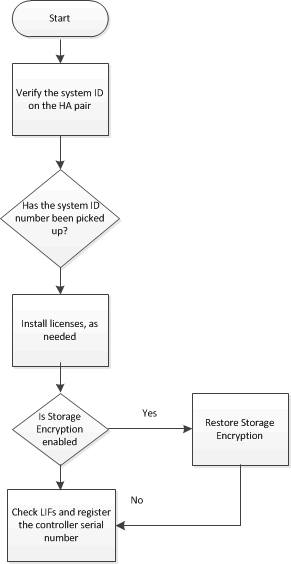

= Complete system restoration - AFF A700 and FAS9000
:icons: font
:imagesdir: ../media/

[.lead]
To complete the replacement procedure and restore your system to full operation, you must recable the storage, restore the NetApp Storage Encryption configuration (if necessary), and install licenses for the new controller. You must complete a series of tasks before restoring your system to full operation.

== Step 1: Recable the system

include::../_include/recable_system_after_controller_rep.adoc[]

== Step 2: Install licenses for the replacement node in ONTAP

include::../_include/install_licenses_mcc.adoc[]

== Step 3: Restoring Storage and Volume Encryption functionality

include::../_include/restore_storage_encryption.adoc[]

== Step 4: Verifying LIFs and registering the serial number

include::../_include/check_lifs_register_serial_number.adoc[]

== Step 5 (MetroCluster only): Switching back aggregates in a two-node MetroCluster configuration

include::../_include/2n_mcc_switchback.adoc[]

== Return the failed part to NetApp
include::../_include/complete_rma.adoc[]
