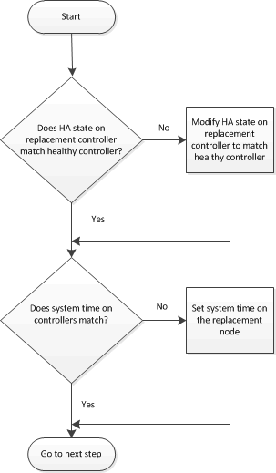

= Restore and verify the system configuration - AFF A700 and FAS9000
:icons: font
:imagesdir: ../media/

[.lead]
After completing the hardware replacement and booting to Maintenance mode, you verify the low-level system configuration of the replacement controller and reconfigure system settings as necessary.

== Step 1: Verify and set the HA state of the controller module

You must verify the `HA` state of the controller module and, if necessary, update the state to match your system configuration.

. In Maintenance mode from the new controller module, verify that all components display the same `HA` state: `ha-config show`
+
|===
| If your system is in...| The HA state for all components should be...
a|
An HA pair
a|
ha
a|
A MetroCluster FC configuration with four or more nodes
a|
mcc
a|
A two-node MetroCluster FC configuration
a|
mcc-2n
a|
A MetroCluster IP configuration
a|
mccip
a|
A stand-alone configuration
a|
non-ha
|===

. If the displayed system state of the controller module does not match your system configuration, set the `HA` state for the controller module: `ha-config modify controller ha-state`
. If the displayed system state of the chassis does not match your system configuration, set the `HA` state for the chassis: `ha-config modify chassis ha-state`

== Step 2: Run system-level diagnostics

[.lead]
You should run comprehensive or focused diagnostic tests for specific components and subsystems whenever you replace the controller.

All commands in the diagnostic procedures are issued from the node where the component is being replaced.

. If the node to be serviced is not at the LOADER prompt, reboot the node: `halt`
+
After you issue the command, you should wait until the system stops at the LOADER prompt.

. At the LOADER prompt, access the special drivers specifically designed for system-level diagnostics to function properly: `boot_diags`
+
During the boot process, you can safely respond `y` to the prompts until the Maintenance mode prompt (*>) appears.

. Display and note the available devices on the controller module: `sldiag device show -dev mb`
+
The controller module devices and ports displayed can be any one or more of the following:

 ** bootmedia is the system booting device.
 ** cna is a Converged Network Adapter or interface not connected to a network or storage device.
 ** fcal is a Fibre Channel-Arbitrated Loop device not connected to a Fibre Channel network.
 ** env is motherboard environmentals.
 ** mem is system memory.
 ** nic is a network interface card.
 ** nvram is nonvolatile RAM.
 ** nvmem is a hybrid of NVRAM and system memory.
 ** sas is a Serial Attached SCSI device not connected to a disk shelf.

. Run diagnostics as desired.
+
|===
| If you want to run diagnostic tests on...| Then...
a|
Individual components
a|

 .. Clear the status logs: `sldiag device clearstatus`
 .. Display the available tests for the selected devices: `sldiag device show -dev dev_name`
+
dev_name can be any one of the ports and devices identified in the preceding step.

 .. Examine the output and, if applicable, select only the tests that you want to run: `sldiag device modify -dev dev_name -selection only`
+
-selection only disables all other tests that you do not want to run for the device.

 .. Run the selected tests: `sldiag device run -dev dev_name`
+
After the test is complete, the following message is displayed:
+
----
*> <SLDIAG:_ALL_TESTS_COMPLETED>
----

 .. Verify that no tests failed: `sldiag device status -dev dev_name -long -state failed`
+
System-level diagnostics returns you to the prompt if there are no test failures, or lists the full status of failures resulting from testing the component.

a|
Multiple components at the same time
a|

 .. Review the enabled and disabled devices in the output from the preceding procedure and determine which ones you want to run concurrently.
 .. List the individual tests for the device: `sldiag device show -dev dev_name`
 .. Examine the output and, if applicable, select only the tests that you want to run: `sldiag device modify -dev dev_name -selection only`
+
-selection only disables all other tests that you do not want to run for the device.

 .. Verify that the tests were modified: `sldiag device show`
 .. Repeat these substeps for each device that you want to run concurrently.
 .. Run diagnostics on all of the devices: `sldiag device run`
+
IMPORTANT: Do not add to or modify your entries after you start running diagnostics.
+
After the test is complete, the following message is displayed:
+
----
*> <SLDIAG:_ALL_TESTS_COMPLETED>
----

 .. Verify that there are no hardware problems on the node: `sldiag device status -long -state failed`
+
System-level diagnostics returns you to the prompt if there are no test failures, or lists the full status of failures resulting from testing the component.

+
|===

. Proceed based on the result of the preceding step:
+
|===
| If the system-level diagnostics tests...| Then...
a|
Were completed without any failures
a|

 .. Clear the status logs: `sldiag device clearstatus`
 .. Verify that the log was cleared: `sldiag device status`
+
The following default response is displayed:
+
SLDIAG: No log messages are present.

 .. Exit Maintenance mode: `halt`
+
The node displays the LOADER prompt.

 .. Boot the node from the LOADER prompt: `bye`
 .. Return the node to normal operation:
+
|===
|===
| If your node is in...| Then...
a|
An HA pair
a|
Perform a give back: `storage failover giveback -ofnode replacement_node_name`        *Note:* If you disabled automatic giveback, re-enable it with the storage failover modify command.
a|
A two-node MetroCluster configuration
a|
Proceed to the next step.         The MetroCluster switchback procedure is done in the next task in the replacement process.
a|
A stand-alone configuration
a|
Proceed to the next step.         No action is required.
+

 You have completed system-level diagnostics.

a|
Resulted in some test failures
a|
Determine the cause of the problem:

 .. Exit Maintenance mode: `halt`
+
After you issue the command, wait until the system stops at the LOADER prompt.

 .. Turn off or leave on the power supplies, depending on how many controller modules are in the chassis:
  *** If you have two controller modules in the chassis, leave the power supplies turned on to provide power to the other controller module.
  *** If you have one controller module in the chassis, turn off the power supplies and unplug them from the power sources.
 .. Verify that you have observed all the considerations identified for running system-level diagnostics, that cables are securely connected, and that hardware components are properly installed in the storage system.
 .. Boot the controller module you are servicing, interrupting the boot by pressing `Ctrl-C` when prompted to get to the Boot menu:
  *** If you have two controller modules in the chassis, fully seat the controller module you are servicing in the chassis.
+
The controller module boots up when fully seated.

  *** If you have one controller module in the chassis, connect the power supplies, and then turn them on.
 .. Select Boot to maintenance mode from the menu.
 .. Exit Maintenance mode by entering the following command: `halt`
+
After you issue the command, wait until the system stops at the LOADER prompt.

 .. Rerun the system-level diagnostic test.

+
|===
