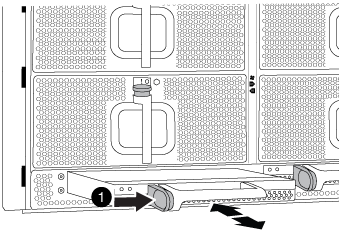

= Replace the DCPM module - AFF A700 and FAS9000
:icons: font
:imagesdir: ../media/

[.lead]
To replace the DCPM module in your system, you must remove the failed DCPM module from the system and then replace it with a new DCPM module.

. If you are not already grounded, properly ground yourself.
. Remove the bezel on the front of the system and set it aside.
. Locate the failed DCPM module in the front of the system by looking for the Attention LED on the module.
+
The LED will be steady amber if the module is faulty.
+
IMPORTANT: The DCPM module must be replaced in the chassis within five minutes of removal or the associated controller will shut down.

. Press the orange locking button on the module handle, and then slide the DCPM module out of the chassis.
+

+
|===
a|
image:../media/legend_icon_01.gif[]
a|
DCPM module orange locking button
|===

. Align the end of the DCPM module with the chassis opening, and then gently slide it into the chassis until it clicks into place.
+
NOTE: The module and slot are keyed. Do not force the module into the opening. If the module does not go in easily, realign the module and slide it into the chassis.
+
The DCPM module LED lights when the module is fully seated into the chassis.
