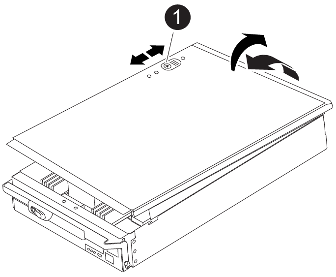
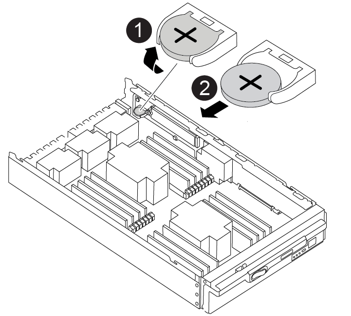

= Replacing the real-time clock battery - AFF A900
:icons: font
:imagesdir: ../media/

[.lead]
You replace the real-time clock (RTC) battery in the controller module so that your system's services and applications that depend on accurate time synchronization continue to function.

* You can use this procedure with all versions of ONTAP supported by your system
* All other components in the system must be functioning properly; if not, you must contact technical support.

== Step 1: Shut down the impaired controller

[.lead]
Shut down or take over the impaired controller using one of the following options.

[role="tabbed-block"]
====

.Option 1: Most systems
--
include::../_include/shutdown_most_frus.adoc[]
--
.Option 2: Controller is in a MetroCluster
--
include::../_include/shutdown_any_mcc_supported.adoc[]
--

====

== Step 2: Remove the controller

[.lead]
To access components inside the controller, you must first remove the controller module from the system and then remove the cover on the controller module.

. If you are not already grounded, properly ground yourself.
. Unplug the cables from the impaired controller module, and keep track of where the cables were connected.
. Slide the terra cotta button on the cam handle downward until it unlocks.
+
video::256721fd-4c2e-40b3-841a-adf2000df5fa[panopto, title="Animation - Remove the controller"]

+

image::../media/drw_a900_remove_PCM.png[]
+
[cols="10,90"]
|===
a|
image:../media/legend_icon_01.png[]
a|
Cam handle release button
a|
image:../media/legend_icon_02.png[]
a|
Cam handle
|===

. Rotate the cam handle so that it completely disengages the controller module from the chassis, and then slide the controller module out of the chassis.
+
Make sure that you support the bottom of the controller module as you slide it out of the chassis.

. Place the controller module lid-side up on a stable, flat surface, press the blue button on the cover, slide the cover to the back of the controller module, and then swing the cover up and lift it off of the controller module.

[cols="10,90"]
|===
a|
image:../media/legend_icon_01.png[]
a|
Controller module cover locking button
|===

== Step 3: Replace the RTC battery

[.lead]
To replace the RTC battery, you must locate the failed battery in the controller module, remove it from the holder, and then install the replacement battery in the holder.

. If you are not already grounded, properly ground yourself.
. Locate the RTC battery.
+
video::1bb4d8d4-5040-471c-9593-adf2000df48d[panopto, title="Animation - Replace RTC battery"]

+

+
[cols="10,90"]
|===
a|
image:../media/legend_icon_01.png[]
a|
RTC battery
a|
image:../media/legend_icon_02.png[]
a|
RTC battery housing
|===

. Gently push the battery away from the holder, rotate it away from the holder, and then lift it out of the holder.
+
NOTE: Note the polarity of the battery as you remove it from the holder. The battery is marked with a plus sign and must be positioned in the holder correctly. A plus sign near the holder tells you how the battery should be positioned.

. Remove the replacement battery from the antistatic shipping bag.
. Locate the empty battery holder in the controller module.
. Note the polarity of the RTC battery, and then insert it into the holder by tilting the battery at an angle and pushing down.
. Visually inspect the battery to make sure that it is completely installed into the holder and that the polarity is correct.
. Reinstall the controller module cover.

== Step 4: Reinstall the controller module and set time/date

[.lead]
After you replace the RTC battery, you must reinstall the controller module. If the RTC battery has been left out of the controller module for more than 10 minutes, you may have to reset the time and date.

. If you have not already done so, close the air duct or controller module cover.
. Align the end of the controller module with the opening in the chassis, and then gently push the controller module halfway into the system.
+
Do not completely insert the controller module in the chassis until instructed to do so.

. Recable the system, as needed.
+
If you removed the media converters (QSFPs or SFPs), remember to reinstall them if you are using fiber optic cables.

. If the power supplies were unplugged, plug them back in and reinstall the power cable retainers.
. Complete the reinstallation of the controller module:
 .. With the cam handle in the open position, firmly push the controller module in until it meets the midplane and is fully seated, and then close the cam handle to the locked position.
+
IMPORTANT: Do not use excessive force when sliding the controller module into the chassis to avoid damaging the connectors.

 .. If you have not already done so, reinstall the cable management device.
 .. Bind the cables to the cable management device with the hook and loop strap.
 .. Reconnect the power cables to the power supplies and to the power sources, and then turn on the power to start the boot process.
 .. Halt the controller at the LOADER prompt.
. Reset the time and date on the controller:
 .. Check the date and time on the healthy controller with the `show date` command.
 .. At the LOADER prompt on the target controller, check the time and date.
 .. If necessary, modify the date with the `set date mm/dd/yyyy` command.
 .. If necessary, set the time, in GMT, using the `set time hh:mm:ss` command.
 .. Confirm the date and time on the target controller.
. At the LOADER prompt, enter `bye` to reinitialize the PCIe cards and other components and let the controller reboot.
. Return the controller to normal operation by giving back its storage: `storage failover giveback -ofnode impaired_node_name`
. If automatic giveback was disabled, reenable it: `storage failover modify -node local -auto-giveback true`

== Step 5: Return the failed part to NetApp

include::../_include/complete_rma.adoc[]
