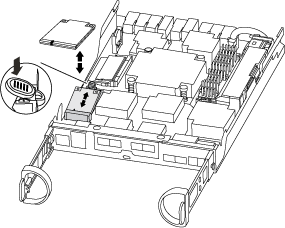
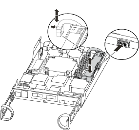
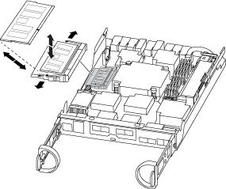

= Replace the controller module hardware - AFF C190
:icons: font
:imagesdir: ../media/

[.lead]
To replace the controller module, you must remove the impaired controller, move FRU components to the replacement controller module, install the replacement controller module in the chassis, and then boot the system to Maintenance mode.

== Step 1: Remove controller module

To replace the controller module, you must first remove the old controller module from the chassis.

. If you are not already grounded, properly ground yourself.
. Loosen the hook and loop strap binding the cables to the cable management device, and then unplug the system cables and SFPs (if needed) from the controller module, keeping track of where the cables were connected.
+
Leave the cables in the cable management device so that when you reinstall the cable management device, the cables are organized.

. Remove and set aside the cable management devices from the left and right sides of the controller module.
+
image::../media/drw_25xx_cable_management_arm.png[]

. If you left the SFP modules in the system after removing the cables, move them to the new controller module.
. Squeeze the latch on the cam handle until it releases, open the cam handle fully to release the controller module from the midplane, and then, using two hands, pull the controller module out of the chassis.
+
image::../media/drw_2240_x_opening_cam_latch.png[]

. Turn the controller module over and place it on a flat, stable surface.
. Open the cover by sliding in the blue tabs to release the cover, and then swing the cover up and open.
+
image::../media/drw_2600_opening_pcm_cover.png[]

== Step 2: Move the boot media

You must locate the boot media and follow the directions to remove it from the old controller module and insert it in the new controller module.

. Locate the boot media using the following illustration or the FRU map on the controller module:
+

. Press the blue button on the boot media housing to release the boot media from its housing, and then gently pull it straight out of the boot media socket.
+
NOTE: Do not twist or pull the boot media straight up, because this could damage the socket or the boot media.

. Move the boot media to the new controller module, align the edges of the boot media with the socket housing, and then gently push it into the socket.
. Check the boot media to make sure that it is seated squarely and completely in the socket.
+
If necessary, remove the boot media and reseat it into the socket.

. Push the boot media down to engage the locking button on the boot media housing.

== Step 3: Move the NVMEM battery

To move the NVMEM battery from the old controller module to the new controller module, you must perform a specific sequence of steps.

. Check the NVMEM LED:
 ** If your system is in an HA configuration, go to the next step.
 ** If your system is in a stand-alone configuration, cleanly shut down the controller module, and then check the NVRAM LED identified by the NV icon.
+

+
NOTE: The NVRAM LED blinks while destaging contents to the flash memory when you halt the system. After the destage is complete, the LED turns off.

  *** If power is lost without a clean shutdown, the NVMEM LED flashes until the destage is complete, and then the LED turns off.
  *** If the LED is on and power is on, unwritten data is stored on NVMEM.
+
This typically occurs during an uncontrolled shutdown after ONTAP has successfully booted.
. Locate the NVMEM battery in the controller module.
+

. Locate the battery plug and squeeze the clip on the face of the battery plug to release the plug from the socket, and then unplug the battery cable from the socket.
. Grasp the battery and press the blue locking tab marked PUSH, and then lift the battery out of the holder and controller module.
. Move the battery to the replacement controller module.
. Loop the battery cable around the cable channel on the side of the battery holder.
. Position the battery pack by aligning the battery holder key ribs to the "`V`" notches on the sheet metal side wall.
. Slide the battery pack down along the sheet metal side wall until the support tabs on the side wall hook into the slots on the battery pack, and the battery pack latch engages and clicks into the opening on the side wall.

== Step 4: Move the DIMMs

To move the DIMMs, you must follow the directions to locate and move them from the old controller module into the replacement controller module.

You must have the new controller module ready so that you can move the DIMMs directly from the impaired controller module to the corresponding slots in the replacement controller module.

. Locate the DIMMs on your controller module.
. Note the orientation of the DIMM in the socket so that you can insert the DIMM in the replacement controller module in the proper orientation.
. Eject the DIMM from its slot by slowly pushing apart the two DIMM ejector tabs on either side of the DIMM, and then slide the DIMM out of the slot.
+
NOTE: Carefully hold the DIMM by the edges to avoid pressure on the components on the DIMM circuit board.
+
The number and placement of system DIMMs depends on the model of your system.
+
The following illustration shows the location of system DIMMs:
+

. Repeat these steps to remove additional DIMMs as needed.
. Verify that the NVMEM battery is not plugged into the new controller module.
. Locate the slot where you are installing the DIMM.
. Make sure that the DIMM ejector tabs on the connector are in the open position, and then insert the DIMM squarely into the slot.
+
The DIMM fits tightly in the slot, but should go in easily. If not, realign the DIMM with the slot and reinsert it.
+
NOTE: Visually inspect the DIMM to verify that it is evenly aligned and fully inserted into the slot.

. Repeat these steps for the remaining DIMMs.
. Locate the NVMEM battery plug socket, and then squeeze the clip on the face of the battery cable plug to insert it into the socket.
+
Make sure that the plug locks down onto the controller module.

== Step 5: Install the controller module

After you install the components from the old controller module into the new controller module, you must install the new controller module into the system chassis and boot the operating system.

For HA pairs with two controller modules in the same chassis, the sequence in which you install the controller module is especially important because it attempts to reboot as soon as you completely seat it in the chassis.

NOTE: The system might update system firmware when it boots. Do not abort this process. The procedure requires you to interrupt the boot process, which you can typically do at any time after prompted to do so. However, if the system updates the system firmware when it boots, you must wait until after the update is complete before interrupting the boot process.

. If you have not already done so, replace the cover on the controller module.
. Align the end of the controller module with the opening in the chassis, and then gently push the controller module halfway into the system.
+
NOTE: Do not completely insert the controller module in the chassis until instructed to do so.

. Cable the management and console ports only, so that you can access the system to perform the tasks in the following sections.
+
NOTE: You will connect the rest of the cables to the controller module later in this procedure.

. Complete the reinstallation of the controller module. The controller module begins to boot as soon as it is fully seated in the chassis. Be prepared to interrupt the boot process.
 .. With the cam handle in the open position, firmly push the controller module in until it meets the midplane and is fully seated, and then close the cam handle to the locked position.
+
NOTE: Do not use excessive force when sliding the controller module into the chassis to avoid damaging the connectors.
+
The controller begins to boot as soon as it is seated in the chassis.

 .. If you have not already done so, reinstall the cable management device.
 .. Bind the cables to the cable management device with the hook and loop strap.
 .. Interrupt the boot process *only* after determining the correct timing:
+
You must look for an Automatic firmware update console message. If the update message appears, do not press `Ctrl-C` to interrupt the boot process until after you see a message confirming that the update is complete.
+
Only press `Ctrl-C` when you see the message `Press Ctrl-C for Boot Menu`.
+
NOTE: If the firmware update is aborted, the boot process exits to the LOADER prompt. You must run the update_flash command and then exit LOADER and boot to Maintenance mode by pressing `Ctrl-C` when you see Starting AUTOBOOT press Ctrl-C to abort.
+
If you miss the prompt and the controller module boots to ONTAP, enter `halt`, and then at the LOADER prompt enter `boot_ontap`, press `Ctrl-C` when prompted, and then boot to Maintenance mode.
+
NOTE: During the boot process, you might see the following prompts:

  *** A prompt warning of a system ID mismatch and asking to override the system ID.
  *** A prompt warning that when entering Maintenance mode in an HA configuration you must ensure that the healthy controller remains down.
You can safely respond `y` to these prompts.

 .. Select the option to boot to Maintenance mode from the displayed menu.
