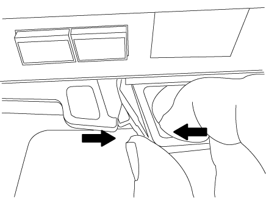
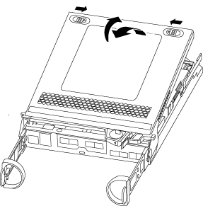
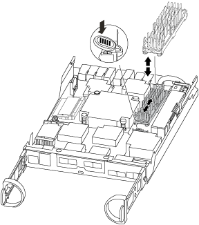

= Replace the caching module - AFF A220 and FAS2700
:icons: font
:imagesdir: ../media/

[.lead]
You must replace the caching module in the controller module when your system registers a single AutoSupport (ASUP) message that the module has gone offline; failure to do so results in performance degradation.

* You must replace the failed component with a replacement FRU component you received from your provider.

== Step 1: Shut down the impaired controller

[.lead]
To shut down the impaired controller, you must determine the status of the controller and, if necessary, take over the controller so that the healthy controller continues to serve data from the impaired controller storage.

.About this task
If you have a cluster with more than two nodes, it must be in quorum. If the cluster is not in quorum or a healthy controller shows false for eligibility and health, you must correct the issue before shutting down the impaired controller.

http://docs.netapp.com/ontap-9/topic/com.netapp.doc.dot-cm-sag/home.html[ONTAP 9 System Administration Reference^]

You might want to erase the contents of your caching module before replacing it.

.Steps
. Although data on the caching module is encrypted, you might want to erase any data from the impaired caching module and verify that the caching module has no data:
 .. Erase the data on the caching module: `system controller flash-cache secure-erase run`
 .. Verify that the data has been erased from the caching module: `system controller flash-cache secure-erase show -node node_name`
+
The output should display the caching module status as erased.
. If the impaired controller is part of an HA pair, disable automatic giveback from the console of the healthy controller: `storage failover modify -node local -auto-giveback false`
. Take the impaired controller to the LOADER prompt:
+
[options="header" cols="1,2"]
|===
| If the impaired controller is displaying...| Then...
a|
The LOADER prompt
a|
Go to the next step.
a|
Waiting for giveback...
a|
Press Ctrl-C, and then respond `y` when prompted.
a|
System prompt or password prompt (enter system password)
a|
Take over or halt the impaired controller:

 ** For an HA pair, take over the impaired controller from the healthy controller: `storage failover takeover -ofnode _impaired_node_name_`
+
When the impaired controller shows Waiting for giveback..., press Ctrl-C, and then respond `y`.

 ** For a stand-alone system: `system node halt _impaired_node_name_`

|===

. If the system has only one controller module in the chassis, turn off the power supplies, and then unplug the impaired controller's power cords from the power source.

== Step 2: Remove controller module

[.lead]
To access components inside the controller, you must first remove the controller module from the system and then remove the cover on the controller module.

.Steps
. If you are not already grounded, properly ground yourself.
. Loosen the hook and loop strap binding the cables to the cable management device, and then unplug the system cables and SFPs (if needed) from the controller module, keeping track of where the cables were connected.
+
Leave the cables in the cable management device so that when you reinstall the cable management device, the cables are organized.

. Remove and set aside the cable management devices from the left and right sides of the controller module.
+
image::../media/drw_25xx_cable_management_arm.png[]

. Squeeze the latch on the cam handle until it releases, open the cam handle fully to release the controller module from the midplane, and then, using two hands, pull the controller module out of the chassis.
+

. Turn the controller module over and place it on a flat, stable surface.
. Open the cover by sliding in the blue tabs to release the cover, and then swing the cover up and open.
+

== Step 3: Replace a caching module

[.lead]
To replace a caching module referred to as the M.2 PCIe card on the label on your controller, locate the slot inside the controller and follow the specific sequence of steps.

Your storage system must meet certain criteria depending on your situation:

* It must have the appropriate operating system for the caching module you are installing.
* It must support the caching capacity.
* All other components in the storage system must be functioning properly; if not, you must contact technical support.

.Steps
. If you are not already grounded, properly ground yourself.
. Locate the caching module at the rear of the controller module and remove it.
 .. Press the release tab.
 .. Remove the heatsink.

+

. Gently pull the caching module straight out of the housing.
. Align the edges of the caching module with the socket in the housing, and then gently push it into the socket.
. Verify that the caching module is seated squarely and completely in the socket.
+
If necessary, remove the caching module and reseat it into the socket.

. Reseat and push the heatsink down to engage the locking button on the caching module housing.
. Close the controller module cover, as needed.

== Step 4: Reinstall the controller module

[.lead]
After you replace components in the controller module, reinstall it into the chassis.

.Steps
. If you are not already grounded, properly ground yourself.
. If you have not already done so, replace the cover on the controller module.
. Align the end of the controller module with the opening in the chassis, and then gently push the controller module halfway into the system.
+
NOTE: Do not completely insert the controller module in the chassis until instructed to do so.

. Recable the system, as needed.
+
If you removed the media converters (QSFPs or SFPs), remember to reinstall them if you are using fiber optic cables.

. Complete the reinstallation of the controller module:
+
[options="header" cols="1,2"]
|===
| If your system is in...| Then perform these steps...
a|
An HA pair
a|
The controller module begins to boot as soon as it is fully seated in the chassis. Be prepared to interrupt the boot process.

 .. With the cam handle in the open position, firmly push the controller module in until it meets the midplane and is fully seated, and then close the cam handle to the locked position.
+
NOTE: Do not use excessive force when sliding the controller module into the chassis to avoid damaging the connectors.
+
The controller begins to boot as soon as it is seated in the chassis.

 .. If you have not already done so, reinstall the cable management device.
 .. Bind the cables to the cable management device with the hook and loop strap.
 .. When you see the message `Press Ctrl-C for Boot Menu`, press `Ctrl-C` to interrupt the boot process.
+
NOTE: If you miss the prompt and the controller module boots to ONTAP, enter `halt`, and then at the LOADER prompt enter `boot_ontap`, press `Ctrl-C` when prompted, and then boot to Maintenance mode.

 .. Select the option to boot to Maintenance mode from the displayed menu.

a|
A stand-alone configuration
a|

 .. With the cam handle in the open position, firmly push the controller module in until it meets the midplane and is fully seated, and then close the cam handle to the locked position.
+
NOTE: Do not use excessive force when sliding the controller module into the chassis to avoid damaging the connectors.

 .. If you have not already done so, reinstall the cable management device.
 .. Bind the cables to the cable management device with the hook and loop strap.
 .. Reconnect the power cables to the power supplies and to the power sources, turn on the power to start the boot process, and then press `Ctrl-C` after you see the `Press Ctrl-C for Boot Menu` message.
+
NOTE: If you miss the prompt and the controller module boots to ONTAP, enter `halt`, and then at the LOADER prompt enter `boot_ontap`, press `Ctrl-C` when prompted, and then boot to Maintenance mode.

 .. From the boot menu, select the option for Maintenance mode.

|===

== Step 5: Run system-level diagnostics

[.lead]
After installing a new caching module, you should run diagnostics.

Your system must be at the LOADER prompt to start System Level Diagnostics.

All commands in the diagnostic procedures are issued from the controller where the component is being replaced.

.Steps
. If the controller to be serviced is not at the LOADER prompt, perform the following steps:
 .. Select the Maintenance mode option from the displayed menu.
 .. After the controller boots to Maintenance mode, halt the controller: `halt`
+
After you issue the command, you should wait until the system stops at the LOADER prompt.
+
NOTE: During the boot process, you can safely respond `y` to prompts:
. At the LOADER prompt, access the special drivers specifically designed for system-level diagnostics to function properly: `boot_diags`
+
During the boot process, you can safely respond `y` to the prompts until the Maintenance mode prompt (*>) appears.

. Run diagnostics on the caching module: `sldiag device run -dev fcache`
. Verify that no hardware problems resulted from the replacement of the caching module: `sldiag device status -dev fcache -long -state failed`
+
System-level diagnostics returns you to the prompt if there are no test failures, or lists the full status of failures resulting from testing the component.

[.lead]
include::../_include/sldiags-proceed-step.adoc[]

== Step 6: Switch back aggregates in a two-node MetroCluster configuration

[.lead]
include::../_include/2n_mcc_switchback.adoc[]

== Step 7: Return the failed part to NetApp

[.lead]
include::../_include/complete_rma.adoc[]
