= Detailed guide - AFF A220 and FAS2700
:icons: font
:imagesdir: ../media/

[.lead]
This guide gives detailed step-by-step instructions for installing a typical NetApp system. Use this guide if you want more detailed installation instructions.

== Step 1: Prepare for installation

[.lead]
To install your FAS2700 or AFF A220 system, you need to create an account on the NetApp Support Site, register your system, and get license keys. You also need to inventory the appropriate number and type of cables for your system and collect specific network information.

You need to have access to the Hardware Universe for information about site requirements as well as additional information on your configured system. You might also want to have access to the Release Notes for your version of ONTAP for more information about this system.

https://hwu.netapp.com[NetApp Hardware Universe]

http://mysupport.netapp.com/documentation/productlibrary/index.html?productID=62286[Find the Release Notes for your version of ONTAP 9]

You need to provide the following at your site:

* Rack space for the storage system
* Phillips #2 screwdriver
* Additional networking cables to connect your system to your network switch and laptop or console with a Web browser
* A laptop or console with an RJ-45 connection and access to a Web browser

.Steps
. Unpack the contents of all boxes.
. Record the system serial number from the controllers.
+
image::../media/drw_ssn_label.png[]

. Set up your account:
 .. Log in to your existing account or create an account.
 .. Register your system.
+
https://mysupport.netapp.com/eservice/registerSNoAction.do?moduleName=RegisterMyProduct[NetApp Product Registration]
. Download and install Config Advisor on your laptop.
+
https://mysupport.netapp.com/site/tools/tool-eula/activeiq-configadvisor[NetApp Downloads: Config Advisor]

. Inventory and make a note of the number and types of cables you received.
+
The following table identifies the types of cables you might receive. If you receive a cable not listed in the table, see the Hardware Universe to locate the cable and identify its use.
+
https://hwu.netapp.com[NetApp Hardware Universe]
+
[options="header" cols="1,2,1,2"]
|===
| Type of cable...| Part number and length| Connector type| For...
a|
10 GbE cable (order dependent)
a|
X6566B-05-R6 (112-00297), 0.5m

X6566B-2-R6 (112-00299), 2m
a|
image:../media/oie_cable_sfp_gbe_copper.png[]
a|
Cluster interconnect network
a|
10 GbE cable (order dependent)
a|
Part number X6566B-2-R6 (112-00299), 2m

or X6566B-3-R6 (112-00300), 3m

X6566B-5-R6 (112-00301), 5m
a|
image:../media/oie_cable_sfp_gbe_copper.png[]
a|
Data
a|
Optical network cables (order dependent)
a|
X6553-R6 (112-00188), 2m

X6536-R6 (112-00090), 5m

X6554-R6(112-00189), 15m
a|
image:../media/oie_cable_fiber_lc_connector.png[]
a|
FC host network
a|
Cat 6, RJ-45 (order dependent)
a|
Part numbers X6585-R6 (112-00291), 3m

X6562-R6 (112-00196), 5m
a|
image:../media/oie_cable_rj45.png[]
a|
Management network and Ethernet data
a|
Storage (order dependent)
a|
Part number X66030A (112-00435), 0.5m

X66031A (112-00436), 1m

X66032A (112-00437), 2m

X66033A (112-00438), 3m
a|
image:../media/oie_cable_mini_sas_hd_to_mini_sas_hd.png[]
a|
Storage
a|
Micro-USB console cable
a|
Not applicable
a|
image:../media/oie_cable_micro_usb.png[]
a|
Console connection during software setup on non-Windows or Mac laptop/console
a|
Power cables
a|
Not applicable
a|
image:../media/oie_cable_power.png[]
a|
Powering up the system
|===

. Download and complete the _Cluster configuration worksheet_.
+
https://library.netapp.com/ecm/ecm_download_file/ECMLP2839002[Cluster Configuration Worksheet]

== Step 2: Install the hardware

[.lead]
You need to install your system in a 4-post rack or NetApp system cabinet, as applicable.

.Steps
. Install the rail kits, as needed.
. Install and secure your system using the instructions included with the rail kit.
+
NOTE: You need to be aware of the safety concerns associated with the weight of the system.
+
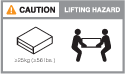

. Attach cable management devices (as shown).
+
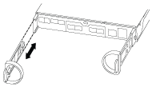

. Place the bezel on the front of the system.

== Step 3: Cable controllers to your network

[.lead]
You can cable the controllers to your network by using the two-node switchless cluster method or by using the cluster interconnect network.

=== Option 1: Cable a two-node switchless cluster, unified network configuration

[.lead]
Management network, UTA2 data network, and management ports on the controllers are connected to switches. The cluster interconnect ports are cabled on both controllers.

You must have contacted your network administrator for information about connecting the system to the switches.

Be sure to check the illustration arrow for the proper cable connector pull-tab orientation.

image::../media/oie_cable_pull_tab_down.png[]

NOTE: As you insert the connector, you should feel it click into place; if you do not feel it click, remove it, turn it around and try again.

.Steps
. You can use the graphic or the step-by step instructions to complete the cabling between the controllers and to the switches:
+
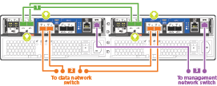
+
[options="header" cols="1,3"]
|===
| Step| Perform on each controller
a|

a|
Cable the cluster interconnect ports to each other with the cluster interconnect cable:

 ** e0a to e0a
 ** e0b to e0b
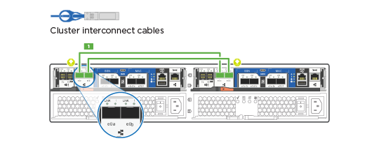
a|

a|
Use one of the following cable types to cable the UTA2 data ports to your host network:

An FC host

 ** 0c and 0d
 ** *or* 0e and 0f
 A 10GbE
 ** e0c and e0d
 ** *or* e0e and e0f

NOTE: You can connect one port pair as CNA and one port pair as FC, or you can connect both port pairs as CNA or both port pairs as FC.

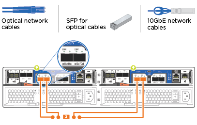
a|

a|
Cable the e0M ports to the management network switches with the RJ45 cables:

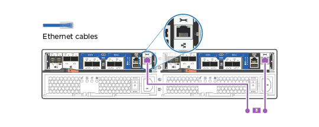
a|

a|
DO NOT plug in the power cords at this point.
|===

. To cable your storage, see link:install_detailed_guide.md#[Cabling controllers to drive shelves]

=== Option 2: Cable a switched cluster, unified network configuration

[.lead]
Management network, UTA2 data network, and management ports on the controllers are connected to switches. The cluster interconnect ports are cabled to the cluster interconnect switches.

You must have contacted your network administrator for information about connecting the system to the switches.

Be sure to check the illustration arrow for the proper cable connector pull-tab orientation.

image::../media/oie_cable_pull_tab_down.png[]

NOTE: As you insert the connector, you should feel it click into place; if you do not feel it click, remove it, turn it around and try again.

.Steps
. You can use the graphic or the step-by step instructions to complete the cabling between the controllers and the switches:
+
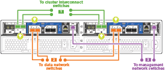
+
[options="header" cols="1,3"]
|===
| Step| Perform on each controller module
a|

a|
Cable e0a and e0b to the cluster interconnect switches with the cluster interconnect cable:

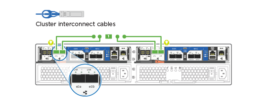
a|

a|
Use one of the following cable types to cable the UTA2 data ports to your host network:

An FC host

-   0c and 0d
-   **or** 0e and 0f

A 10GbE

-   e0c and e0d
-   **or** e0e and e0f

NOTE: You can connect one port pair as CNA and one port pair as FC, or you can connect both port pairs as CNA or both port pairs as FC.

a|

a|
Cable the e0M ports to the management network switches with the RJ45 cables:

a|

a|
DO NOT plug in the power cords at this point.
|===

. To cable your storage, see link:install_detailed_guide.md#[Cabling controllers to drive shelves]

=== Option 3: Cable a two-node switchless cluster, Ethernet network configuration

[.lead]
Management network, Ethernet data network, and management ports on the controllers are connected to switches. The cluster interconnect ports are cabled on both controllers.

You must have contacted your network administrator for information about connecting the system to the switches.

Be sure to check the illustration arrow for the proper cable connector pull-tab orientation.

image::../media/oie_cable_pull_tab_down.png[]

NOTE: As you insert the connector, you should feel it click into place; if you do not feel it click, remove it, turn it around and try again.

.Steps
. You can use the graphic or the step-by step instructions to complete the cabling between the controllers and to the switches:
+
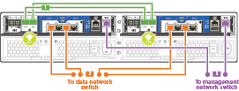
+
[options="header" cols="1,3"]
|===
| Step| Perform on each controller
a|

a|
Cable the cluster interconnect ports to each other with the cluster interconnect cable:

 ** e0a to e0a
 ** e0b to e0b
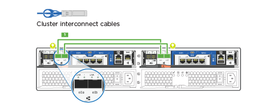
a|

a|
Use the Cat 6 RJ45 cable to cable the e0c through e0f ports to your host network:

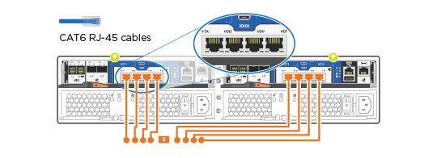
a|

a|
Cable the e0M ports to the management network switches with the RJ45 cables:

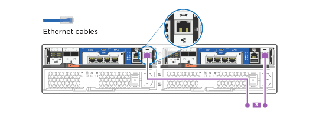
a|

a|
DO NOT plug in the power cords at this point.
|===

. To cable your storage, see link:install_detailed_guide.md#[Cabling controllers to drive shelves]

=== Option 4: Cable a switched cluster, Ethernet network configuration

[.lead]
Management network, Ethernet data network, and management ports on the controllers are connected to switches. The cluster interconnect ports are cabled to the cluster interconnect switches.

You must have contacted your network administrator for information about connecting the system to the switches.

Be sure to check the illustration arrow for the proper cable connector pull-tab orientation.

image::../media/oie_cable_pull_tab_down.png[]

NOTE: As you insert the connector, you should feel it click into place; if you do not feel it click, remove it, turn it around and try again.

.Steps
. You can use the graphic or the step-by step instructions to complete the cabling between the controllers and the switches:
+
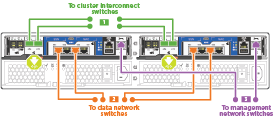
+
[options="header" cols="1,2"]
|===
| Step| Perform on each controller module
a|

a|
Cable e0a and e0b to the cluster interconnect switches with the cluster interconnect cable:

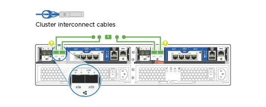
a|

a|
Use the Cat 6 RJ45 cable to cable the e0c through e0f ports to your host network:

a|

a|
Cable the e0M ports to the management network switches with the RJ45 cables:

a|

a|
DO NOT plug in the power cords at this point.
|===

. To cable your storage, see link:install_detailed_guide.md#[Cabling controllers to drive shelves]

== Step 4: Cable controllers to drive shelves

[.lead]
You must cable the controllers to your shelves using the onboard storage ports. NetApp recommends MP-HA cabling for systems with external storage. If you have a SAS tape drive, you can use single-path cabling. If you have no external shelves, MP-HA cabling to internal drives is optional (not shown) if the SAS cables are ordered with the system.

=== Option 1: Cable storage on an HA pair with external drive shelves

[.lead]
You must cable the shelf-to-shelf connections, and then cable both controllers to the drive shelves.

Be sure to check the illustration arrow for the proper cable connector pull-tab orientation.

image::../media/oie_cable_pull_tab_down.png[]

.Steps
. Cable the HA pair with external drive shelves:
+
NOTE: The example uses DS224C. Cabling is similar with other supported drive shelves.
+
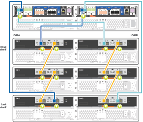
+
[options="header" cols="1,3"]
|===
| Step| Perform on each controller
a|

a|
Cable the shelf-to-shelf ports.

 ** Port 3 on IOM A to port 1 on the IOM A on the shelf directly below.
 ** Port 3 on IOM B to port 1 on the IOM B on the shelf directly below.
+
image:../media/oie_cable_mini_sas_hd_to_mini_sas_hd.png[]     mini-SAS HD to mini-SAS HD cables

a|

a|
Connect each node to IOM A in the stack.

 ** Controller 1 port 0b to IOM A port 3 on last drive shelf in the stack.
 ** Controller 2 port 0a to IOM A port 1 on the first drive shelf in the stack.
+
image:../media/oie_cable_mini_sas_hd_to_mini_sas_hd.png[]     mini-SAS HD to mini-SAS HD cables

a|

a|
Connect each node to IOM B in the stack

 ** Controller 1 port 0a to IOM B port 1 on first drive shelf in the stack.
 ** Controller 2 port 0b to IOM B port 3 on the last drive shelf in the stack.
 image:../media/oie_cable_mini_sas_hd_to_mini_sas_hd.png[]     mini-SAS HD to mini-SAS HD cables

|===
If you have more than one drive shelf stack, see the _Installation and Cabling Guide_ for your drive shelf type.
+
link:../com.netapp.doc.hw-ds-sas3-icg/home.html[Installing and cabling]

. To complete setting up your system, see link:install_detailed_guide.md#[Completing system setup and configuration]

== Step 5: Complete system setup and configuration

[.lead]
You can complete the system setup and configuration using cluster discovery with only a connection to the switch and laptop, or by connecting directly to a controller in the system and then connecting to the management switch.

=== Option 1: Complete system setup if network discovery is enabled

[.lead]
If you have network discovery enabled on your laptop, you can complete system setup and configuration using automatic cluster discovery.

.Steps
. Use the following animation to set one or more drive shelf IDs
+
video::c600f366-4d30-481a-89d9-ab1b0066589b[panopto, title="Animation - Set drive shelf IDs"]

. Plug the power cords into the controller power supplies, and then connect them to power sources on different circuits.
. Turn on the power switches to both nodes.
+
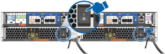
+
NOTE: Initial booting may take up to eight minutes.

. Make sure that your laptop has network discovery enabled.
+
See your laptop's online help for more information.

. Use the following animation to connect your laptop to the Management switch.
+
video::d61f983e-f911-4b76-8b3a-ab1b0066909b[panopto, title="Animation - Connect your laptop to the Management switch"]

. Select an ONTAP icon listed to discover:
+
image::../media/drw_autodiscovery_controler_select.png[]

 .. Open File Explorer.
 .. Click network in the left pane.
 .. Right click and select refresh.
 .. Double-click either ONTAP icon and accept any certificates displayed on your screen.
+
NOTE: XXXXX is the system serial number for the target node.
+
System Manager opens.

. Use System Manager guided setup to configure your system using the data you collected in the _NetApp ONTAP Configuration Guide_.
+
https://library.netapp.com/ecm/ecm_download_file/ECMLP2862613[ONTAP Configuration Guide]

. Verify the health of your system by running Config Advisor.
. After you have completed the initial configuration, go to the https://www.netapp.com/data-management/oncommand-system-documentation/[ONTAP & ONTAP System Manager Documentation Resources] page for information about configuring additional features in ONTAP.

=== Option 2: Completing system setup and configuration if network discovery is not enabled

[.lead]
If network discovery is not enabled on your laptop, you must complete the configuration and setup using this task.

.Steps
. Cable and configure your laptop or console:
 .. Set the console port on the laptop or console to 115,200 baud with N-8-1.
+
NOTE: See your laptop or console's online help for how to configure the console port.

 .. Connect the console cable to the laptop or console, and connect the console port on the controller using the console cable that came with your system.
+
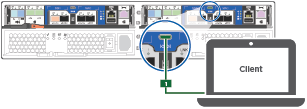

 .. Connect the laptop or console to the switch on the management subnet.
+
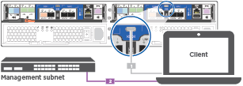

 .. Assign a TCP/IP address to the laptop or console, using one that is on the management subnet.
. Use the following animation to set one or more drive shelf IDs:
+
video::c600f366-4d30-481a-89d9-ab1b0066589b[panopto, title="Animation - Set drive shelf IDs"]

. Plug the power cords into the controller power supplies, and then connect them to power sources on different circuits.
. Turn on the power switches to both nodes.
+

+
NOTE: Initial booting may take up to eight minutes.

. Assign an initial node management IP address to one of the nodes.
+
[options="header" cols="1-3"]
|===
| If the management network has DHCP...| Then...
a|
Configured
a|
Record the IP address assigned to the new controllers.
a|
Not configured
a|

 .. Open a console session using PuTTY, a terminal server, or the equivalent for your environment.
+
NOTE: Check your laptop or console's online help if you do not know how to configure PuTTY.

 .. Enter the management IP address when prompted by the script.

|===

. Using System Manager on your laptop or console, configure your cluster:
 .. Point your browser to the node management IP address.
+
NOTE: The format for the address is https://x.x.x.x.

 .. Configure the system using the data you collected in the _NetApp ONTAP Configuration guide_.
+
https://library.netapp.com/ecm/ecm_download_file/ECMLP2862613[ONTAP Configuration Guide]
. Verify the health of your system by running Config Advisor.
. After you have completed the initial configuration, go to the https://www.netapp.com/data-management/oncommand-system-documentation/[ONTAP & ONTAP System Manager Documentation Resources] page for information about configuring additional features in ONTAP.
