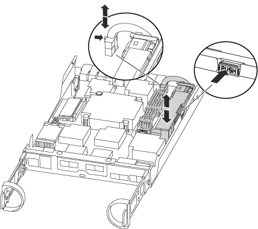

= Replace the NVMEM battery - AFF A220 and FAS2700
:icons: font
:imagesdir: ../media/

[.lead]
To replace an NVMEM battery in the system, you must remove the controller module from the system, open it, replace the battery, and close and replace the controller module.

All other components in the system must be functioning properly; if not, you must contact technical support.

== Step 1: Shut down the impaired controller

[.lead]
include::../_include/shutdown_most_frus.adoc[]

. If the system has only one controller module in the chassis, turn off the power supplies, and then unplug the impaired controller's power cords from the power source.

== Step 2: Remove controller module

[.lead]
To access components inside the controller, you must first remove the controller module from the system and then remove the cover on the controller module.

.Steps
. If you are not already grounded, properly ground yourself.
. Loosen the hook and loop strap binding the cables to the cable management device, and then unplug the system cables and SFPs (if needed) from the controller module, keeping track of where the cables were connected.
+
Leave the cables in the cable management device so that when you reinstall the cable management device, the cables are organized.

. Remove and set aside the cable management devices from the left and right sides of the controller module.
+
image::../media/drw_25xx_cable_management_arm.png[]

. Squeeze the latch on the cam handle until it releases, open the cam handle fully to release the controller module from the midplane, and then, using two hands, pull the controller module out of the chassis.
+
image::../media/drw_2240_x_opening_cam_latch.png[]

. Turn the controller module over and place it on a flat, stable surface.
. Open the cover by sliding in the blue tabs to release the cover, and then swing the cover up and open.

== Step 3: Replace the NVMEM battery

[.lead]
To replace the NVMEM battery in your system, you must remove the failed NVMEM battery from the system and replace it with a new NVMEM battery.

.Steps
. If you are not already grounded, properly ground yourself.
. Check the NVMEM LED:
 ** If your system is in an HA configuration, go to the next step.
 ** If your system is in a stand-alone configuration, cleanly shut down the controller module, and then check the NVRAM LED identified by the NV icon.
+
image::../media/drw_hw_nvram_icon.png[]
+
NOTE: The NVRAM LED blinks while destaging contents to the flash memory when you halt the system. After the destage is complete, the LED turns off.

  *** If power is lost without a clean shutdown, the NVMEM LED flashes until the destage is complete, and then the LED turns off.
  *** If the LED is on and power is on, unwritten data is stored on NVMEM.
+
This typically occurs during an uncontrolled shutdown after ONTAP has successfully booted.
. Locate the NVMEM battery in the controller module.
+

. Locate the battery plug and squeeze the clip on the face of the battery plug to release the plug from the socket, and then unplug the battery cable from the socket.
. Remove the battery from the controller module and set it aside.
. Remove the replacement battery from its package.
. Loop the battery cable around the cable channel on the side of the battery holder.
. Position the battery pack by aligning the battery holder key ribs to the "`V`" notches on the sheet metal side wall.
. Slide the battery pack down along the sheet metal side wall until the support tabs on the side wall hook into the slots on the battery pack, and the battery pack latch engages and clicks into the opening on the side wall.
. Plug the battery plug back into the controller module.

== Step 4: Reinstall the controller module

[.lead]
After you replace components in the controller module, reinstall it into the chassis.

.Steps
. If you are not already grounded, properly ground yourself.
. If you have not already done so, replace the cover on the controller module.
. Align the end of the controller module with the opening in the chassis, and then gently push the controller module halfway into the system.
+
NOTE: Do not completely insert the controller module in the chassis until instructed to do so.

. Recable the system, as needed.
+
If you removed the media converters (QSFPs or SFPs), remember to reinstall them if you are using fiber optic cables.

. Complete the reinstallation of the controller module:
+
[options="header" cols="1,2"]
|===
| If your system is in...| Then perform these steps...
a|
An HA pair
a|
The controller module begins to boot as soon as it is fully seated in the chassis. Be prepared to interrupt the boot process.

 .. With the cam handle in the open position, firmly push the controller module in until it meets the midplane and is fully seated, and then close the cam handle to the locked position.
+
NOTE: Do not use excessive force when sliding the controller module into the chassis to avoid damaging the connectors.
+
The controller begins to boot as soon as it is seated in the chassis.

 .. If you have not already done so, reinstall the cable management device.
 .. Bind the cables to the cable management device with the hook and loop strap.
 .. When you see the message `Press Ctrl-C for Boot Menu`, press `Ctrl-C` to interrupt the boot process.
+
NOTE: If you miss the prompt and the controller module boots to ONTAP, enter `halt`, and then at the LOADER prompt enter `boot_ontap`, press `Ctrl-C` when prompted, and then boot to Maintenance mode.

 .. Select the option to boot to Maintenance mode from the displayed menu.

a|
A stand-alone configuration
a|

 .. With the cam handle in the open position, firmly push the controller module in until it meets the midplane and is fully seated, and then close the cam handle to the locked position.
+
NOTE: Do not use excessive force when sliding the controller module into the chassis to avoid damaging the connectors.

 .. If you have not already done so, reinstall the cable management device.
 .. Bind the cables to the cable management device with the hook and loop strap.
 .. Reconnect the power cables to the power supplies and to the power sources, turn on the power to start the boot process, and then press `Ctrl-C` after you see the `Press Ctrl-C for Boot Menu` message.
+
NOTE: If you miss the prompt and the controller module boots to ONTAP, enter `halt`, and then at the LOADER prompt enter `boot_ontap`, press `Ctrl-C` when prompted, and then boot to Maintenance mode.

 .. From the boot menu, select the option for Maintenance mode.

|===

== Step 5: Run system-level diagnostics

[.lead]
After installing a new NVMEM battery, you should run diagnostics.

Your system must be at the LOADER prompt to start System Level Diagnostics.

All commands in the diagnostic procedures are issued from the controller where the component is being replaced.

.Steps
. If the controller to be serviced is not at the LOADER prompt, perform the following steps:
 .. Select the Maintenance mode option from the displayed menu.
 .. After the controller boots to Maintenance mode, halt the controller: `halt`
+
After you issue the command, you should wait until the system stops at the LOADER prompt.
+
NOTE: During the boot process, you can safely respond `y` to prompts:

  *** A prompt warning that when entering Maintenance mode in an HA configuration, you must ensure that the healthy controller remains down.
. At the LOADER prompt, access the special drivers specifically designed for system-level diagnostics to function properly: `boot_diags`
+
During the boot process, you can safely respond `y` to the prompts until the Maintenance mode prompt (*>) appears.

. Run diagnostics on the NVMEM memory: `sldiag device run -dev nvmem`
. Verify that no hardware problems resulted from the replacement of the NVMEM battery: `sldiag device status -dev nvmem -long -state failed`
+
System-level diagnostics returns you to the prompt if there are no test failures, or lists the full status of failures resulting from testing the component.

. Proceed based on the result of the preceding step:
+
[options="header" cols="1,2"]
|===
| If the system-level diagnostics tests...| Then...
a|
Were completed without any failures
a|

 .. Clear the status logs: `sldiag device clearstatus`
 .. Verify that the log was cleared: `sldiag device status`
+
The following default response is displayed:
+
SLDIAG: No log messages are present.

 .. Exit Maintenance mode: `halt`
+
The controller displays the LOADER prompt.

 .. Boot the controller from the LOADER prompt: `bye`
 .. Return the controller to normal operation:

|===
+
[options="header" cols="1,2"]
|===
| If your controller is in...| Then...
a|
An HA pair
a|
Perform a give back: `storage failover giveback -ofnode _replacement_node_name_`

NOTE: If you disabled automatic giveback, re-enable it with the storage failover modify command.

a|
A two-node MetroCluster configuration
a|
Proceed to the next step.

The MetroCluster switchback procedure is done in the next task in the replacement process.
a|
A stand-alone configuration
a|
Proceed to the next step.

No action is required.

You have completed system-level diagnostics.

a|
Resulted in some test failures
a|
Determine the cause of the problem:

 .. Exit Maintenance mode: `halt`
+
After you issue the command, wait until the system stops at the LOADER prompt.

 .. Turn off or leave on the power supplies, depending on how many controller modules are in the chassis:
  *** If you have two controller modules in the chassis, leave the power supplies turned on to provide power to the other controller module.
  *** If you have one controller module in the chassis, turn off the power supplies and unplug them from the power sources.
 .. Verify that you have observed all the considerations identified for running system-level diagnostics, that cables are securely connected, and that hardware components are properly installed in the storage system.
 .. Boot the controller module you are servicing, interrupting the boot by pressing `Ctrl-C` when prompted to get to the Boot menu:
  *** If you have two controller modules in the chassis, fully seat the controller module you are servicing in the chassis.
+
The controller module boots up when fully seated.

  *** If you have one controller module in the chassis, connect the power supplies, and then turn them on.
 .. Select Boot to maintenance mode from the menu.
 .. Exit Maintenance mode by entering the following command: `halt`
+
After you issue the command, wait until the system stops at the LOADER prompt.

 .. Rerun the system-level diagnostic test.

|===

== Step 6: Switch back aggregates in a two-node MetroCluster configuration

[.lead]
include::../_include/2n_mcc_switchback.adoc[]

== Step 7: Return the failed part to NetApp

[.lead]
include::../_include/complete_rma.adoc[]
