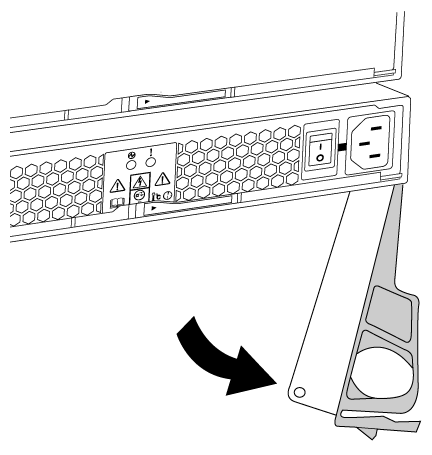

= Swap out a power supply - AFF A220 and FAS2700
:icons: font
:imagesdir: ../media/

[.lead]
Swapping out a power supply involves turning off, disconnecting, and removing the old power supply and installing, connecting, and turning on the replacement power supply.

All other components in the system must be functioning properly; if not, you must contact technical support.

* The power supplies are redundant and hot-swappable.
* This procedure is written for replacing one power supply at a time.
+
NOTE: Cooling is integrated with the power supply, so you must replace the power supply within two minutes of removal to prevent overheating due to reduced airflow. Because the chassis provides a shared cooling configuration for the two HA nodes, a delay longer than two minutes will shut down all controller modules in the chassis. If both controller modules do shut down, make sure that both power supplies are inserted, turn both off for 30 seconds, and then turn both on.

* Power supplies are auto-ranging.

.Steps

. Identify the power supply you want to replace, based on console error messages or through the LEDs on the power supplies.
. If you are not already grounded, properly ground yourself.
. Turn off the power supply and disconnect the power cables:
 .. Turn off the power switch on the power supply.
 .. Open the power cable retainer, and then unplug the power cable from the power supply.
 .. Unplug the power cable from the power source.
. Squeeze the latch on the power supply cam handle, and then open the cam handle to fully release the power supply from the mid plane.
+

. Use the cam handle to slide the power supply out of the system.
+
CAUTION: When removing a power supply, always use two hands to support its weight.
+

. Make sure that the on/off switch of the new power supply is in the Off position.
. Using both hands, support and align the edges of the power supply with the opening in the system chassis, and then gently push the power supply into the chassis using the cam handle.
+
The power supplies are keyed and can only be installed one way.
+
NOTE: Do not use excessive force when sliding the power supply into the system. You can damage the connector.

. Close the cam handle so that the latch clicks into the locked position and the power supply is fully seated.
. Reconnect the power supply cabling:
 .. Reconnect the power cable to the power supply and the power source.
 .. Secure the power cable to the power supply using the power cable retainer.

+
Once power is restored to the power supply, the status LED should be green.
. Turn on the power to the new power supply, and then verify the operation of the power supply activity LEDs.
+
The power supply LEDs are lit when the power supply comes online.

include::../_include/complete_rma_step.adoc[]
