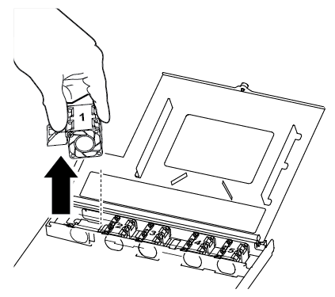

= Replace a fan -- FAS500f
:icons: font
:imagesdir: ../media/

[.lead]
You replace a fan with a new fan module when it fails.

== Step 1: Shut down the impaired controller

include::../_include/shutdown_most_frus.adoc[]

== Step 2: Remove the controller module

You must remove the controller module from the chassis when you replace a fan module.

Make sure that you label the cables so that you know where they came from.

. If you are not already grounded, properly ground yourself.
. Unplug the controller module power supplies from the source.
. Release the power cable retainers, and then unplug the cables from the power supplies.
. Insert your forefinger into the latching mechanism on either side of the controller module, press the lever with your thumb, and gently pull the controller a few inches out of the chassis.
+
NOTE: If you have difficulty removing the controller module, place your index fingers through the finger holes from the inside (by crossing your arms).
+
image::../media/drw_a250_pcm_remove_install.png[]
+
|===
a|
image:../media/legend_icon_01.png[]|
Lever
a|
image:../media/legend_icon_02.png[]
a|
Latching mechanism
|===

. Using both hands, grasp the controller module sides and gently pull it out of the chassis and set it on a flat, stable surface.
. Turn the thumbscrew on the front of the controller module anti-clockwise and open the controller module cover.
+
image::../media/drw_a250_open_controller_module_cover.png[]
+
|===
a|
image:../media/legend_icon_01.png[]|
Thumbscrew
a|
image:../media/legend_icon_02.png[]
a|
Controller module cover
|===

== Step 3: Replace a fan

To replace a fan, remove the failed fan module and replace it with a new fan module.

You can use the following video or the tabulated steps to replace a fan:

video::ccfa6665-2c2b-4571-ae79-ac5b015c19fc[panopto, title="Animation - Replace a fan"]

. Identify the fan module that you must replace by checking the console error messages or by locating the lit LED for the fan module on the motherboard.
. Remove the fan module by pinching the side of the fan module, and then lifting the fan module straight out of the controller module.
+

+
|===
a|
image:../media/legend_icon_01.png[]|
Fan module
|===

. Align the edges of the replacement fan module with the opening in the controller module, and then slide the replacement fan module into the controller module.

== Step 4: Reinstall the controller module

After you replace a component within the controller module, you must reinstall the controller module in the system chassis and boot it.

. Close the controller module cover and tighten the thumbscrew.
+
image::../media/drw_a250_close_controller_module_cover.png[]
+
|===
a|
image:../media/legend_icon_01.png[]|
Controller module cover
a|
image:../media/legend_icon_02.png[]
a|
Thumbscrew
|===

. Insert the controller module into the chassis:
 .. Ensure the latching mechanism arms are locked in the fully extended position.
 .. Using both hands, align and gently slide the controller module into the latching mechanism arms until it stops.
 .. Place your index fingers through the finger holes from the inside of the latching mechanism.
 .. Press your thumbs down on the orange tabs on top of the latching mechanism and gently push the controller module over the stop.
 .. Release your thumbs from the top of the latching mechanisms and continue pushing until the latching mechanisms snap into place.
+
The controller module begins to boot as soon as it is fully seated in the chassis. Be prepared to interrupt the boot process.

+
The controller module should be fully inserted and flush with the edges of the chassis.
. Recable the system, as needed.
. Return the controller to normal operation by giving back its storage: `storage failover giveback -ofnode _impaired_node_name_`
. If automatic giveback was disabled, reenable it: `storage failover modify -node local -auto-giveback true`

== Step 5: Return the failed part to NetApp

include::../_include/complete_rma.adoc[]
