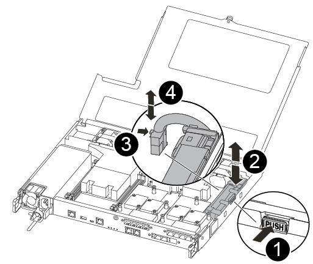
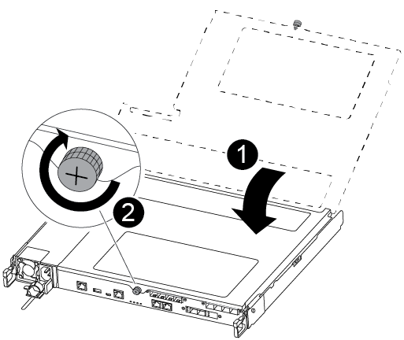

= Replace the NVMEM battery - FAS500f
:icons: font
:imagesdir: ../media/

[.lead]
To replace an NVMEM battery in the system, you must remove the controller module from the system, open it, replace the battery, and close and replace the controller module.

All other components in the system must be functioning properly; if not, you must contact technical support.

== Step 1: Shut down the impaired controller

include::../_include/shutdown_most_frus.adoc[]

== Step 2: Remove the controller module

You must remove the controller module from the chassis when you replace a component inside the controller module.

Make sure that you label the cables so that you know where they came from.

. If you are not already grounded, properly ground yourself.
. Unplug the controller module power supplies from the source.
. Release the power cable retainers, and then unplug the cables from the power supplies.
. Insert your forefinger into the latching mechanism on either side of the controller module, press the lever with your thumb, and gently pull the controller a few inches out of the chassis.
+
NOTE: If you have difficulty removing the controller module, place your index fingers through the finger holes from the inside (by crossing your arms).
+
image::../media/drw_a250_pcm_remove_install.png[]
+
|===
a|
image:../media/legend_icon_01.png[]|
Lever
a|
image:../media/legend_icon_02.png[]
a|
Latching mechanism
|===

. Using both hands, grasp the controller module sides and gently pull it out of the chassis and set it on a flat, stable surface.
. Turn the thumbscrew on the front of the controller module anti-clockwise and open the controller module cover.
+
image::../media/drw_a250_open_controller_module_cover.png[]
+
|===
a|
image:../media/legend_icon_01.png[]|
Thumbscrew
a|
image:../media/legend_icon_02.png[]
a|
Controller module cover.
|===

== Step 3: Replace the NVMEM battery

To replace the NVMEM battery, you must remove the failed battery from the controller module and install the replacement battery into the controller module.

You can use the following video or the tabulated steps to replace the NVMEM battery:

video::89f6d5c3-1a5b-4500-8ba8-ac5b01653050[panopto, title="Animation - Replace the NVMEM battery"]

. Locate and replace the impaired NVMEM battery on your controller module.
+
NOTE: It is recommended that you follow the illustrated instructions in the order listed.
+

+
|===
a|
image:../media/legend_icon_01.png[]|
Squeeze the clip on the face of the battery plug.
a|
image:../media/legend_icon_02.png[]
a|
Unplug the battery cable from the socket.
a|
image:../media/legend_icon_03.png[]
a|
Grasp the battery and press the blue locking tab marked PUSH.
a|
image:../media/legend_icon_04.png[]
a|
Lift the battery out of the holder and controller module.
|===

. Locate the battery plug and squeeze the clip on the face of the battery plug to release the plug from the socket.
. Grasp the battery and press the blue locking tab marked PUSH, and then lift the battery out of the holder and controller module and set it aside.
. Remove the replacement NV battery from the antistatic shipping bag and align it to the battery holder.
. Insert the replacement NV battery plug into the socket.
. Slide the battery pack down along the sheet metal side wall until the support tabs on the side wall hook into the slots on the battery pack, and the battery pack latch engages and clicks into the opening on the side wall.
. Press firmly down on the battery pack to make sure that it is locked into place.

== Step 4: Install the controller module

After you have replaced the component in the controller module, you must reinstall the controller module into the chassis, and then boot it to Maintenance mode.

You can use the following illustration or the written steps to install the replacement controller module in the chassis.

. Close the controller module cover and tighten the thumbscrew.
+

+
|===
a|
image:../media/legend_icon_01.png[]|
Controller module cover
a|
image:../media/legend_icon_02.png[]
a|
Thumbscrew
|===

. Insert the controller module into the chassis:
 .. Ensure the latching mechanism arms are locked in the fully extended position.
 .. Using both hands, align and gently slide the controller module into the latching mechanism arms until it stops.
 .. Place your index fingers through the finger holes from the inside of the latching mechanism.
 .. Press your thumbs down on the orange tabs on top of the latching mechanism and gently push the controller module over the stop.
 .. Release your thumbs from the top of the latching mechanisms and continue pushing until the latching mechanisms snap into place.
+
The controller module begins to boot as soon as it is fully seated in the chassis. Be prepared to interrupt the boot process.

+
The controller module should be fully inserted and flush with the edges of the chassis.
. Cable the management and console ports only, so that you can access the system to perform the tasks in the following sections.
+
NOTE: You will connect the rest of the cables to the controller module later in this procedure.

== Step 5: Run diagnostics

After you have replaced a component in your system, you should run diagnostic tests on that component.

Your system must be at the LOADER prompt to start diagnostics.

All commands in the diagnostic procedures are issued from the controller where the component is being replaced.

.Steps
. If the controller to be serviced is not at the LOADER prompt, reboot the controller: `system node halt -node node_name`
+
After you issue the command, you should wait until the system stops at the LOADER prompt.

. At the LOADER prompt, access the special drivers specifically designed for system-level diagnostics to function properly: `boot_diags`
. Select *Scan System* from the displayed menu to enable running the diagnostics tests.
. Select *Test system* from the displayed menu to run diagnostics tests.
. Proceed based on the result of the preceding step:
 ** If the scan show problems, correct the issue, and then rerun the scan.
 ** If the scan reported no failures, select Reboot from the menu to reboot the system.

== Step 6: Return the failed part to NetApp

include::../_include/complete_rma.adoc[]
