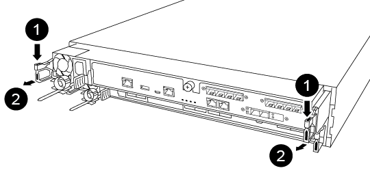
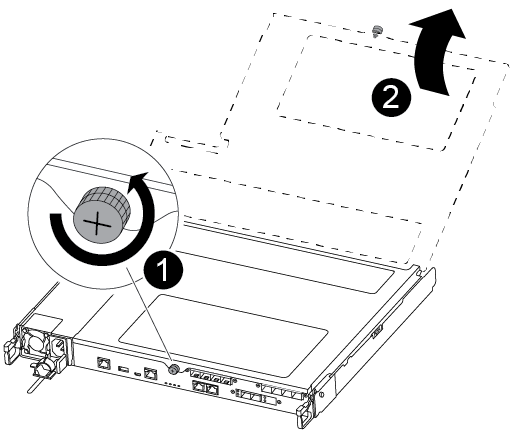
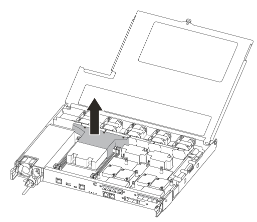
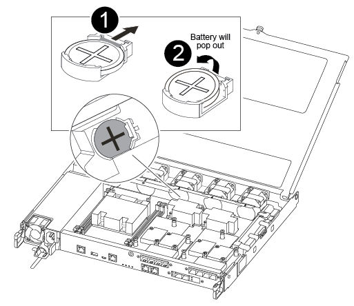
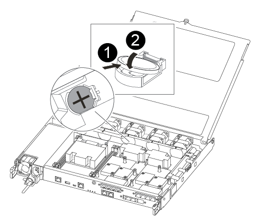

= Replace the real-time clock battery
:icons: font
:imagesdir: ../media/

[.lead]
You replace the real-time clock (RTC) battery in the controller module so that your system's services and applications that depend on accurate time synchronization continue to function.

* You can use this procedure with all versions of ONTAP supported by your system
* All other components in the system must be functioning properly; if not, you must contact technical support.

== Step 1: Shut down the impaired controller

include::../_include/shutdown_most_frus.adoc[]

== Step 2: Remove the controller module

You must remove the controller module from the chassis when you replace a component inside the controller module.

Make sure that you label the cables so that you know where they came from.

. If you are not already grounded, properly ground yourself.
. Unplug the controller module power supplies from the source.
. Release the power cable retainers, and then unplug the cables from the power supplies.
. Insert your forefinger into the latching mechanism on either side of the controller module, press the lever with your thumb, and gently pull the controller a few inches out of the chassis.
+
NOTE: If you have difficulty removing the controller module, place your index fingers through the finger holes from the inside (by crossing your arms).
+

+
|===
a|
image:../media/legend_icon_01.png[]|
Lever
a|
image:../media/legend_icon_02.png[]
a|
Latching mechanism
|===

. Using both hands, grasp the controller module sides and gently pull it out of the chassis and set it on a flat, stable surface.
. Turn the thumbscrew on the front of the controller module anti-clockwise and open the controller module cover.
+

+
|===
a|
image:../media/legend_icon_01.png[]|
Thumbscrew
a|
image:../media/legend_icon_02.png[]
a|
Controller module cover.
|===

. Lift out the air duct cover.
+

== Step 3: Replace the RTC battery

To replace the RTC battery, locate it inside the controller and follow the specific sequence of steps.

You can use the following video or the tabulated steps to replace the RTC battery:

video::6ed27f71-d3a7-4cee-8d9f-ac5b016c982d[panopto, title="Animation - Replace the RTC battery"]

. Locate the RTC battery between the heatsink and the midplane and remove it exactly as shown in the graphic.
+

+
|===
a|
image:../media/legend_icon_01.png[]|
Gently pull tab away from the battery housing.

NOTE: Pulling it away aggressively might displace the tab.
a|
image:../media/legend_icon_02.png[]
a|
Lift the battery up.

NOTE: Make a note of the polarity of the battery.

a|
image:../media/legend_icon_03.png[]
a|
The battery should eject out.
|===
The battery will be ejected out.

. Remove the replacement battery from the antistatic shipping bag.
. Locate the RTC battery holder between the heatsink and the midplane and insert it exactly as shown in the graphic.
+

+
|===
a|
image:../media/legend_icon_01.png[]|
With positive polarity face up, slide the battery under the tab of the battery housing.
a|
image:../media/legend_icon_02.png[]
a|
Push the battery gently into place and make sure the tab secures it to the housing.

CAUTION: Pushing it in aggressively might cause the battery to eject out again.

|===

. Visually inspect the battery to make sure that it is completely installed into the holder and that the polarity is correct.

== Step 4: Reinstall the controller module and set time/date after RTC battery replacement

[.lead]
After you replace a component within the controller module, you must reinstall the controller module in the system chassis, reset the time and date on the controller, and then boot it.

.Steps
. If you have not already done so, close the air duct or controller module cover.
. Align the end of the controller module with the opening in the chassis, and then gently push the controller module halfway into the system.
+
Do not completely insert the controller module in the chassis until instructed to do so.

. Recable the system, as needed.
+
If you removed the media converters (QSFPs or SFPs), remember to reinstall them if you are using fiber optic cables.

. If the power supplies were unplugged, plug them back in and reinstall the power cable retainers.
. Insert the controller module into the chassis:
 .. Ensure the latching mechanism arms are locked in the fully extended position.
 .. Using both hands, align and gently slide the controller module into the latching mechanism arms until it stops.
 .. Place your index fingers through the finger holes from the inside of the latching mechanism.
 .. Press your thumbs down on the orange tabs on top of the latching mechanism and gently push the controller module over the stop.
 .. Release your thumbs from the top of the latching mechanisms and continue pushing until the latching mechanisms snap into place.
+
The controller module begins to boot as soon as it is fully seated in the chassis. Be prepared to interrupt the boot process.

 .. Halt the controller at the LOADER prompt.

+
The controller module should be fully inserted and flush with the edges of the chassis.
. Reset the time and date on the controller:
 .. Check the date and time on the healthy controller with the `show date` command.
 .. At the LOADER prompt on the target controller, check the time and date.
 .. If necessary, modify the date with the `set date mm/dd/yyyy` command.
 .. If necessary, set the time, in GMT, using the `set time hh:mm:ss` command.
 .. Confirm the date and time on the target controller.
. At the LOADER prompt, enter `bye` to reinitialize the PCIe cards and other components and let the controller reboot.
. Return the controller to normal operation by giving back its storage: `storage failover giveback -ofnode _impaired_node_name_`
. If automatic giveback was disabled, reenable it: `storage failover modify -node local -auto-giveback true`

== Step 5: Complete the replacement process

include::../_include/complete_rma.adoc[]
