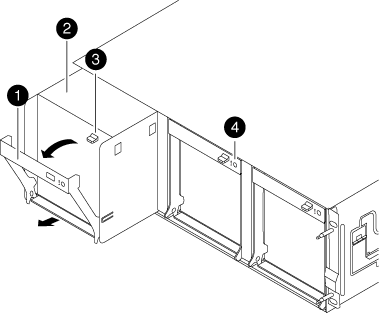

= Move and replace hardware - FAS8200
:icons: font
:imagesdir: ../media/

== Step 1: Move a power supply

[.lead]
Moving out a power supply when replacing a chassis involves turning off, disconnecting, and removing the power supply from the old chassis and installing and connecting it on the replacement chassis.

. If you are not already grounded, properly ground yourself.
. Turn off the power supply and disconnect the power cables:
 .. Turn off the power switch on the power supply.
 .. Open the power cable retainer, and then unplug the power cable from the power supply.
 .. Unplug the power cable from the power source.
. Press down the release latch on the power supply cam handle, and then lower the cam handle to the fully open position to release the power supply from the mid plane.
+
image::../media/drw_rxl_psu.png[]
+
|===
a|
image:../media/legend_icon_01.png[]|
Power supply
a|
image:../media/legend_icon_02.png[]
a|
Cam handle release latch
a|
image:../media/legend_icon_03.png[]
a|
Power and Fault LEDs
a|
image:../media/legend_icon_04.png[]
a|
Cam handle
a|
image:../media/legend_icon_05.png[]
a|
Power cable locking mechanism
|===

. Use the cam handle to slide the power supply out of the system.
+
*CAUTION:* When removing a power supply, always use two hands to support its weight.

. Repeat the preceding steps for any remaining power supplies.
. Using both hands, support and align the edges of the power supply with the opening in the system chassis, and then gently push the power supply into the chassis using the cam handle.
+
The power supplies are keyed and can only be installed one way.
+
NOTE: Do not use excessive force when sliding the power supply into the system. You can damage the connector.

. Push firmly on the power supply cam handle to seat it all the way into the chassis, and then push the cam handle to the closed position, making sure that the cam handle release latch clicks into its locked position.
. Reconnect the power cable and secure it to the power supply using the power cable locking mechanism.
+
NOTE: Only connect the power cable to the power supply. Do not connect the power cable to a power source at this time.

== Step 2: Move a fan

[.lead]
Moving out a fan module when replacing the chassis involves a specific sequence of tasks.

. Remove the bezel (if necessary) with two hands, by grasping the openings on each side of the bezel, and then pulling it toward you until the bezel releases from the ball studs on the chassis frame.
. Press down the release latch on the fan module cam handle, and then pull the cam handle downward.
+
The fan module moves a little bit away from the chassis.
+

+
|===
a|
image:../media/legend_icon_01.png[]|
Cam handle
a|
image:../media/legend_icon_02.png[]
a|
Fan module
a|
image:../media/legend_icon_03.png[]
a|
Cam handle release latch
a|
image:../media/legend_icon_04.png[]
a|
Fan module Attention LED
|===

. Pull the fan module straight out from the chassis, making sure that you support it with your free hand so that it does not swing out of the chassis.
+
*CAUTION:* The fan modules are short. Always support the bottom of the fan module with your free hand so that it does not suddenly drop free from the chassis and injure you.

. Set the fan module aside.
. Repeat the preceding steps for any remaining fan modules.
. Insert the fan module into the replacement chassis by aligning it with the opening, and then sliding it into the chassis.
. Push firmly on the fan module cam handle so that it is seated all the way into the chassis.
+
The cam handle raises slightly when the fan module is completely seated.

. Swing the cam handle up to its closed position, making sure that the cam handle release latch clicks into the locked position.
+
The fan LED should be green after the fan is seated and has spun up to operational speed.

. Repeat these steps for the remaining fan modules.
. Align the bezel with the ball studs, and then gently push the bezel onto the ball studs.

== Step 3: Remove the controller module

[.lead]
To replace the chassis, you must remove the controller module or modules from the old chassis.

. Loosen the hook and loop strap binding the cables to the cable management device, and then unplug the system cables and SFPs (if needed) from the controller module, keeping track of where the cables were connected.
+
Leave the cables in the cable management device so that when you reinstall the cable management device, the cables are organized.

. Remove and set aside the cable management devices from the left and right sides of the controller module.
+
image::../media/drw_32xx_cbl_mgmt_arm.png[]

. Loosen the thumbscrew on the cam handle on the controller module.
+
image::../media/drw_8020_cam_handle_thumbscrew.png[]
+
|===
a|
image:../media/legend_icon_01.png[]|
Thumbscrew
a|
image:../media/legend_icon_02.png[]
a|
Cam handle
|===

. Pull the cam handle downward and begin to slide the controller module out of the chassis.
+
Make sure that you support the bottom of the controller module as you slide it out of the chassis.

. Set the controller module aside in a safe place, and repeat these steps if you have another controller module in the chassis.

== Step 4: Replace a chassis from within the equipment rack or system cabinet

[.lead]
You must remove the existing chassis from the equipment rack or system cabinet before you can install the replacement chassis.

. Remove the screws from the chassis mount points.
+
NOTE: If the system is in a system cabinet, you might need to remove the rear tie-down bracket.

. With the help of two or three people, slide the old chassis off the rack rails in a system cabinet or _L_ brackets in an equipment rack, and then set it aside.
. If you are not already grounded, properly ground yourself.
. Using two or three people, install the replacement chassis into the equipment rack or system cabinet by guiding the chassis onto the rack rails in a system cabinet or _L_ brackets in an equipment rack.
. Slide the chassis all the way into the equipment rack or system cabinet.
. Secure the front of the chassis to the equipment rack or system cabinet, using the screws you removed from the old chassis.
. If you have not already done so, install the bezel.

== Step 4: Install the controller

[.lead]
After you install the controller module and any other components into the new chassis, boot it to a state where you can run the interconnect diagnostic test.

For HA pairs with two controller modules in the same chassis, the sequence in which you install the controller module is especially important because it attempts to reboot as soon as you completely seat it in the chassis.

. Align the end of the controller module with the opening in the chassis, and then gently push the controller module halfway into the system.
+
NOTE: Do not completely insert the controller module in the chassis until instructed to do so.

. Recable the console to the controller module, and then reconnect the management port.
. Repeat the preceding steps if there is a second controller to install in the new chassis.
. Complete the installation of the controller module:
+
[options="header" cols="1,2"]
|===
| If your system is in...| Then perform these steps...
a|
An HA pair
a|

 .. With the cam handle in the open position, firmly push the controller module in until it meets the midplane and is fully seated, and then close the cam handle to the locked position. Tighten the thumbscrew on the cam handle on back of the controller module.
+
NOTE: Do not use excessive force when sliding the controller module into the chassis to avoid damaging the connectors.

 .. If you have not already done so, reinstall the cable management device.
 .. Bind the cables to the cable management device with the hook and loop strap.
 .. Repeat the preceding steps for the second controller module in the new chassis.

a|
A stand-alone configuration
a|

 .. With the cam handle in the open position, firmly push the controller module in until it meets the midplane and is fully seated, and then close the cam handle to the locked position. Tighten the thumbscrew on the cam handle on back of the controller module.
+
NOTE: Do not use excessive force when sliding the controller module into the chassis to avoid damaging the connectors.

 .. If you have not already done so, reinstall the cable management device.
 .. Bind the cables to the cable management device with the hook and loop strap.
 .. Reinstall the blanking panel and then go to the next step.

|===

. Connect the power supplies to different power sources, and then turn them on.
. Boot each node to Maintenance mode:
 .. As each node starts the booting, press `Ctrl-C` to interrupt the boot process when you see the message `Press Ctrl-C for Boot Menu`.
+
NOTE: If you miss the prompt and the controller modules boot to ONTAP, enter `halt`, and then at the LOADER prompt enter `boot_ontap`, press `Ctrl-C` when prompted, and then repeat this step.

 .. From the boot menu, select the option for Maintenance mode.
