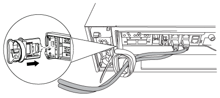
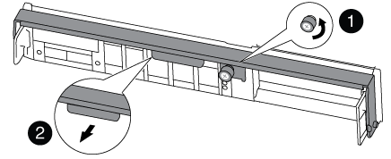
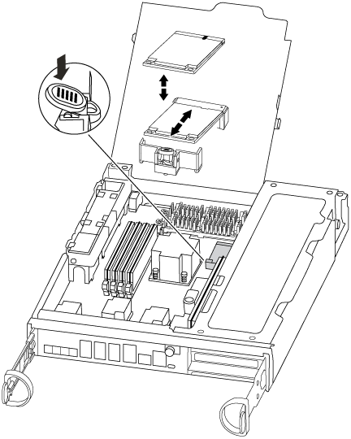
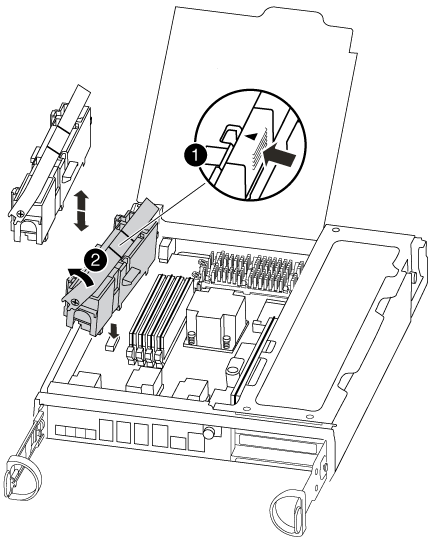
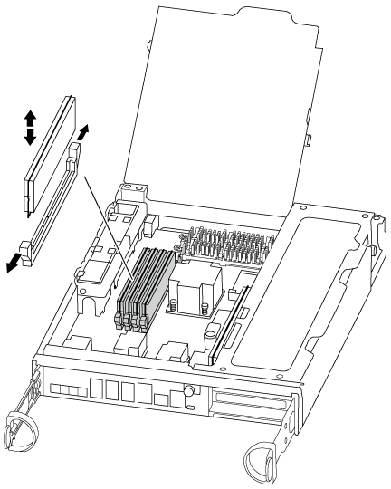
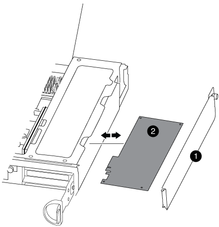
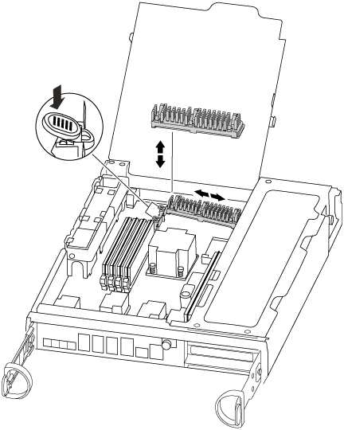

= Replace the controller module hardware - FAS8200
:icons: font
:imagesdir: ../media/

[.lead]
To replace the controller module hardware, you must remove the impaired controller, move FRU components to the replacement controller module, install the replacement controller module in the chassis, and then boot the system to Maintenance mode.

== Step 1: Open the controller module

To replace the controller module, you must first remove the old controller module from the chassis.

. If you are not already grounded, properly ground yourself.
. Loosen the hook and loop strap binding the cables to the cable management device, and then unplug the system cables and SFPs (if needed) from the controller module, keeping track of where the cables were connected.
+
Leave the cables in the cable management device so that when you reinstall the cable management device, the cables are organized.

. Remove and set aside the cable management devices from the left and right sides of the controller module.
+

. If you left the SFP modules in the system after removing the cables, move them to the new controller module.
. Loosen the thumbscrew on the cam handle on the controller module.
+

+
|===
a|
image:../media/legend_icon_01.png[]|
Thumbscrew
a|
image:../media/legend_icon_02.png[]
a|
Cam handle
|===

. Pull the cam handle downward and begin to slide the controller module out of the chassis.
+
Make sure that you support the bottom of the controller module as you slide it out of the chassis.

== Step 2: Move the boot device

You must locate the boot media and follow the directions to remove it from the old controller and insert it in the new controller.

. Locate the boot media using the following illustration or the FRU map on the controller module:
+

. Press the blue button on the boot media housing to release the boot media from its housing, and then gently pull it straight out of the boot media socket.
+
NOTE: Do not twist or pull the boot media straight up, because this could damage the socket or the boot media.

. Move the boot media to the new controller module, align the edges of the boot media with the socket housing, and then gently push it into the socket.
. Check the boot media to make sure that it is seated squarely and completely in the socket.
+
If necessary, remove the boot media and reseat it into the socket.

. Push the boot media down to engage the locking button on the boot media housing.

== Step 3: Move the NVMEM battery

To move the NVMEM battery from the old controller module to the new controller module, you must perform a specific sequence of steps.

. Check the NVMEM LED:
 ** If your system is in an HA configuration, go to the next step.
 ** If your system is in a stand-alone configuration, cleanly shut down the controller module, and then check the NVRAM LED identified by the NV icon.
+
image::../media/drw_hw_nvram_icon.png[]
+
NOTE: The NVRAM LED blinks while destaging contents to the flash memory when you halt the system. After the destage is complete, the LED turns off.

  *** If power is lost without a clean shutdown, the NVMEM LED flashes until the destage is complete, and then the LED turns off.
  *** If the LED is on and power is on, unwritten data is stored on NVMEM.
+
This typically occurs during an uncontrolled shutdown after ONTAP has successfully booted.
. Open the CPU air duct and locate the NVMEM battery.
+

+
|===
a|
image:../media/legend_icon_01.png[]|
Battery lock tab
a|
image:../media/legend_icon_02.png[]
a|
NVMEM battery pack
|===

. Grasp the battery and press the blue locking tab marked PUSH, and then lift the battery out of the holder and controller module.
. Remove the battery from the controller module and set it aside.

== Step 4: Move the DIMMs

To move the DIMMs, locate and move them from the old controller into the replacement controller and follow the specific sequence of steps.

. Locate the DIMMs on your controller module.
. Note the orientation of the DIMM in the socket so that you can insert the DIMM in the replacement controller module in the proper orientation.
. Eject the DIMM from its slot by slowly pushing apart the two DIMM ejector tabs on either side of the DIMM, and then slide the DIMM out of the slot.
+
NOTE: Carefully hold the DIMM by the edges to avoid pressure on the components on the DIMM circuit board.
+
The number and placement of system DIMMs depends on the model of your system.
+
The following illustration shows the location of system DIMMs:
+

. Locate the slot where you are installing the DIMM.
. Make sure that the DIMM ejector tabs on the connector are in the open position, and then insert the DIMM squarely into the slot.
+
The DIMM fits tightly in the slot, but should go in easily. If not, realign the DIMM with the slot and reinsert it.
+
NOTE: Visually inspect the DIMM to verify that it is evenly aligned and fully inserted into the slot.

. Repeat these steps for the remaining DIMMs.
. Move the NVMEM battery to the replacement controller module.
. Align the tab or tabs on the battery holder with the notches in the controller module side, and then gently push down on the battery housing until the battery housing clicks into place.

== Step 5: Move a PCIe card

To move PCIe cards, locate and move them from the old controller into the replacement controller and follow the specific sequence of steps.

You must have the new controller module ready so that you can move the PCIe cards directly from the old controller module to the corresponding slots in the new one.

. Loosen the thumbscrew on the controller module side panel.
. Swing the side panel off the controller module.
+

+
|===
a|
image:../media/legend_icon_01.png[]
a|
Side panel
a|
image:../media/legend_icon_02.png[]
a|
PCIe card
|===

. Remove the PCIe card from the old controller module and set it aside.
+
Make sure that you keep track of which slot the PCIe card was in.

. Repeat the preceding step for the remaining PCIe cards in the old controller module.
. Open the new controller module side panel, if necessary, slide off the PCIe card filler plate, as needed, and carefully install the PCIe card.
+
Be sure that you properly align the card in the slot and exert even pressure on the card when seating it in the socket. The card must be fully and evenly seated in the slot.

. Repeat the preceding step for the remaining PCIe cards that you set aside.
. Close the side panel and tighten the thumbscrew.

== Step 6: Move a caching module

You must move the caching modules from the impaired controller modules to the replacement controller module when replacing a controller module.

. Locate the caching module at the rear of the controller module and remove it:
 .. Press the release tab.
 .. Remove the heatsink.
+
The storage system comes with two slots available for the caching module and only one slot is occupied, by default.
+

+

. Move the caching module to the new controller module, and then align the edges of the caching module with the socket housing and gently push it into the socket.
. Verify that the caching module is seated squarely and completely in the socket. If necessary, remove the caching module and reseat it into the socket.
. Reseat and push the heatsink down to engage the locking button on the caching module housing.
. Repeat the steps if you have a second caching module. Close the controller module cover.

== Step 7: Install the controller

After you install the components from the old controller module into the new controller module, you must install the new controller module into the system chassis and boot the operating system.

For HA pairs with two controller modules in the same chassis, the sequence in which you install the controller module is especially important because it attempts to reboot as soon as you completely seat it in the chassis.

NOTE: The system might update system firmware when it boots. Do not abort this process. The procedure requires you to interrupt the boot process, which you can typically do at any time after prompted to do so. However, if the system updates the system firmware when it boots, you must wait until after the update is complete before interrupting the boot process.

. If you are not already grounded, properly ground yourself.
. If you have not already done so, close the CPU air duct.
. Align the end of the controller module with the opening in the chassis, and then gently push the controller module halfway into the system.
+
NOTE: Do not completely insert the controller module in the chassis until instructed to do so.

. Cable the management and console ports only, so that you can access the system to perform the tasks in the following sections.
+
NOTE: You will connect the rest of the cables to the controller module later in this procedure.

. Complete the reinstallation of the controller module:
+
[options="header" cols="1,2"]
|===
| If your system is in...| Then perform these steps...
a|
An HA pair
a|
    The controller module begins to boot as soon as it is fully seated in the chassis. Be prepared to interrupt the boot process.

 .. With the cam handle in the open position, firmly push the controller module in until it meets the midplane and is fully seated, and then close the cam handle to the locked position. Tighten the thumbscrew on the cam handle on back of the controller module.
+
NOTE: Do not use excessive force when sliding the controller module into the chassis to avoid damaging the connectors.
+
The controller begins to boot as soon as it is seated in the chassis.

 .. If you have not already done so, reinstall the cable management device.
 .. Bind the cables to the cable management device with the hook and loop strap.
 .. When you see the message `Press Ctrl-C for Boot Menu`, press `Ctrl-C` to interrupt the boot process.
+
NOTE: If you miss the prompt and the controller module boots to ONTAP, enter `halt`, and then at the LOADER prompt enter `boot_ontap`, press `Ctrl-C` when prompted, and then boot to Maintenance mode.

 .. Select the option to boot to Maintenance mode from the displayed menu.

a|
A stand-alone configuration
a|

 .. With the cam handle in the open position, firmly push the controller module in until it meets the midplane and is fully seated, and then close the cam handle to the locked position. Tighten the thumbscrew on the cam handle on back of the controller module.
+
NOTE: Do not use excessive force when sliding the controller module into the chassis to avoid damaging the connectors.

 .. If you have not already done so, reinstall the cable management device.
 .. Bind the cables to the cable management device with the hook and loop strap.
 .. Reconnect the power cables to the power supplies and to the power sources, turn on the power to start the boot process, and then press `Ctrl-C` after you see the `Press Ctrl-C for Boot Menu` message.
+
NOTE: If you miss the prompt and the controller module boots to ONTAP, enter `halt`, and then at the LOADER prompt enter `boot_ontap`, press `Ctrl-C` when prompted, and then boot to Maintenance mode.

 .. From the boot menu, select the option for Maintenance mode.

+
|===
*Important:* During the boot process, you might see the following prompts:

 ** A prompt warning of a system ID mismatch and asking to override the system ID.
 ** A prompt warning that when entering Maintenance mode in an HA configuration you must ensure that the healthy controller remains down.
You can safely respond `y` to these prompts.
