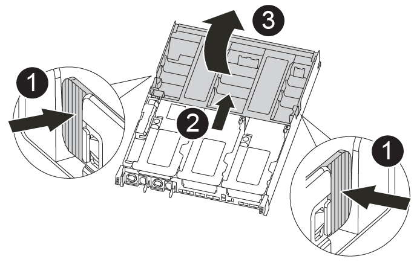
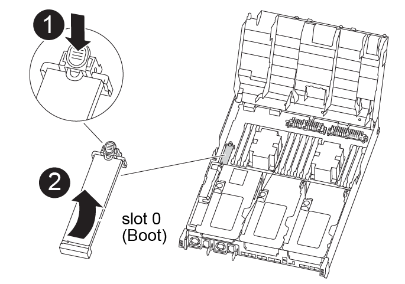

= Replace the boot media - FAS8300 and FAS8700
:icons: font
:imagesdir: ../media/

To replace the boot media, you must remove the impaired controller module, install the replacement boot media, and transfer the boot image to a USB flash drive.

== Step 1: Remove the controller module
:icons: font
:imagesdir: ../media/

[.lead]
To access components inside the controller module, you must remove the controller module from the chassis.

You can use the following animation, illustration, or the written steps to remove the controller module from the chassis.

video::ca74d345-e213-4390-a599-aae10019ec82[panopto, title="Animation - Remove the controller module"]

.Steps
. If you are not already grounded, properly ground yourself.
. Release the power cable retainers, and then unplug the cables from the power supplies.
. Loosen the hook and loop strap binding the cables to the cable management device, and then unplug the system cables and SFPs (if needed) from the controller module, keeping track of where the cables were connected.
+
Leave the cables in the cable management device so that when you reinstall the cable management device, the cables are organized.

. Remove the cable management device from the controller module and set it aside.
. Press down on both of the locking latches, and then rotate both latches downward at the same time.
+
The controller module moves slightly out of the chassis.
+
image::../media/drw_A400_Remove_controller.png[]
+
|===
a|
image:../media/legend_icon_01.png[] a|
Locking latches
a|
image:../media/legend_icon_02.png[]
a|
Slide controller out of chassis
|===

. Slide the controller module out of the chassis.
+
Make sure that you support the bottom of the controller module as you slide it out of the chassis.

. Place the controller module on a stable, flat surface.

== Step 2: Replace the boot media

[.lead]
You must locate the boot media in the controller module (see the FRU map on the controller module), and then follow the directions to replace it.

.Before you begin

Although the contents of the boot media is encrypted, it is a best practice to erase the contents of the boot media before replacing it. For more information, see the https://mysupport.netapp.com/info/web/ECMP1132988.html[Statement of Volatility] for your system on the NetApp Support Site.

NOTE: You must log into the NetApp Support Site to display the _Statement of Volatility_ for your system.

You can use the following animation, illustrations, or the written steps to replace the boot media.

video::e0825a97-c57d-47d7-b87d-aad9012efa12[panopto, title="Animation - Replace the boot media "]

.Steps
. Open the air duct:
+

+
|===
a|
image:../media/legend_icon_01.png[] a|
Locking tabs
a|
image:../media/legend_icon_02.png[]
a|
Slide air duct toward back of controller
a|
image::../media/legend_icon_03.png[]
a|
Rotate air duct up
|===

 .. Press the locking tabs on the sides of the air duct in toward the middle of the controller module.
 .. Slide the air duct toward the back of the controller module, and then rotate it upward to its completely open position.
. Locate and remove the boot media from the controller module:
+

+
|===
a|
image:../media/legend_icon_01.png[] a|
Press blue button
a|
image:../media/legend_icon_02.png[]
a|
Rotate boot media up and remove from socket
|===
 .. Press the blue button at the end of the boot media until the lip on the boot media clears the blue button.
 .. Rotate the boot media up and gently pull the boot media out of the socket.
. Align the edges of the replacement boot media with the boot media socket, and then gently push it into the socket.
. Check the boot media to make sure that it is seated squarely and completely in the socket.
+
If necessary, remove the boot media and reseat it into the socket.

. Lock the boot media in place:
 .. Rotate the boot media down toward the motherboard.
 .. Placing a finger at the end of the boot media by the blue button, push down on the boot media end to engage the blue locking button.
 .. While pushing down on the boot media, lift the blue locking button to lock the boot media in place.
. Close the air duct.

== Step 3: Transfer the boot image to the boot media
:icons: font
:imagesdir: ../media/

[.lead]
The replacement boot media that you installed does not have a boot image, so you need to transfer a boot image using a USB flash drive.

.Before you begin
* You must have a USB flash drive, formatted to MBR/FAT32, with at least 4GB capacity
* A copy of the same image version of ONTAP as what the impaired controller was running. You can download the appropriate image from the Downloads section on the NetApp Support Site
 ** If NVE is enabled, download the image with NetApp Volume Encryption, as indicated in the download button.
 ** If NVE is not enabled, download the image without NetApp Volume Encryption, as indicated in the download button.
* If your system is an HA pair, you must have a network connection.
* If your system is a stand-alone system you do not need a network connection, but you must perform an additional reboot when restoring the `var` file system.

. Download and copy the appropriate service image from the NetApp Support Site to the USB flash drive.
 .. Download the service image to your work space on your laptop.
 .. Unzip the service image.
+
NOTE: If you are extracting the contents using Windows, do not use WinZip to extract the netboot image. Use another extraction tool, such as 7-Zip or WinRAR.
+
There are two folders in the unzipped service image file:

  *** `boot`
  *** `efi`

 .. Copy the `efi` folder to the top directory on the USB flash drive.
+
The USB flash drive should have the efi folder and the same Service Image (BIOS) version of what the impaired controller is running.

 .. Remove the USB flash drive from your laptop.
. If you have not already done so, close the air duct.
. Align the end of the controller module with the opening in the chassis, and then gently push the controller module halfway into the system.
. Reinstall the cable management device and recable the system, as needed.
+
When recabling, remember to reinstall the media converters (SFPs or QSFPs) if they were removed.

. Plug the power cable into the power supply and reinstall the power cable retainer.
. Insert the USB flash drive into the USB slot on the controller module.
+
Make sure that you install the USB flash drive in the slot labeled for USB devices, and not in the USB console port.

. Complete the installation of the controller module:
 .. Plug the power cord into the power supply, reinstall the power cable locking collar, and then connect the power supply to the power source.
 .. Firmly push the controller module into the chassis until it meets the midplane and is fully seated.
+
The locking latches rise when the controller module is fully seated.
+
NOTE: Do not use excessive force when sliding the controller module into the chassis to avoid damaging the connectors.
+
The controller module begins to boot as soon as it is fully seated in the chassis. Be prepared to interrupt the boot process.

 .. Rotate the locking latches upward, tilting them so that they clear the locking pins, and then lower them into the locked position.
 .. If you have not already done so, reinstall the cable management device.
. Interrupt the boot process by pressing Ctrl-C to stop at the LOADER prompt.
+
If you miss this message, press Ctrl-C, select the option to boot to Maintenance mode, and then `halt` the controller to boot to LOADER.

. If the controller is in a stretch or fabric-attached MetroCluster, you must restore the FC adapter configuration:
 .. Boot to Maintenance mode: `boot_ontap maint`
 .. Set the MetroCluster ports as initiators: `ucadmin modify -m fc -t _initiator adapter_name_`
 .. Halt to return to Maintenance mode: `halt`

+
The changes will be implemented when the system is booted.
