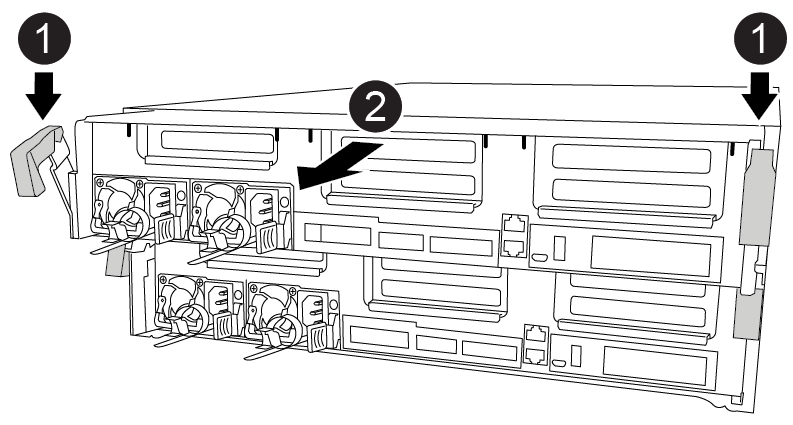
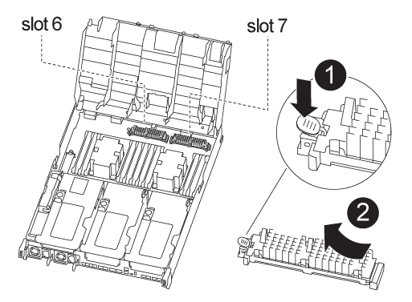
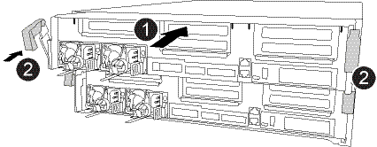

= Replace the caching module - FAS8300 and FAS8700
:icons: font
:imagesdir: ../media/

[.lead]
You must replace the caching module in the controller module when your system registers a single AutoSupport (ASUP) message that the module has gone offline; failure to do so results in performance degradation.

* You must replace the failed component with a replacement FRU component you received from your provider.

== Step 1: Shut down the impaired controller

[.lead]
You can shut down or take over the impaired controller using different procedures, depending on the storage system hardware configuration.

[role="tabbed-block"]
====

.Option 1: Most configurations
--

[.lead]
To shut down the impaired controller, you must determine the status of the controller and, if necessary, take over the controller so that the healthy controller continues to serve data from the impaired controller storage.

.About this tasks
If you have a cluster with more than two nodes, it must be in quorum. If the cluster is not in quorum or a healthy controller shows false for eligibility and health, you must correct the issue before shutting down the impaired controller.

http://docs.netapp.com/ontap-9/topic/com.netapp.doc.dot-cm-sag/home.html[ONTAP 9 System Administration Reference]

You might want to erase the contents of your caching module before replacing it.

.Steps
. Although data on the caching module is encrypted, you might want to erase any data from the impaired caching module and verify that the caching module has no data:
 .. Erase the data on the caching module: `system controller flash-cache secure-erase run -node _node_name_ -device-id _device_id_`
 .. Verify that the data has been erased from the caching module: `system controller flash-cache secure-erase show -node _node_name_`
+
The output should display the caching module status as erased.
. If AutoSupport is enabled, suppress automatic case creation by invoking an AutoSupport message: `system node autosupport invoke -node * -type all -message MAINT=_number_of_hours_down_h`
+
The following AutoSupport message suppresses automatic case creation for two hours: `cluster1:*> system node autosupport invoke -node * -type all -message MAINT=2h`

. Disable automatic giveback from the console of the healthy controller: `storage failover modify –node local -auto-giveback false`
. Take the impaired controller to the LOADER prompt:
+
[options="header" cols="1,2"]
|===
| If the impaired controller is displaying...| Then...
a|
The LOADER prompt
a|
Go to the next step.
a|
Waiting for giveback...
a|
Press Ctrl-C, and then respond `y`.
a|
System prompt or password prompt (enter system password)
a|
Take over or halt the impaired controller: `storage failover takeover -ofnode _impaired_node_name_`    When the impaired controller shows Waiting for giveback..., press Ctrl-C, and then respond `y`.

|===

--
.Option 2: Controller is in a two-node MetroCluster
--
[.lead]
include::../_include/shutdown_2n_mcc.adoc[]
--

====

== Step 2: Remove the controller module

[.lead]
To access components inside the controller module, you must remove the controller module from the chassis.

You can use the following animation, illustration, or the written steps to remove the controller module from the chassis.

video::75b6fa91-96b9-4323-b156-aae10007c9a5[panopto, title="Animation - Remove the controller module"]

.Steps
. If you are not already grounded, properly ground yourself.
. Release the power cable retainers, and then unplug the cables from the power supplies.
. Loosen the hook and loop strap binding the cables to the cable management device, and then unplug the system cables and SFPs (if needed) from the controller module, keeping track of where the cables were connected.
+
Leave the cables in the cable management device so that when you reinstall the cable management device, the cables are organized.

. Remove the cable management device from the controller module and set it aside.
. Press down on both of the locking latches, and then rotate both latches downward at the same time.
+
The controller module moves slightly out of the chassis.

. Slide the controller module out of the chassis.
+
Make sure that you support the bottom of the controller module as you slide it out of the chassis.

. Place the controller module on a stable, flat surface.

== Step 3: Replace a caching module

[.lead]
To replace a caching module, referred to as the Flash Cache on the label on your controller, locate the slot inside the controller and follow the specific sequence of steps. See the FRU map on the controller module for the location of the Flash Cache.

Your storage system must meet certain criteria depending on your situation:

* It must have the appropriate operating system for the caching module you are installing.
* It must support the caching capacity.
* Although the contents of the caching module is encrypted, it is a best practice to erase the contents of the module before replacing it. For more information, see the https://mysupport.netapp.com/info/web/ECMP1132988.html[Statement of Volatility] for your system on the NetApp Support Site.
+
NOTE: You must log into the NetApp Support Site to display the _Statement of Volatility_ for your system.

* All other components in the storage system must be functioning properly; if not, you must contact technical support.

You can use the following animation, illustration, or the written steps to replace a caching module.

video::d5f75ac5-b4f3-4b49-984b-aad9012f0c8e[panopto, title="Animation - Replace the caching module "]

.Steps
. If you are not already grounded, properly ground yourself.
. Open the air duct:
 .. Press the locking tabs on the sides of the air duct in toward the middle of the controller module.
 .. Slide the air duct toward the back of the controller module, and then rotate it upward to its completely open position.
. Using the FRU map on the controller module, locate the failed caching module and remove it:
+
Depending on your configuration, there may be zero, one, or two caching modules in the controller module.  Use the FRU map inside the controller module to help locate the caching module. 

 .. Press the blue release tab.
+
The caching module end rises clear of the release tab.

 .. Rotate the caching module up and slide it out of the socket.

. Install the replacement caching module:
 .. Align the edges of the replacement caching module with the socket and gently insert it into the socket.
 .. Rotate the caching module downward toward the motherboard.
 .. Placing your finger at the end of the caching module by the blue button, firmly push down on the caching module end, and then lift the locking button to lock the caching module in place.
. Close the air duct:
 .. Rotate the air duct down to the controller module.
 .. Slide the air duct toward the risers to lock it in place.

== Step 4: Install the controller module

[.lead]
After you have replaced the component in the controller module, you must reinstall the controller module into the chassis, and then boot it to Maintenance mode.

You can use the following animation, illustration, or the written steps to install the controller module in the chassis.

video::9249fdb8-1522-437d-9280-aae10007c97b[panopto, title="Animation - Install the controller module "]

.Steps
. If you have not already done so, close the air duct.
. Align the end of the controller module with the opening in the chassis, and then gently push the controller module halfway into the system.
+
NOTE: Do not completely insert the controller module in the chassis until instructed to do so.

. Cable the management and console ports only, so that you can access the system to perform the tasks in the following sections.
+
NOTE: You will connect the rest of the cables to the controller module later in this procedure.

. Complete the installation of the controller module:
 .. Plug the power cord into the power supply, reinstall the power cable locking collar, and then connect the power supply to the power source.
 .. Using the locking latches, firmly push the controller module into the chassis until the locking latches begin to rise.
+
NOTE: Do not use excessive force when sliding the controller module into the chassis to avoid damaging the connectors.

 .. Fully seat the controller module in the chassis by rotating the locking latches upward, tilting them so that they clear the locking pins, gently push the controller all the way in, and then lower the locking latches into the locked position.
+
The controller module begins to boot as soon as it is fully seated in the chassis. Be prepared to interrupt the boot process.

 .. If you have not already done so, reinstall the cable management device.
 .. Interrupt the normal boot process and boot to LOADER by pressing `Ctrl-C`.
+
NOTE: If your system stops at the boot menu, select the option to boot to LOADER.

 .. At the LOADER prompt, enter `bye` to reinitialize the PCIe cards and other components.
 .. Interrupt the boot process and boot to the LOADER prompt by pressing `Ctrl-C`.
+
If your system stops at the boot menu, select the option to boot to LOADER.

== Step 5: Run diagnostics

[.lead]
After you have replaced a component in your system, you should run diagnostic tests on that component.

Your system must be at the LOADER prompt to start diagnostics.

All commands in the diagnostic procedures are issued from the controller where the component is being replaced.

.Steps
. If the controller to be serviced is not at the LOADER prompt, reboot the controller: `system node halt -node _node_name_`
+
After you issue the command, you should wait until the system stops at the LOADER prompt.

. At the LOADER prompt, access the special drivers specifically designed for system-level diagnostics to function properly: `boot_diags`
. Select *Scan System* from the displayed menu to enable running the diagnostics tests.
. Select *Stress-Test system* from the displayed menu.
. Select **M.2 NVME Drive Stress** from the displayed menu.
. Proceed based on the result of the preceding step:
 ** If the test failed, correct the failure, and then rerun the test.
 ** If the test reported no failures, select Reboot from the menu to reboot the system.

== Step 6: Restore the controller module to operation after running diagnostics

[.lead]
After completing diagnostics, you must recable the system, give back the controller module, and then reenable automatic giveback.

.Steps
. Recable the system, as needed.
+
If you removed the media converters (QSFPs or SFPs), remember to reinstall them if you are using fiber optic cables.

. Return the controller to normal operation by giving back its storage: `storage failover giveback -ofnode _impaired_node_name_`
. If automatic giveback was disabled, reenable it: `storage failover modify -node local -auto-giveback true`

== Step 7: Switch back aggregates in a two-node MetroCluster configuration

[.lead]
include::../_include/2n_mcc_switchback.adoc[]

== Step 8: Complete the replacement process

[.lead]
include::../_include/complete_rma.adoc[]
