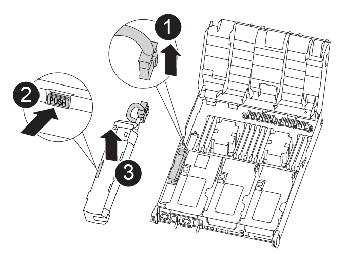

= Replace the NVDIMM battery - FAS8300 and FAS8700
:icons: font
:imagesdir: ../media/

[.lead]
To replace the NVDIMM battery, you must remove the controller module, remove the battery, replace the battery, and then reinstall the controller module.

All other components in the system must be functioning properly; if not, you must contact technical support.

== Step 1: Shut down the impaired controller

[.lead]
You can shut down or take over the impaired controller using different procedures, depending on the storage system hardware configuration.

[role="tabbed-block"]
====

.Option 1: Most configurations
--
[.lead]
include::../_include/shutdown_most_frus.adoc[]
--

.Option 2: Controller is in a two-node MetroCluster
--
[.lead]
include::../_include/shutdown_2n_mcc.adoc[]
--

====

== Step 2: Remove the controller module

[.lead]
To access components inside the controller module, you must remove the controller module from the chassis.

You can use the following animation, illustration, or the written steps to remove the controller module from the chassis.

video::75b6fa91-96b9-4323-b156-aae10007c9a5[panopto, title="Animation - Remove the controller module"]

image::../media/drw_A400_Remove_controller.png[]

.Steps
. If you are not already grounded, properly ground yourself.
. Release the power cable retainers, and then unplug the cables from the power supplies.
. Loosen the hook and loop strap binding the cables to the cable management device, and then unplug the system cables and SFPs (if needed) from the controller module, keeping track of where the cables were connected.
+
Leave the cables in the cable management device so that when you reinstall the cable management device, the cables are organized.

. Remove the cable management device from the controller module and set it aside.
. Press down on both of the locking latches, and then rotate both latches downward at the same time.
+
The controller module moves slightly out of the chassis.

. Slide the controller module out of the chassis.
+
Make sure that you support the bottom of the controller module as you slide it out of the chassis.

. Place the controller module on a stable, flat surface.

== Step 3: Replace the NVDIMM battery

[.lead]
To replace the NVDIMM battery, you must remove the failed battery from the controller module and install the replacement battery into the controller module. See the FRU map inside the controller module to locate the NVDIMM battery.

The NVDIMM LED blinks while destaging contents when you halt the system. After the destage is complete, the LED turns off.

You can use the following animation, illustration, or the written steps to replace the NVDIMM battery.

video::1f1425a8-5a91-4810-82da-aad9012efa4f[panopto, title="Animation - Replace the NVDIMM battery"]

.Steps
. Open the air duct:
 .. Press the locking tabs on the sides of the air duct in toward the middle of the controller module.
 .. Slide the air duct toward the back of the controller module, and then rotate it upward to its completely open position.
. Locate the NVDIMM battery in the controller module.
. Locate the battery plug and squeeze the clip on the face of the battery plug to release the plug from the socket, and then unplug the battery cable from the socket.
. Grasp the battery and press the blue locking tab marked PUSH, and then lift the battery out of the holder and controller module.
. Remove the replacement battery from its package.
. Align the battery module with the opening for the battery, and then gently push the battery into slot until it locks into place.
. Plug the battery plug back into the controller module, and then close the air duct.

== Step 4: Install the controller module

[.lead]
After you have replaced the component in the controller module, you must reinstall the controller module into the chassis, and then boot it to Maintenance mode.

You can use the following animation, illustration, or the written steps to install the controller module in the chassis.

video::9249fdb8-1522-437d-9280-aae10007c97b[panopto, title="Animation - Install the controller module"]

image::../media/drw_A400_Install_controller_source.png[]

.Steps
. If you have not already done so, close the air duct.
. Align the end of the controller module with the opening in the chassis, and then gently push the controller module halfway into the system.
+
NOTE: Do not completely insert the controller module in the chassis until instructed to do so.

. Cable the management and console ports only, so that you can access the system to perform the tasks in the following sections.
+
NOTE: You will connect the rest of the cables to the controller module later in this procedure.

. Complete the installation of the controller module:
 .. Plug the power cord into the power supply, reinstall the power cable locking collar, and then connect the power supply to the power source.
 .. Using the locking latches, firmly push the controller module into the chassis until the locking latches begin to rise.
+
NOTE: Do not use excessive force when sliding the controller module into the chassis to avoid damaging the connectors.

 .. Fully seat the controller module in the chassis by rotating the locking latches upward, tilting them so that they clear the locking pins, gently push the controller all the way in, and then lower the locking latches into the locked position.
+
The controller module begins to boot as soon as it is fully seated in the chassis. Be prepared to interrupt the boot process.

 .. If you have not already done so, reinstall the cable management device.
 .. Interrupt the normal boot process and boot to LOADER by pressing `Ctrl-C`.
+
NOTE: If your system stops at the boot menu, select the option to boot to LOADER.

 .. At the LOADER prompt, enter `bye` to reinitialize the PCIe cards and other components.
 .. Interrupt the boot process and boot to the LOADER prompt by pressing `Ctrl-C`.
+
If your system stops at the boot menu, select the option to boot to LOADER.

== Step 5: Run diagnostics

[.lead]
After you have replaced a component in your system, you should run diagnostic tests on that component.

Your system must be at the LOADER prompt to start diagnostics.

All commands in the diagnostic procedures are issued from the controller where the component is being replaced.

.Steps
. If the controller to be serviced is not at the LOADER prompt, reboot the controller: `system node halt -node _node_name_`
+
After you issue the command, you should wait until the system stops at the LOADER prompt.

. At the LOADER prompt, access the special drivers specifically designed for system-level diagnostics to function properly: `boot_diags`
. Select *Scan System* from the displayed menu to enable running the diagnostics tests.
. Select *Test Memory* from the displayed menu to run diagnostics tests.
. Proceed based on the result of the preceding step:
 ** If the scan show problems, correct the issue, and then rerun the scan.
 ** If the scan reported no failures, select `Reboot` from the menu to reboot the system.

== Step 6: Restore the controller module to operation after running diagnostics

[.lead]
After completing diagnostics, you must recable the system, give back the controller module, and then reenable automatic giveback.

.Steps
. Recable the system, as needed.
+
If you removed the media converters (QSFPs or SFPs), remember to reinstall them if you are using fiber optic cables.

. Return the controller to normal operation by giving back its storage: `storage failover giveback -ofnode _impaired_node_name_`
. If automatic giveback was disabled, reenable it: `storage failover modify -node local -auto-giveback true`

== Step 7: Switch back aggregates in a two-node MetroCluster configuration

[.lead]
include::../_include/2n_mcc_switchback.adoc[]

== Step 8: Return the failed part to NetApp

[.lead]
include::../_include/complete_rma.adoc[]
