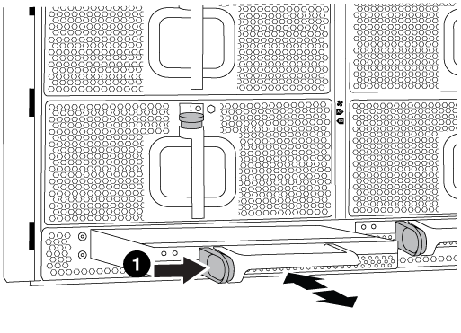

= Hot-swap a de-stage controller power module (DCPM) - AFF A700 and FAS9000
:icons: font
:imagesdir: ../media/

[.lead]
To hot-swap a de-stage controller power module (DCPM), which contains the NVRAM10 battery, you must locate the failed DCPM module, remove it from the chassis, and install the replacement DCPM module.

You must have a replacement DCPM module in-hand before removing the failed module from the chassis and it must be replaced within five minutes of removal. Once the DCPM module is removed from the chassis, there is no shutdown protection for the controller module that owns the DCPM module, other than failover to the other controller module.

== Replacing the DCPM module

To replace the DCPM module in your system, you must remove the failed DCPM module from the system and then replace it with a new DCPM module.

.Steps
. If you are not already grounded, properly ground yourself.
. Remove the bezel on the front of the system and set it aside.
. Locate the failed DCPM module in the front of the system by looking for the Attention LED on the module.
+
The LED will be steady amber if the module is faulty.
+
NOTE: The DCPM module must be replaced in the chassis within five minutes of removal or the associated controller will shut down.

. Press the orange locking button on the module handle, and then slide the DCPM module out of the chassis.
+

+
|===
a|
image:../media/legend_icon_01.png[] a|
DCPM module orange locking button
|===

. Align the end of the DCPM module with the chassis opening, and then gently slide it into the chassis until it clicks into place.
+
NOTE: The module and slot are keyed. Do not force the module into the opening. If the module does not go in easily, realign the module and slide it into the chassis.
+
The DCPM module LED lights when the module is fully seated into the chassis.

== Dispose of batteries

You must dispose of batteries according to the local regulations regarding battery recycling or disposal. If you cannot properly dispose of batteries, you must return the batteries to NetApp, as described in the RMA instructions that are shipped with the kit.

https://library.netapp.com/ecm/ecm_download_file/ECMP12475945

== Return the failed part to NetApp

include::../_include/complete_rma.adoc[]
