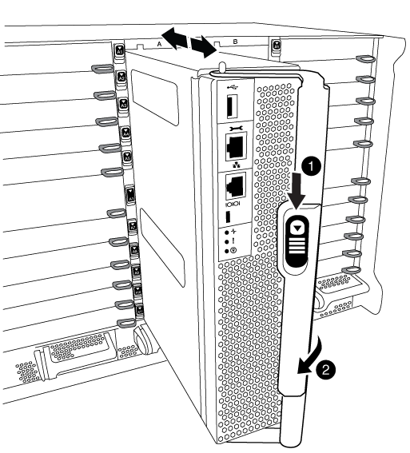
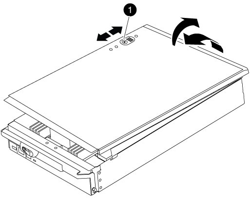
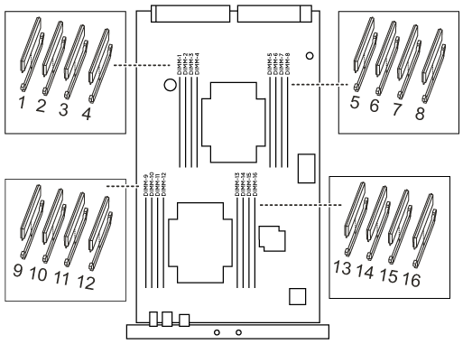

= Replace a DIMM - AFF A700 and FAS9000
:icons: font
:imagesdir: ../media/

[.lead]
You must replace a DIMM in the controller module when your system registers an increasing number of correctable error correction codes (ECC); failure to do so causes a system panic.

All other components in the system must be functioning properly; if not, you must contact technical support.

You must replace the failed component with a replacement FRU component you received from your provider.

== Step 1: Shut down the impaired controller

[.lead]
You can shut down or take over the impaired controller using different procedures, depending on the storage system hardware configuration.

[role="tabbed-block"]
====

.Option 1: Most configurations

--

[.lead]
include::../_include/shutdown_most_frus.adoc[]

--

.Option 2: Controller is in a two-node MetroCluster

--

[.lead]
include::../_include/shutdown_2n_mcc.adoc[]

--
====

== Step 2: Remove the controller module

[.lead]
To access components inside the controller, you must first remove the controller module from the system and then remove the cover on the controller module.

.Steps
. If you are not already grounded, properly ground yourself.
. Unplug the cables from the impaired controller module, and keep track of where the cables were connected.
. Slide the orange button on the cam handle downward until it unlocks.
+

+
|===
a|
image:../media/legend_icon_01.png[] a|
Cam handle release button
a|
image:../media/legend_icon_02.png[]
a|
Cam handle
|===

. Rotate the cam handle so that it completely disengages the controller module from the chassis, and then slide the controller module out of the chassis.
+
Make sure that you support the bottom of the controller module as you slide it out of the chassis.

. Place the controller module lid-side up on a stable, flat surface, press the blue button on the cover, slide the cover to the back of the controller module, and then swing the cover up and lift it off of the controller module.
+

+
|===
a|
image:../media/legend_icon_01.png[] a|
Controller module cover locking button
|===

== Step 3: Replace the DIMMs

[.lead]
To replace the DIMMs, locate them inside the controller and follow the specific sequence of steps.

.Steps
. If you are not already grounded, properly ground yourself.
. Locate the DIMMs on your controller module.

. Eject the DIMM from its slot by slowly pushing apart the two DIMM ejector tabs on either side of the DIMM, and then slide the DIMM out of the slot.
+
NOTE: Carefully hold the DIMM by the edges to avoid pressure on the components on the DIMM circuit board.
+
image::../media/drw_9000_replace_pcm_dimms.png[]
+
[cols="1,3"]
|===
a|
image:../media/legend_icon_01.png[]
a|
DIMM ejector tabs
a|
image:../media/legend_icon_02.png[]
a|
DIMM
|===

. Remove the replacement DIMM from the antistatic shipping bag, hold the DIMM by the corners, and align it to the slot.
+
The notch among the pins on the DIMM should line up with the tab in the socket.

. Make sure that the DIMM ejector tabs on the connector are in the open position, and then insert the DIMM squarely into the slot.
+
The DIMM fits tightly in the slot, but should go in easily. If not, realign the DIMM with the slot and reinsert it.
+
NOTE: Visually inspect the DIMM to verify that it is evenly aligned and fully inserted into the slot.

. Push carefully, but firmly, on the top edge of the DIMM until the ejector tabs snap into place over the notches at the ends of the DIMM.
. Close the controller module cover.

== Step 4: Install the controller

[.lead]
After you install the components into the controller module, you must install the controller module back into the system chassis and boot the operating system.

For HA pairs with two controller modules in the same chassis, the sequence in which you install the controller module is especially important because it attempts to reboot as soon as you completely seat it in the chassis.

.Steps
. If you are not already grounded, properly ground yourself.
. If you have not already done so, replace the cover on the controller module.
. Align the end of the controller module with the opening in the chassis, and then gently push the controller module halfway into the system.
+
NOTE: Do not completely insert the controller module in the chassis until instructed to do so.

. Cable the management and console ports only, so that you can access the system to perform the tasks in the following sections.
+
NOTE: You will connect the rest of the cables to the controller module later in this procedure.

. Complete the reinstallation of the controller module:
 .. If you have not already done so, reinstall the cable management device.
 .. Firmly push the controller module into the chassis until it meets the midplane and is fully seated.
+
The locking latches rise when the controller module is fully seated.
+
NOTE: Do not use excessive force when sliding the controller module into the chassis to avoid damaging the connectors.
+
The controller module begins to boot as soon as it is fully seated in the chassis. Be prepared to interrupt the boot process.

 .. Rotate the locking latches upward, tilting them so that they clear the locking pins, and then lower them into the locked position.
 .. Interrupt the boot process by pressing `Ctrl-C` when you see `Press Ctrl-C for Boot Menu`.
 .. Select the option to boot to Maintenance mode from the displayed menu.

== Step 5: Run system-level diagnostics

[.lead]
After installing a new DIMM, you should run diagnostics.

Your system must be at the LOADER prompt to start System Level Diagnostics.

All commands in the diagnostic procedures are issued from the node where the component is being replaced.

.Steps
. If the node to be serviced is not at the LOADER prompt, perform the following steps:
 .. Select the Maintenance mode option from the displayed menu.
 .. After the node boots to Maintenance mode, halt the node: `halt`
+
After you issue the command, you should wait until the system stops at the LOADER prompt.
+
NOTE: During the boot process, you can safely respond `y` to prompts:

  *** A prompt warning that when entering Maintenance mode in an HA configuration, you must ensure that the healthy node remains down.
. At the LOADER prompt, access the special drivers specifically designed for system-level diagnostics to function properly: `boot_diags`
+
During the boot process, you can safely respond `y` to the prompts until the Maintenance mode prompt (*>) appears.

. Run diagnostics on the system memory: `sldiag device run -dev mem`
. Verify that no hardware problems resulted from the replacement of the DIMMs: `sldiag device status -dev mem -long -state failed`
+
System-level diagnostics returns you to the prompt if there are no test failures, or lists the full status of failures resulting from testing the component.

. Proceed based on the result of the preceding step:
+
[options="header" cols="1,2"]
|===
| If the system-level diagnostics tests...| Then...
a|
Were completed without any failures
a|
.. Clear the status logs: `sldiag device clearstatus`

.. Verify that the log was cleared: `sldiag device status`
+
The following default response is displayed:
+

_SLDIAG: No log messages are present._

 .. Exit Maintenance mode: `halt`
+
The node displays the LOADER prompt.

.. Boot the node from the LOADER prompt: `bye`
.. Return the node to normal operation.

a|
An HA pair
a|
Perform a give back: `storage failover giveback -ofnode _replacement_node_name_`

NOTE: If you disabled automatic giveback, re-enable it with the storage failover modify command.

a|
A two-node MetroCluster configuration
a|
Proceed to the next step.

The MetroCluster switchback procedure is done in the next task in the replacement process.
a|
A stand-alone configuration
a|
Proceed to the next step.

No action is required.

You have completed system-level diagnostics.

a|
Resulted in some test failures
a|
Determine the cause of the problem:

 .. Exit Maintenance mode: `halt`
+
After you issue the command, wait until the system stops at the LOADER prompt.

 .. Turn off or leave on the power supplies, depending on how many controller modules are in the chassis:
*** If you have two controller modules in the chassis, leave the power supplies turned on to provide power to the other controller module.
*** If you have one controller module in the chassis, turn off the power supplies and unplug them from the power sources.
.. Verify that you have observed all the considerations identified for running system-level diagnostics, that cables are securely connected, and that hardware components are properly installed in the storage system.
.. Boot the controller module you are servicing, interrupting the boot by pressing `Ctrl-C` when prompted to get to the Boot menu:
*** If you have two controller modules in the chassis, fully seat the controller module you are servicing in the chassis.
+
The controller module boots up when fully seated.

*** If you have one controller module in the chassis, connect the power supplies, and then turn them on.
.. Select Boot to maintenance mode from the menu.
.. Exit Maintenance mode by entering the following command: `halt`
+
After you issue the command, wait until the system stops at the LOADER prompt.

.. Rerun the system-level diagnostic test.

|===

== Step 6: Switch back aggregates in a two-node MetroCluster configuration

[.lead]
include::../_include/2n_mcc_switchback.adoc[]

== Step 7: Return the failed part to NetApp

[.lead]
include::../_include/complete_rma.adoc[]
