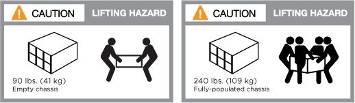
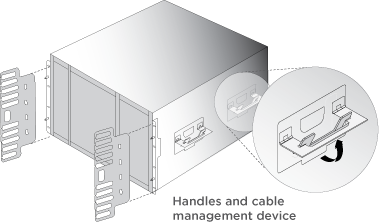
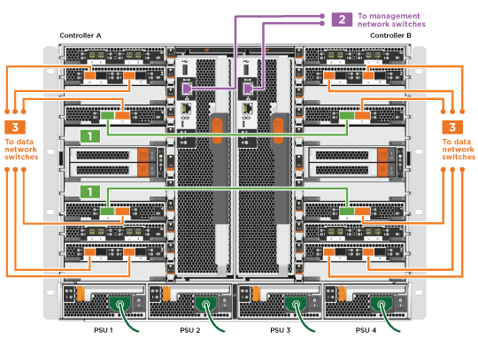
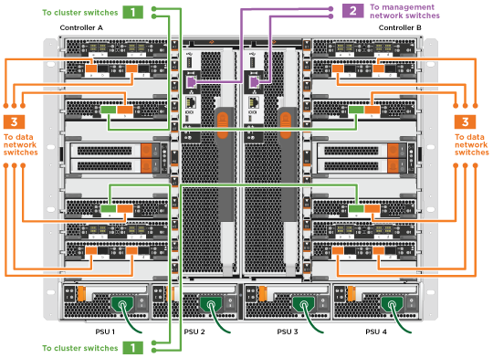
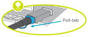
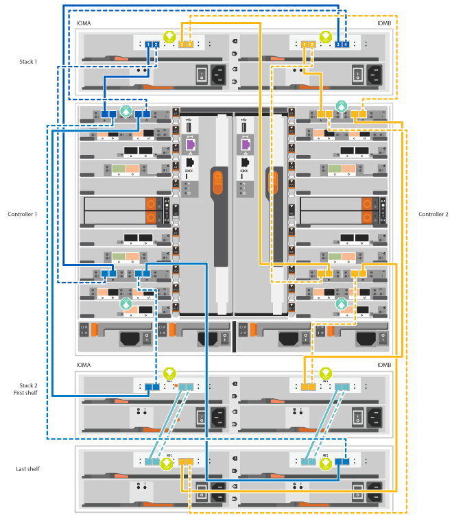
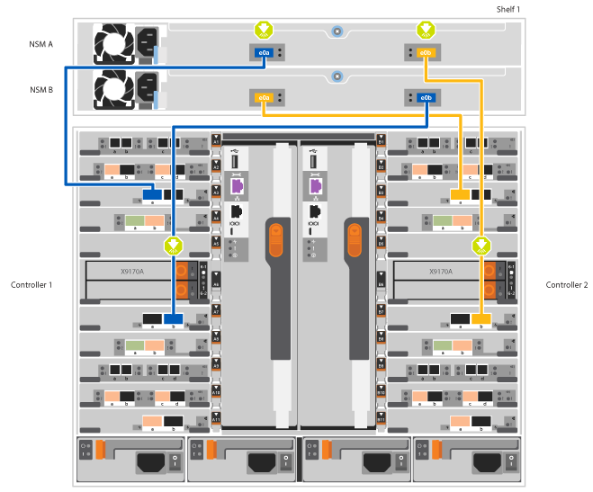
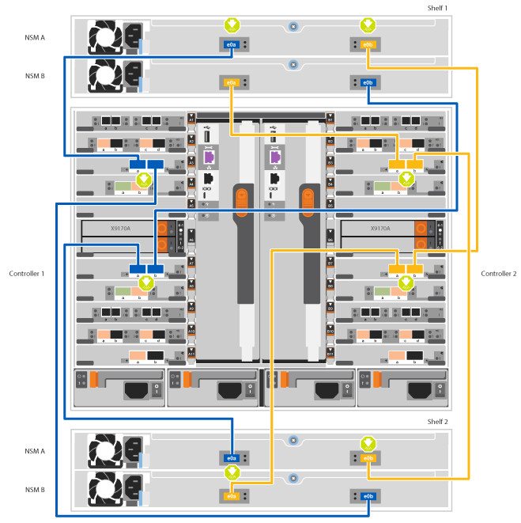
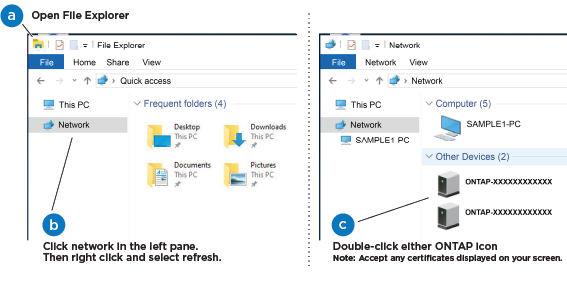
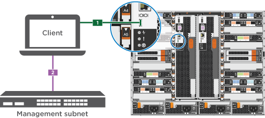

= Detailed guide - AFF A700 and FAS9000
:icons: font
:imagesdir: ../media/

[.lead]
This guide gives detailed step-by-step instructions for installing a typical NetApp system. Use this guide if you want more detailed installation instructions.

== Step 1: Prepare for installation

[.lead]
To install your system, you need to create an account on the NetApp Support Site, register your system, and get license keys. You also need to inventory the appropriate number and type of cables for your system and collect specific network information.

.Before you begin

You need to have access to the Hardware Universe for information about site requirements as well as additional information on your configured system. You might also want to have access to the Release Notes for your version of ONTAP for more information about this system.

https://hwu.netapp.com[NetApp Hardware Universe]

http://mysupport.netapp.com/documentation/productlibrary/index.html?productID=62286[Find the Release Notes for your version of ONTAP 9]

You need to provide the following at your site:

* Rack space for the storage system
* Phillips #2 screwdriver
* Additional networking cables to connect your system to your network switch and laptop or console with a Web browser

.Steps
. Unpack the contents of all boxes.
. Record the system serial number from the controllers.
+

. Inventory and make a note of the number and types of cables you received.
+
The following table identifies the types of cables you might receive. If you receive a cable not listed in the table, see the Hardware Universe to locate the cable and identify its use.
+
https://hwu.netapp.com[NetApp Hardware Universe]
+
[options="header" cols="1,2,1,2"]
|===
| Type of cable...| Part number and length| Connector type| For...
a|
10 GbE network cable
a|
X6566B-2-R6, (112-00299), 2m

X6566B-3-R6, 112-00300, 3m

X6566B-5-R6 , 112-00301, 5m
a|

a|
Network cable
a|
40 GbE network cable

40 GbE cluster interconnect
a|
X66100-1,112-00542, 1m

X66100-3,112-00543, 3m
a|

a|
40 GbE network

Cluster interconnect
a|
100 GbE network cable

100 GbE storage cable
a|
X66211A-05 (112-00595), 0.5m

X66211A-1 (112-00573), 1m

X66211A-2 (112-00574), 2m

X66211A-5 (112-00574), 5m
a|

a|
Network cable

Storage cable

NOTE: This cable applies to AFF A700 only.

a|
Optical network cables (order dependent)
a|
X6553-R6 (112-00188), 2m

X6536-R6 (112-00090), 5m
a|

a|
FC host network
a|
Cat 6, RJ-45 (order dependent)
a|
Part numbers X6585-R6 (112-00291), 3m

X6562-R6 (112-00196), 5m
a|

a|
Management network and Ethernet data
a|
Storage
a|
X66031A (112-00436), 1m

X66032A (112-00437), 2m

X66033A (112-00438), 3m
a|

a|
Storage
a|
Micro-USB console cable
a|
Not applicable
a|

a|
Console connection during software setup on non-Windows or Mac laptop/console
a|
Power cables
a|
Not applicable
a|

a|
Powering up the system
|===

. Review the _NetApp ONTAP Confiuration Guide_ and collect the required information listed in that guide.
+
https://library.netapp.com/ecm/ecm_download_file/ECMLP2862613[ONTAP Configuration Guide]

== Step 2: Install the hardware

[.lead]
You need to install your system in a 4-post rack or NetApp system cabinet, as applicable.

.Steps
. Install the rail kits, as needed.
. Install and secure your system using the instructions included with the rail kit.
+
NOTE: You need to be aware of the safety concerns associated with the weight of the system.
+

NOTE: The label on the left indicates an empty chassis, while the label on the right indicates a fully-populated system.

. Attach cable management devices (as shown).
+

. Place the bezel on the front of the system.

== Step 3: Cable controllers to your network

[.lead]
You can cable the controllers to your network by using the two-node switchless cluster method or by using the cluster interconnect network.

=== Option 1: Two-node switchless cluster

[.lead]
Management network, data network, and management ports on the controllers are connected to switches. The cluster interconnect ports are cabled on both controllers.

You must have contacted your network administrator for information about connecting the system to the switches.

Be sure to check the direction of the cable pull-tabs when inserting the cables in the ports. Cable pull-tabs are up for all networking module ports.

image::../media/oie_cable_pull_tab_up.png[]

NOTE: As you insert the connector, you should feel it click into place; if you do not feel it click, remove it, turn it around and try again.

.Steps
. Use the animation or illustration to complete the cabling between the controllers and to the switches:
+
video::7a55b98a-e8b8-41d5-821f-ac5b0032ead0[panopto, title="Animation - Cable a two-node switchless cluster"]

. Go to <<Step 4: Cable controllers to drive shelves>> for drive shelf cabling instructions.

=== Option 2: Switched cluster

[.lead]
Management network, data network, and management ports on the controllers are connected to switches. The cluster interconnect and HA ports are cabled on to the cluster/HA switch.

You must have contacted your network administrator for information about connecting the system to the switches.

Be sure to check the direction of the cable pull-tabs when inserting the cables in the ports. Cable pull-tabs are up for all networking module ports.

image::../media/oie_cable_pull_tab_up.png[]

NOTE: As you insert the connector, you should feel it click into place; if you do not feel it click, remove it, turn it around and try again.

.Steps
. Use the animation or illustration to complete the cabling between the controllers and to the switches:
+
video::6381b3f1-4ce5-4805-bd0a-ac5b0032f51d[panopto, title="Animation - Switched cluster cabling"]

. Go to <<Step 4: Cable controllers to drive shelves>> for drive shelf cabling instructions.

== Step 4: Cable controllers to drive shelves
[.lead]
You can cable your new system to DS212C, DS224C, or NS224 shelves, depending on if it is an AFF or FAS system.

=== Option 1: Cable the controllers to DS212C or DS224C drive shelves

[.lead]
You must cable the shelf-to-shelf connections, and then cable both controllers to the DS212C or DS224C drive shelves.

The cables are inserted into the drive shelf with the pull-tabs facing down, while the other end of the cable is inserted into the controller storage modules with the pull-tabs up.

image::../media/oie_cable_pull_tab_up.png[]

.Steps
. Use the following animations or illustrations to cable your drive shelves to your controllers.
+
NOTE: The examples use DS224C shelves. Cabling is similar with other supported SAS drive shelves.
+
 ** Cabling SAS shelves in FAS9000, AFF A700, and ASA AFF A700, ONTAP 9.7 and earlier:
+
video::a312e09e-df56-47b3-9b5e-ab2300477f67[panopto, title="Animation - Cable SAS storage - ONTAP 9.7 and earlier"]

+
image:../media/SAS_storage_ONTAP_9.7_and_earlier.png[]
+
 ** Cabling SAS shelves in FAS9000, AFF A700, and ASA AFF A700, ONTAP 9.8 and later:
+
video::61d23302-9526-4a2b-9335-ac5b0032eafd[panopto, title="Animation - Cable SAS storage - ONTAP 9.8 and later"]
+

+
NOTE: If you have more than one drive shelf stack, see the _Installation and Cabling Guide_ for your drive shelf type.
+
link:..https://docs.netapp.com/us-en/ontap-systems/sas3/install-new-system.html[Install and cable shelves for a new system installation - shelves with IOM12 modules]
+
image:../media/Cable_shelves_new_system_IOM12_shelves.png[]
+
. Go to <<Step 5: Complete system setup and configuration>> to complete system setup and configuration.

=== Option 2: Cable the controllers to a single NS224 drive shelf in AFF A700 and ASA AFF A700 systems running ONTAP 9.8 and later only

[.lead]
You must cable each controller to the NSM modules on the NS224 drive shelf on an AFF A700 or ASA AFF A700 running system ONTAP 9.8 or later.

* This task applies to AFF A700 and ASA AFF A700 running ONTAP 9.8 or later only.
* The systems must have at least one X91148A module installed in slots 3 and/or 7 for each controller. The animation or illustrations show this module installed in both slots 3 and 7.
* Be sure to check the illustration arrow for the proper cable connector pull-tab orientation. The cable pull-tab for the storage modules are up, while the pull tabs on the shelves are down.
+
image::../media/oie_cable_pull_tab_up.png[]
+

+
NOTE: As you insert the connector, you should feel it click into place; if you do not feel it click, remove it, turn it around and try again.

.Steps
. Use the following animation or illustrations to cable your controllers with two X91148A storage modules to a single NS224 drive shelf, or use the diagram to cable your controllers with one X91148A storage module to a single NS224 drive shelf.
+
video::6520eb01-87b3-4520-9109-ac5b0032ea4e[panopto, title="Animation - Cable a single NS224 shelf - ONTAP 9.8 and later"]
+
image::../media/drw_ns224_a700_1shelf.png[]
+

. Go to <<Step 5: Complete system setup and configuration>> to complete system setup and configuration.

=== Option 3: Cable the controllers to two NS224 drive shelves in AFF A700 and ASA AFF A700 systems running ONTAP 9.8 and later only

[.lead]
You must cable each controller to the NSM modules on the NS224 drive shelves on an AFF A700 or ASA AFF A700 running system ONTAP 9.8 or later.

* This task applies to AFF A700 and ASA AFF A700 running ONTAP 9.8 or later only.
* The systems must have two X91148A modules, per controller, installed in slots 3 and 7.
* Be sure to check the illustration arrow for the proper cable connector pull-tab orientation. The cable pull-tab for the storage modules are up, while the pull tabs on the shelves are down.
+
image::../media/oie_cable_pull_tab_up.png[]
+

+
NOTE: As you insert the connector, you should feel it click into place; if you do not feel it click, remove it, turn it around and try again.

.Steps
. Use the following animation or illustrations to cable your controllers to two NS224 drive shelves.
+
video::34098e39-73ad-45de-9af7-ac5b0032ea9a[panopto, title="Animation - Cable two NS224 shelves - ONTAP 9.8 and later"]

+
image::../media/drw_ns224_a700_2shelves.png[]
+

. Go to <<Step 5: Complete system setup and configuration>> to complete system setup and configuration.

== Step 5: Complete system setup and configuration

[.lead]
You can complete the system setup and configuration using cluster discovery with only a connection to the switch and laptop, or by connecting directly to a controller in the system and then connecting to the management switch.

=== Option 1: Completing system setup and configuration if network discovery is enabled

[.lead]
If you have network discovery enabled on your laptop, you can complete system setup and configuration using automatic cluster discovery.

.Steps
. Use the following animation to set one or more drive shelf IDs:
+
If your system has NS224 drive shelves, the shelves are pre-set to shelf ID 00 and 01. If you want to change the shelf IDs, you must create a tool to insert into the hole where button is located.
+
video::95a29da1-faa3-4ceb-8a0b-ac7600675aa6[panopto, title="Animation - Set SAS or NVMe drive shelf IDs"]

. Plug the power cords into the controller power supplies, and then connect them to power sources on different circuits.
. Turn on the power switches to both nodes.
+
video::bb04eb23-aa0c-4821-a87d-ab2300477f8b[panopto, title="Animation - Turn on the power to the controllers"]

+
NOTE: Initial booting may take up to eight minutes.

. Make sure that your laptop has network discovery enabled.
+
See your laptop's online help for more information.

. Use the following animation to connect your laptop to the Management switch.
+
video::d61f983e-f911-4b76-8b3a-ab1b0066909b[panopto, title="Animation - Connect your laptop to the Management switch"]

. Select an ONTAP icon listed to discover:
+

 .. Open File Explorer.
 .. Click network in the left pane.
 .. Right click and select refresh.
 .. Double-click either ONTAP icon and accept any certificates displayed on your screen.
+
NOTE: XXXXX is the system serial number for the target node.
+
System Manager opens.

. Use System Manager guided setup to configure your system using the data you collected in the _NetApp ONTAP Configuration Guide_.
+
https://library.netapp.com/ecm/ecm_download_file/ECMLP2862613[ONTAP Configuration Guide]

. Set up your account and download Active IQ Config Advisor:
 .. Log in to your existing account or create an account.
+
https://mysupport.netapp.com/eservice/public/now.do[NetApp Support Registration]

 .. Register your system.
+
https://mysupport.netapp.com/eservice/registerSNoAction.do?moduleName=RegisterMyProduct[NetApp Product Registration]

 .. Download Active IQ Config Advisor.
+
https://mysupport.netapp.com/site/tools/tool-eula/activeiq-configadvisor[NetApp Downloads: Config Advisor]
. Verify the health of your system by running Config Advisor.
. After you have completed the initial configuration, go to the https://www.netapp.com/data-management/oncommand-system-documentation/[ONTAP & ONTAP System Manager Documentation Resources] page for information about configuring additional features in ONTAP.

=== Option 2: Completing system setup and configuration if network discovery is not enabled

[.lead]
If network discovery is not enabled on your laptop, you must complete the configuration and setup using this task.

.Steps
. Cable and configure your laptop or console:
 .. Set the console port on the laptop or console to 115,200 baud with N-8-1.
+
NOTE: See your laptop or console's online help for how to configure the console port.

 .. Connect the console cable to the laptop or console using the console cable that came with your system, and then connect the laptop to the management switch on the management subnet .
+

 .. Assign a TCP/IP address to the laptop or console, using one that is on the management subnet.
. Use the following animation to set one or more drive shelf IDs:
+
If your system has NS224 drive shelves, the shelves are pre-set to shelf ID 00 and 01. If you want to change the shelf IDs, you must create a tool to insert into the hole where button is located.
+
video::95a29da1-faa3-4ceb-8a0b-ac7600675aa6[panopto, title="Animation - Set SAS or NVMe drive shelf IDs"]

. Plug the power cords into the controller power supplies, and then connect them to power sources on different circuits.
. Turn on the power switches to both nodes.
+
video::bb04eb23-aa0c-4821-a87d-ab2300477f8b[panopto, title="Animation - Turn on the power to the controllers"]

+
NOTE: Initial booting may take up to eight minutes.

. Assign an initial node management IP address to one of the nodes.
+
[options="header" cols="1,3"]
|===
| If the management network has DHCP...| Then...
a|
Configured
a|
Record the IP address assigned to the new controllers.
a|
Not configured
a|

 .. Open a console session using PuTTY, a terminal server, or the equivalent for your environment.
+
NOTE: Check your laptop or console's online help if you do not know how to configure PuTTY.

 .. Enter the management IP address when prompted by the script.

|===

. Using System Manager on your laptop or console, configure your cluster:
 .. Point your browser to the node management IP address.
+
NOTE: The format for the address is +https://x.x.x.x.+

 .. Configure the system using the data you collected in the _NetApp ONTAP Configuration guide_.
+
https://library.netapp.com/ecm/ecm_download_file/ECMLP2862613[ONTAP Configuration Guide]
. Set up your account and download Active IQ Config Advisor:
 .. Log in to your existing account or create an account.
+
https://mysupport.netapp.com/eservice/public/now.do[NetApp Support Registration]

 .. Register your system.
+
https://mysupport.netapp.com/eservice/registerSNoAction.do?moduleName=RegisterMyProduct[NetApp Product Registration]

 .. Download Active IQ Config Advisor.
+
https://mysupport.netapp.com/site/tools/tool-eula/activeiq-configadvisor[NetApp Downloads: Config Advisor]
. Verify the health of your system by running Config Advisor.
. After you have completed the initial configuration, go to the https://www.netapp.com/data-management/oncommand-system-documentation/[ONTAP & ONTAP System Manager Documentation Resources] page for information about configuring additional features in ONTAP.
